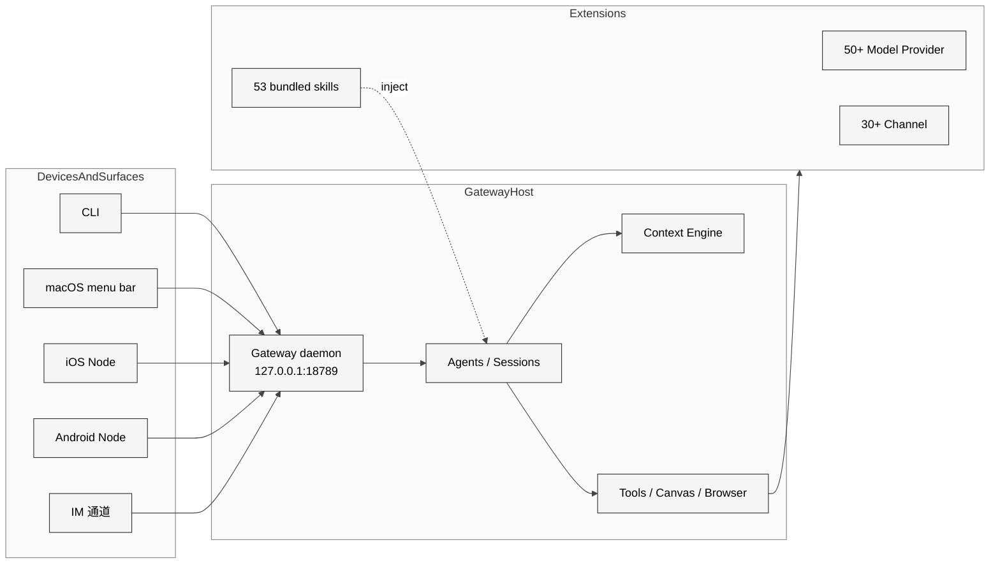

# 01 项目定位与 Molty 愿景

## 本章外部视角

OpenClaw 在 2026-04 被英文社区广泛定位为"生活化 agentic CLI 领跑者"（[The Viable Edge](https://www.viableedge.com/blog/openclaw-vs-alternatives-agentic-ai-comparison)、[dev.to 30+ AI CLI 盘点](https://dev.to/soulentheo/every-ai-coding-cli-in-2026-the-complete-map-30-tools-compared-4gob)），在中文社区更多被视为"多通道 + 飞书 / 国产模型适配"的工程样本（[掘金万字架构](https://juejin.cn/post/7616167665171021870)、[人人都是产品经理反共识拆解](https://www.woshipm.com/it/6350530.html)）。本章不重复这些外部描述，而是回到 [VISION.md](../../openclaw-repo/VISION.md) 和 [README.md](../../openclaw-repo/README.md) 本身，从 project 自我声明 + 源码组织回答一个问题：OpenClaw 到底是什么，不是什么。

## 一、本质是什么

OpenClaw 声明自己是 **personal AI assistant**。在 [VISION.md](../../openclaw-repo/VISION.md) 开篇几行给出了最精简的定义：

> OpenClaw is the AI that actually does things. It runs on your devices, in your channels, with your rules.

三个关键词对应三个技术决策：

- **on your devices**：Gateway 守护进程 + 多端节点，而不是 SaaS 后端。这决定了它是一个 daemon 形态的 CLI 工程，`openclaw onboard --install-daemon` 把自己装成 `launchd`（macOS）或 `systemd --user`（Linux）单位。
- **in your channels**：不新造用户界面，而是进驻你已有的 IM（README 明确列了 24 个通道：WhatsApp/Telegram/Slack/Discord/Feishu/WeChat/QQ/LINE/Zalo/…）。对应 `src/channels` 抽象 + `extensions/<channel>` 实现。
- **with your rules**：配置是 JSON5 文件（`~/.openclaw/openclaw.json`）、默认拒绝陌生 DM（`dmPolicy="pairing"`）、沙箱策略可以精确到 per-session 颗粒度。

因此正文口径统一为"**个人 AI 助手网关**"而不是"AI agent 框架"或"multi-agent platform"——后两者是社区常见但不准确的标签。

## 二、核心问题和痛点

OpenClaw 要解决的不是"如何调模型"，而是"如何让 agent 真正嵌进一个普通人的日常"。这里有六个子问题是其他 agent 框架通常避开的：

1. **入口碎片化**：用户在 WhatsApp、Slack、iMessage、Telegram、飞书之间切换，没有任何一个 AI 服务能覆盖全量
2. **设备碎片化**：桌面 + 手机 + 穿戴 + 智能家居，每个设备本地能力不同
3. **隐私约束**：把聊天记录上传给云端是个人用户难接受的底线
4. **模型切换成本**：OpenAI 涨价、Anthropic 限流、本地 ollama 可用的情况下，用户希望能无痛切换
5. **"看得见"的 agent 状态**：99% 的 agent 框架缺失一个可视化的 dashboard、菜单栏、语音提示层
6. **可信执行**：agent 要真正执行命令（发邮件、改日程、调 API），怎么安全？

OpenClaw 的源码组织就是这六个问题的答案。下面这张表是章节与源码目录的一一映射：

| 痛点 | 对应目录 / 模块 | 相关章节 |
|------|----------------|----------|
| 入口碎片化 | [src/channels](../../openclaw-repo/src/channels) + [extensions/](../../openclaw-repo/extensions) | [Ch14](../Part%20III%20Channels%20Extensions%20Apps/14%20Channels%20%E6%8A%BD%E8%B1%A1%E4%B8%8E%20DM%20%E7%AD%96%E7%95%A5.md) |
| 设备碎片化 | [apps/](../../openclaw-repo/apps) + [src/pairing](../../openclaw-repo/src/pairing) | [Ch18](../Part%20III%20Channels%20Extensions%20Apps/18%20macOS%20%E8%8F%9C%E5%8D%95%E6%A0%8F%20App.md) [Ch19](../Part%20III%20Channels%20Extensions%20Apps/19%20iOS%20%E4%B8%8E%20Android%20%E8%8A%82%E7%82%B9.md) |
| 隐私约束 | [src/secrets](../../openclaw-repo/src/secrets) + [src/security](../../openclaw-repo/src/security) | [Ch13](../Part%20II%20Source%20Execution/13%20%E5%AE%89%E5%85%A8%20%E6%B2%99%E7%AE%B1%E4%B8%8E%E9%85%8D%E5%AF%B9.md) |
| 模型切换 | [docs/concepts/model-failover.md](../../openclaw-repo/docs/concepts/model-failover.md) + 50+ provider 扩展 | [Ch15](../Part%20III%20Channels%20Extensions%20Apps/15%20%E6%A8%A1%E5%9E%8B%E6%8F%90%E4%BE%9B%E6%96%B9%E6%8E%A5%E5%85%A5%E5%85%A8%E6%99%AF.md) |
| 可视化状态 | [apps/macos](../../openclaw-repo/apps/macos) + [ui/](../../openclaw-repo/ui) | [Ch18](../Part%20III%20Channels%20Extensions%20Apps/18%20macOS%20%E8%8F%9C%E5%8D%95%E6%A0%8F%20App.md) |
| 可信执行 | [src/security](../../openclaw-repo/src/security) + [Dockerfile.sandbox](../../openclaw-repo/Dockerfile.sandbox) | [Ch13](../Part%20II%20Source%20Execution/13%20%E5%AE%89%E5%85%A8%20%E6%B2%99%E7%AE%B1%E4%B8%8E%E9%85%8D%E5%AF%B9.md) |

## 三、解决思路与方案

OpenClaw 的整体答法是 **单一 Gateway + 多端 Node + 插件化扩展**。

<div style="background: #ffffff !important; background-color: #ffffff !important; padding: 16px; border-radius: 8px; margin: 16px 0;" bgcolor="#ffffff">



</div>

这张图的关键信息不在于"有多少层"，而在于**中间只有一层 Gateway**。[docs/concepts/architecture.md:13-17](../../openclaw-repo/docs/concepts/architecture.md) 用一句话概括：

> One Gateway per host; it is the only place that opens a WhatsApp session.

这是一个有意识的 trade-off：Gateway 成为**单点**（故障、升级都会影响所有通道），但换来的是每个 channel 的连接数、token、Cookie 只需要 hold 一份，也只在一台机器上。

## 四、实现细节关键点

### 4.1 入口统一到 entry.ts（213 行）

[src/entry.ts](../../openclaw-repo/src/entry.ts) 是 `openclaw` 二进制的唯一入口。即便是从 `dist/index.js` 导入时，它也用 [src/entry.ts:40-48](../../openclaw-repo/src/entry.ts) 的 `isMainModule` guard 避免二次执行：

```ts
// src/entry.ts:40-48 (摘录)
if (!isMainModule({ currentFile: fileURLToPath(import.meta.url), wrapperEntryPairs: [...ENTRY_WRAPPER_PAIRS] })) {
  // Imported as a dependency — skip all entry-point side effects.
} else {
  // ... start CLI
}
```

这类防御式 guard 在 CLI 项目里并不常见，但 OpenClaw 因为既能做 npm global、又能做内嵌模块、还能做 Docker 镜像入口，不做这个守卫会重复启动 Gateway，撞到 lock 文件。

### 4.2 "one agent, many surfaces" 的抽象

[docs/concepts/architecture.md:17-28](../../openclaw-repo/docs/concepts/architecture.md) 明确把 client 分成三类：

- **operator client**：CLI、macOS app、web UI
- **node client**：iOS / Android / 无头设备
- **channel**：通过 extension 接入的 IM/邮件

三类 client 都走同一个 WS 端口、同一套协议（`docs/gateway/protocol.md`），只是 `role` 字段不同。节点和通道的区别是：节点**贡献本地能力**（`canvas.*`、`camera.*`、`screen.record`、`location.get`），通道**消费 agent 输出**。

### 4.3 演化节点

`git log` 可以清晰看出名字演化的时间线。本研究的 [总纲](../总纲-OpenClaw技术主线分析.md) 已列出 Warelay → Clawdbot → Moltbot → OpenClaw 四阶段，这里补一条源码证据：[.mailmap](../../openclaw-repo/.mailmap) 里至今还保留着 Peter Steinberger 过往作者身份的合并规则（`.mailmap` 1045 字节，确保早期提交在 shortlog 里归一），侧面印证项目是基于早期 fork 重命名而来。

## 五、易错点和注意事项

1. **Gateway 只一个**：并发跑两个 `openclaw gateway` 会在 lock 文件上失败，见 `docs/gateway/gateway-lock.md`
2. **"main session" 是身份锚**：`session.mainKey` 默认 `"main"`，是沙箱/权限的决定变量。误以为 `main` 是 agent 标识就会踩坑（见 [docs/gateway/sandboxing.md](../../openclaw-repo/docs/gateway/sandboxing.md) 模式说明）
3. **不要把 Gateway 写成反向代理**：它不转发 HTTP，它解释 WS 协议帧、分发到 agent。Channel 的 webhook 是由 extension 接收后封装成内部帧提交给 Gateway，不是 Gateway 直收。
4. **Node 24 vs Node 22.16+**：[README.md](../../openclaw-repo/README.md) 写了 Node 24 为"推荐"，实际 issue 里仍有大量 Node 22 报错——首次遇到诡异 crash 时先核对 node 版本

## 六、竞品对比

| 维度 | OpenClaw | Claude Code | Cursor | Codex |
|------|----------|-------------|--------|-------|
| 形态 | daemon + 多端 | terminal CLI | IDE fork | web/cli 双端 |
| 主要入口 | IM / 菜单栏 / 语音 | terminal | 编辑器 | web dashboard |
| 沙箱 | per-session Docker | cwd 隔离 | IDE 进程 | cloud sandbox |
| 模型自由度 | 50+ provider | 仅 Anthropic | 多 provider | 仅 OpenAI |
| 记忆 | MD 文件 + vector | 无持久化 | context | 无跨会话 |

OpenClaw 与 Claude Code / Codex 的关键区别是**人机交互界面的选择**：Claude Code 赌 terminal，Codex 赌 web，OpenClaw 赌"用户已有的 IM + 语音 + 菜单栏"。这个赌注直接决定了后面六个顶层子系统的排布。

## 七、仍存在的问题和缺陷

从定位层面看，OpenClaw 有三个结构性张力（会在 [Part V Ch25](../Part%20V%20Issues%20and%20Roadmap/25%20%E6%BA%90%E7%A0%81%E5%B1%82%E8%AE%BE%E8%AE%A1%E9%97%AE%E9%A2%98.md) 深入）：

1. **"personal" 与"extensions 大而全"的张力**：106 个扩展 + 53 个 skill + 3 个 app 的复杂度已经远超"个人助手"应有的维护成本。多数个人用户用不到 90% 的 extension，但项目要维护全部。
2. **"on your devices" 与"sandboxes won't save you"的张力**：用户本机跑就意味着 agent 可以读取用户任何数据。Docker sandbox 不能隔离"agent 自己知道的秘密"，这是 [HN 讨论](https://news.ycombinator.com/item?id=47154803) 的主旨。
3. **"your rules" 与设置复杂度的张力**：Issue [#6028](https://github.com/openclaw/openclaw/issues/6028) 反映 json5 配置稍一改就 crash；JSON schema 校验拒绝陌生 key 对专业用户是保护，对新手是"onboard 失败"的根源。

## 下一章预告

第二章进入 **Gateway 控制面总览**，把本章提到的"单一 Gateway + WS + role/scope"拆到端口、帧、session 层，回答"一条消息在 Gateway 里走了哪几段"。
