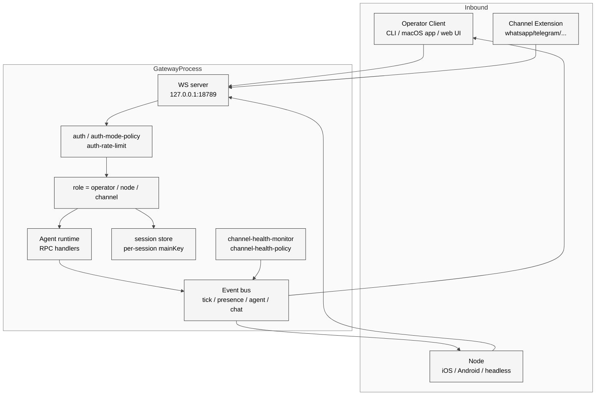

# 02 Gateway 控制面总览

## 本章外部视角

Gateway 是 OpenClaw 最常被社区描述的部分：[Enrico Piovano 的架构 Deep Dive](https://enricopiovano.com/blog/openclaw-architecture-deep-dive) 把它叫做 "hub-and-spoke router"；[ququ123 的源码解析系列](https://www.ququ123.top/2026/03/openclaw-gateway-core/) 直接把它称为"系统的心脏"；[技术栈飞书分析](https://jishuzhan.net/article/2036009670641516546) 用"接单—验单—分单—处理—出餐"的餐厅比喻。本章不重复这些比喻，而是回到 [docs/gateway/protocol.md](../../openclaw-repo/docs/gateway/protocol.md) 与 [src/gateway/](../../openclaw-repo/src/gateway) 的 539 个 TS 文件，解释"Gateway 为什么长成这样"。

## 一、本质是什么

Gateway 是 **唯一控制面 + 唯一 node 通信通道**。[docs/concepts/architecture.md](../../openclaw-repo/docs/concepts/architecture.md) 的第一句就把它钉死：

> A single long‑lived **Gateway** owns all messaging surfaces … Control-plane clients … connect to the Gateway over **WebSocket** on the configured bind host (default `127.0.0.1:18789`).

它同时干三件事：

1. **owns**：独占某些连接（WhatsApp Baileys 会话、Telegram grammY bot、iMessage 桥）
2. **broadcasts**：事件总线（`event:tick`、`event:presence`、`event:agent`）
3. **serves RPC**：WS 请求/响应（`req:connect`、`req:agent`、`req:send`）

这三件事合并在一个长连接里，不是 REST、不是 SSE、不是 gRPC——是 WebSocket 文本帧 + JSON payload + 严格 schema。

## 二、核心问题和痛点

把所有 channel、所有 device、所有 UI 放进一个进程，本质上要解决五个问题：

1. **协议统一**：WhatsApp 是 MQTT-like 长连接、Telegram 是 long poll / webhook、iMessage 是 macOS 内部桥——这些差异需要被"翻译"成一个内部协议
2. **认证单点**：50+ 模型 provider 的 API key、30+ channel 的 token、iOS/Android 节点的配对密钥，都要在 Gateway 这一个点上管理
3. **事件广播**：一条消息到达时，macOS 菜单栏要闪红点、iOS 要震动、CLI 要打印日志——必须广播给所有订阅者
4. **可恢复连接**：WS 断线后必须能接上中间事件（`lastEventId` 模式）
5. **每通道健康监测**：Telegram 限流、WhatsApp banned、Feishu token 过期——需要独立的 `channel-health-monitor`

## 三、解决思路与方案

OpenClaw 的答法是：**一个 WS server + 三类 role + 每类 role 的独立 policy 层**。

<div style="background: #ffffff !important; background-color: #ffffff !important; padding: 16px; border-radius: 8px; margin: 16px 0;" bgcolor="#ffffff">



</div>

三类 role 的差异在 [docs/gateway/protocol.md:38-46](../../openclaw-repo/docs/gateway/protocol.md) 显式声明（handshake 时 `role` 必填），对应源码文件：

- **operator**：[src/gateway/auth.ts](../../openclaw-repo/src/gateway/auth.ts) + [src/gateway/auth-mode-policy.ts](../../openclaw-repo/src/gateway/auth-mode-policy.ts)
- **node**：[src/gateway/android-node.capabilities.*.ts](../../openclaw-repo/src/gateway) 系列 + `src/pairing`
- **channel**：[src/gateway/channel-health-monitor.ts](../../openclaw-repo/src/gateway/channel-health-monitor.ts) + [src/gateway/server-channels.ts](../../openclaw-repo/src/gateway/server-channels.ts)

## 四、实现细节关键点

### 4.1 handshake 有 pre-connect challenge

[docs/gateway/protocol.md:24-32](../../openclaw-repo/docs/gateway/protocol.md) 明确：Gateway 在 `connect` 之前先发一个 `connect.challenge` 事件，带 nonce + ts。客户端的 `connect` 请求必须引用这个 nonce。这是 CVE-2026-25253 修复的一部分（见 [Part II Ch13](../Part%20II%20Source%20Execution/13-security-sandbox-pairing.md)），防止跨站 WebSocket 劫持。早期版本没有这个 challenge，是漏洞利用链的核心环节。

### 4.2 protocol version 强制范围

```json
// docs/gateway/protocol.md 节选
{ "type":"req","id":"…","method":"connect",
  "params":{"minProtocol":3,"maxProtocol":3,"client":{…},"role":"operator"}}
```

`minProtocol: 3, maxProtocol: 3` 是 v3 协议的硬性锁定。旧协议版本（v1/v2）已删除，Gateway 启动时会拒绝。这在 [src/gateway/boot.ts](../../openclaw-repo/src/gateway/boot.ts) + [src/gateway/auth-token-resolution.ts](../../openclaw-repo/src/gateway/auth-token-resolution.ts) 的调用链里生效。

### 4.3 channel-health-monitor 的独立策略

539 个 TS 里至少有四个文件与 channel health 有关：

- [src/gateway/channel-health-monitor.ts](../../openclaw-repo/src/gateway/channel-health-monitor.ts)
- [src/gateway/channel-health-monitor.test.ts](../../openclaw-repo/src/gateway/channel-health-monitor.test.ts)
- [src/gateway/channel-health-policy.ts](../../openclaw-repo/src/gateway/channel-health-policy.ts)
- [src/gateway/channel-health-policy.test.ts](../../openclaw-repo/src/gateway/channel-health-policy.test.ts)

policy 和 monitor 解耦是典型的 "mechanism vs policy" 分层：monitor 只负责定期探活，policy 决定"连续 N 次失败后是否重连/下线/报警"。

### 4.4 control-ui 有专门的 HTTP utils

[src/gateway/control-ui-http-utils.ts](../../openclaw-repo/src/gateway/control-ui-http-utils.ts) 暗示除了 WS，Gateway 也提供一个有限的 HTTP 面向 control UI。这里是 CVE-2026-25253 的原始攻击面——Control UI 的 HTTP 端点被用作 `gatewayUrl` 诱导跨站 WebSocket。修复后这层 HTTP 被限制为"仅为 control-ui 服务的有限协议反射"，并加 Origin header 校验。

### 4.5 server-tailscale 与 server-shared

Gateway 支持通过 [server-tailscale.ts](../../openclaw-repo/src/gateway/server-tailscale.ts) 暴露到 Tailscale 网络内的设备，对应 [docs/gateway/tailscale.md](../../openclaw-repo/docs/gateway/tailscale.md)。`server-shared.ts` 是 Tailscale 模式和本地模式共享的 server 启动流程。这是"本地 first + 远程可选"的关键实现点。

### 4.6 事件类型

[docs/concepts/architecture.md:29-32](../../openclaw-repo/docs/concepts/architecture.md) 列了 Gateway 主要 server-push event 类型：

```
agent, chat, presence, health, heartbeat, cron
```

每一种对应一类订阅者。`tick` 是周期心跳（用来维持 keepalive），`agent` 是 agent 运行的流式事件（思考/工具调用/回复 delta），`presence` 是 channel/node/user 的在线状态变化。

## 五、易错点和注意事项

1. **连 Gateway 必须先 `connect`**：[docs/gateway/protocol.md:18](../../openclaw-repo/docs/gateway/protocol.md)"First frame **must** be a connect request"——任何第一帧不是 `connect` 的连接会被立刻关闭
2. **role 声明必须一致**：连接时声明 `role: node` 但后续发 `req:send`（operator 专属方法）会被拒绝
3. **rate-limit 在 auth 层**：[src/gateway/auth-rate-limit.ts](../../openclaw-repo/src/gateway/auth-rate-limit.ts) 独立限流，和 channel 自身的 rate-limit 是两层——排查"消息没发出去"要分别看
4. **bind host 不要改成 0.0.0.0**：[docs/gateway/configuration.md](../../openclaw-repo/docs/gateway/configuration.md) 警告，默认 `127.0.0.1` 是故意的——绑 0.0.0.0 就意味着把 agent 暴露在 LAN 上，CVE-2026-25253 的影响半径会因此放大
5. **`connect.challenge` 超时要短**：nonce 窗口设计上是秒级，长了等于没有防护

## 六、竞品对比

- **Claude Code**：没有"Gateway"概念，它本身就是 CLI 进程。优点是简单，缺点是无法在多个设备间共享 session
- **Hermes Agent**：有控制面但走 HTTP REST，不走 WS。Mermaid 形式的事件流要走额外的 SSE 管道
- **Codex**：云端托管，user 端是轻量 CLI；控制面在 OpenAI 后端，不受用户掌控
- **OpenClaw 的独特之处**：控制面是**用户拥有**的进程，这带来"用户能看见 agent 在做什么"的独有能力（菜单栏动画、iOS 通知），代价是运维复杂度从 0 变成 1

## 七、仍存在的问题和缺陷

1. **单点故障**：Gateway 崩就全挂。[Issue #6028](https://github.com/openclaw/openclaw/issues/6028) 报告 json5 配置误改会让 Gateway 进入 crash loop。目前没有"gateway 退化到只读模式"的机制
2. **rate-limit 粒度粗**：[src/gateway/auth-rate-limit.ts](../../openclaw-repo/src/gateway/auth-rate-limit.ts) 是全局限流，不区分 operator/node/channel，突发流量场景下容易误杀
3. **control-ui 的 HTTP 子集**：虽然 CVE 修过一次，但 HTTP 与 WS 共端口的设计本身是攻击面集中点，长期看不如彻底分端口
4. **事件回放**：断线重连要求客户端自己保存 `lastEventId`，没有服务端 offline queue——对 iOS Node 这种经常断网的场景不够友好

## 下一章预告

第三章进入 **Agent 与 Session 模型**，从 Gateway 转入单次 agent loop 的执行细节——Agent 身份、session key、SOUL.md 注入顺序、main vs non-main 的授权差异。
