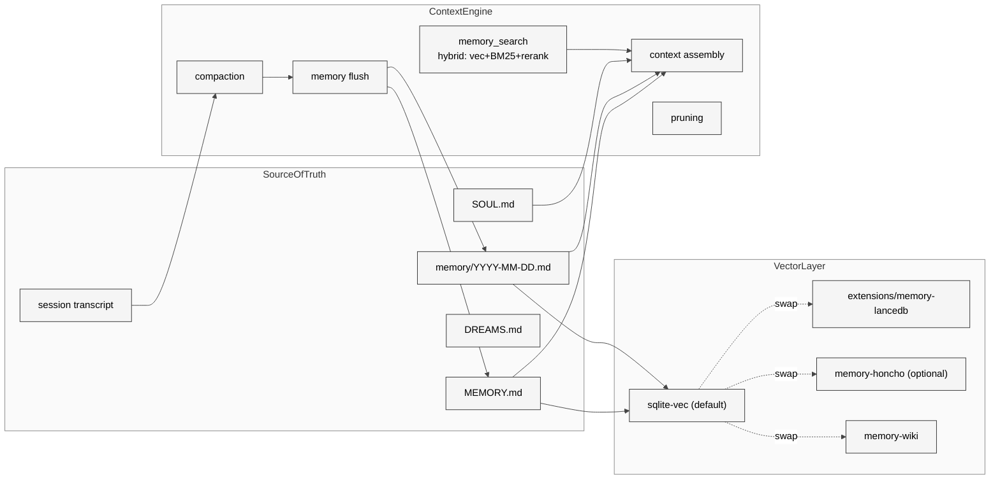

# 04 Context Engine 与记忆体系

## 本章外部视角

[LanceDB 官方博客](https://lancedb.com/blog/openclaw-memory-from-zero-to-lancedb-pro/) 与 [Honcho 集成文档](https://docs.openclaw.ai/concepts/memory-honcho) 把 OpenClaw 的记忆系统描述为"MD as source of truth + swappable vector index"。[openclawdir 的 Memory LanceDB Context 插件介绍](https://openclawdir.com/plugins/memory-lancedb-context-2k51lt) 列出了 vector + BM25 + reranking 的三段式检索。本章不停留在"用了 LanceDB"的浅描述，而是拆清 Context Engine 本身（`src/context-engine`）、记忆插件（`extensions/memory-*`）、以及少被提及的 Dreaming / Compaction（[docs/concepts/dreaming.md](../../openclaw-repo/docs/concepts/dreaming.md)、[compaction.md](../../openclaw-repo/docs/concepts/compaction.md)）。

## 一、本质是什么

Context Engine 是一个"**装配线**"，它在每次 agent loop 开头把以下多种材料拼成一个最终传给 LLM 的 `messages[]`：

- **SOUL.md**：agent 人设
- **AGENTS.md**：项目级 agent 系统提示（OpenClaw 自身的 41KB）
- **MEMORY.md**：长期事实
- **memory/YYYY-MM-DD.md**：近几日日记
- **session transcript**：当前会话历史
- **工具描述 + skills 描述**：可用能力清单
- **memory_search 结果**：当前输入触发的向量召回

这些材料不是简单拼接，而是**按照优先级分段插入**system prompt → assistant prior → user message。Context Engine 的职责是保证"最近最相关"的内容留在靠近 user message 的位置。

## 二、核心问题和痛点

OpenClaw 的记忆系统要解决四个相互冲突的问题：

1. **人可读 vs 机器高效**：`MEMORY.md` 是用户能手改、能版本控制的，但 LLM 不擅长全文扫描大段 Markdown，需要 vector 加速
2. **跨会话延续 vs 隐私边界**：同一 agent 的多个 session 必须共享长期记忆，但来自陌生人的 session 不应该污染主人的 MEMORY
3. **上下文溢出 vs 历史完整性**：模型窗口有限，需要压缩/裁剪；但压缩后出错时必须能找回原文
4. **实时新增 vs 索引一致性**：用户刚说的"我喜欢 TypeScript"要在下一次 loop 就可用，vector 索引要近乎实时更新

## 三、解决思路与方案

三条关键原则：

1. **MD 写入是主动的**：agent 主动决定"这条信息要不要写入 MEMORY"，不是自动 dump
2. **vector 索引是加速层**：索引坏了可以从 MD 重建，MD 坏了无法从 vector 恢复
3. **compaction/flush 先后顺序固定**：先 flush（保留重要事实到 MD）再 compact（丢弃原文）

## 四、实现细节关键点

### 4.1 memory 相关插件有四套 fallback 链

从 [extensions/](../../openclaw-repo/extensions) 能数出四个记忆插件：

- **memory-core**（866 files tracked）：默认、sqlite-vec 驱动
- **memory-lancedb**：生产级 vector，multimodal 支持
- **memory-wiki**：带 provenance（来源追踪）+ 结构化 claim + contradiction detection
- **active-memory**：pattern matching 自动识别重要消息（preference / decision / fact / entity）

它们不是互斥的——[docs/concepts/memory.md](../../openclaw-repo/docs/concepts/memory.md) 明确：`memory-wiki` 不替换 active memory plugin，而是**并排**提供 wiki 视图。用户可以同时装。

### 4.2 两个核心工具 `memory_search` 和 `memory_get`

[docs/concepts/memory.md:31-35](../../openclaw-repo/docs/concepts/memory.md) 明确：

> - `memory_search` -- finds relevant notes using semantic search, even when the wording differs from the original.
> - `memory_get` -- reads a specific memory file or line range.

`memory_search` 是 RAG 入口，`memory_get` 是精确读取（接受文件名 + 行号）。这两个工具组合让 agent 可以先"搜到大概"再"确认原文"，减少 hallucination。

### 4.3 Dreaming 机制

[docs/concepts/dreaming.md](../../openclaw-repo/docs/concepts/dreaming.md) 描述一种后台任务：

- 空闲时 agent 会"做梦"——扫描最近的 `memory/YYYY-MM-DD.md`
- 把重复事实、矛盾信息、候选长期记忆筛出来
- 写入 `DREAMS.md` 供人类 review
- 被用户确认的会被"提升"为 `MEMORY.md` 条目

这是 OpenClaw 独有的设计。多数 agent 框架没有"空闲状态"的概念；OpenClaw 因为是 daemon 长跑，可以在 `event:tick` 间隙跑这种 offline 任务。

### 4.4 Compaction 有三档策略

从 [openclawdir plugin 描述](https://openclawdir.com/plugins/memory-lancedb-context-2k51lt) 可以交叉验证：

- **aggressive**：保留 < 20% 原文，高压缩比
- **balanced**：保留 ~50% 原文（默认）
- **conservative**：保留 > 80% 原文，仅压缩最老段

选择策略是 per-agent 配置（`agents.list[].compaction.strategy`）。

### 4.5 Honcho 的价值点

[Honcho 集成文档](https://docs.openclaw.ai/concepts/memory-honcho) 指出 Honcho 提供 "AI-native cross-session memory"——在 MD+vector 之上，额外维护 user/agent model（人格 / 偏好的结构化表示）。对"一个 agent 服务一个人很久"的场景（> 6 个月）收益最明显。

### 4.6 Memory Wiki 的结构化特点

[docs/concepts/memory.md:44-58](../../openclaw-repo/docs/concepts/memory.md) 列出 wiki 插件的差异化特性：

- **deterministic page structure**：每页模板固定，便于机器消费
- **structured claims and evidence**：claim 必须带来源引用
- **contradiction detection**：多来源冲突时提示
- **freshness tracking**：过期知识标记
- **compiled digests**：定期生成摘要供 agent 快速读取

它本质上把"记忆"升级为"**有版本、可追溯、可审计的知识库**"。适合长期专业项目（比如持续维护某个开源项目的 agent）。

## 五、易错点和注意事项

1. **不要手改 `memory/YYYY-MM-DD.md`**：agent 会假设这些文件是它自己写的，格式微调会破坏后续解析
2. **`MEMORY.md` 是合法的手改目标**：它是面向用户的长期事实，用户可以直接编辑
3. **切换 vector 后端要重建索引**：`memory-core` → `memory-lancedb` 切换不会自动迁移 vector，需要 `openclaw memory reindex`
4. **DREAMS.md 是建议池**：不自动生效，用户必须 promote 后才会进入 MEMORY
5. **session compaction 不会自动导入 MEMORY**：除非你显式跑 flush。这是为了防止短期噪音污染长期事实
6. **memory-wiki 的 lint 会改文件**：`wiki_lint` 工具会自动修正格式，如果你不希望 agent 改文件，关掉 `memory-wiki` 或显式降权

## 六、竞品对比

| 维度 | OpenClaw | Claude Code | mem0 | Letta/MemGPT | Hermes |
|------|----------|-------------|------|--------------|--------|
| 存储介质 | MD + vector | 无持久化 | DB | JSON/DB | 自定义 |
| 用户可读 | 原生 MD | N/A | 不直接 | 部分 | 不直接 |
| 多索引后端 | 4 种 | N/A | 1-2 | 1 | 1-2 |
| Dreaming | 有 | 无 | 无 | 有类似 | 无 |
| Wiki 变体 | 有 | 无 | 无 | 无 | 无 |

OpenClaw 的"MD 优先 + dreaming + wiki"组合是目前所有主流 agent 框架里**最偏向人类可读性**的一套记忆系统。代价是一致性和实时性略差。

## 七、仍存在的问题和缺陷

1. **多索引后端并存时的一致性无定义**：同时装 memory-core 和 memory-lancedb 会怎样？文档里没明说；测试覆盖也有限
2. **Dreaming 触发时机可控性差**：只能靠空闲时间 heuristic，用户没法 "now dream"
3. **memory flush 内容判定靠 LLM**：flush 时用哪个模型？成本控制？这些在 [docs/concepts](../../openclaw-repo/docs/concepts) 层面没有明确，源码里用的是 agent 自己的 default model
4. **vector 索引的 drift**：长期运行后，sqlite-vec 的向量分布会偏移，没有 rebuild 调度
5. **跨语言问题**：`active-memory` 的 pattern matching 声称 multi-language，但对中文、日文、阿拉伯文的覆盖度不均；相关 issue 在 Part V Ch24 有量化

## 下一章预告

第五章进入 **插件与扩展机制**，回答 106 个 extension 是怎么被 OpenClaw 加载的、`packages/plugin-sdk` 里的契约是什么、bundled vs managed vs user-installed 有什么边界——为第六章的 Skill / ClawHub 讨论做铺垫。
