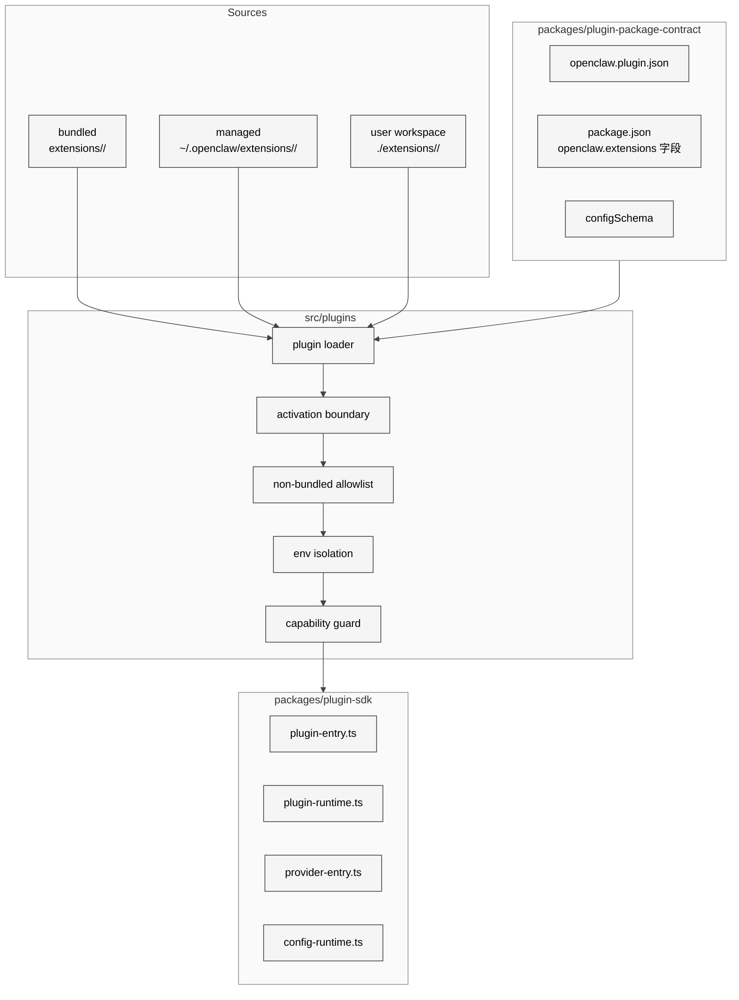

# 05 插件与扩展机制

## 本章外部视角

[OpenClaw DC 的"从 SKILL.md 到 ClawHub"](https://openclawdc.com/blog/openclaw-build-skill/) 与 [DigitalApplied ClawHub 开发者指南](https://www.digitalapplied.com/blog/clawhub-skills-marketplace-developer-guide-2026) 通常把 skill 和 plugin 混为一谈。但在源码里它们是两套不同的机制：plugin 走 [packages/plugin-sdk](../../openclaw-repo/packages/plugin-sdk)、extension 走 [packages/plugin-package-contract](../../openclaw-repo/packages/plugin-package-contract)、skill 走 `extensions/clawhub` + `skills/`。本章聚焦前两个，skill 留给第 6 章。

## 一、本质是什么

OpenClaw 的扩展点结构是"**套娃**"：

- **plugin**：进程内扩展，以 TS 代码 + SDK 直接注册 command / tool / cli
- **extension**：plugin 的"打包发布形态"，按 `openclaw.plugin.json` + `package.json` 标准目录组织
- **skill**：既可以是纯 Markdown 文档（描述 LLM 怎么做事），也可以是带 code 的 skill（本质上是一种 plugin 子类）

一句话对应：**plugin 是代码接入点，extension 是分发载体，skill 是 LLM 指令载体**。

## 二、核心问题和痛点

106 个扩展要在一个 CLI 进程里和谐共存，需要解决五个问题：

1. **加载顺序**：provider 扩展必须先于需要它的 channel；memory 扩展必须早于 context-engine；怎么声明依赖？
2. **激活边界**：哪些扩展是随 Gateway 自动起的（bundled），哪些是按需加载的（managed/user）
3. **权限隔离**：第三方扩展不能像 bundled 扩展那样直接访问 secrets、runCommand
4. **配置 schema 演进**：扩展升级后 config 格式变了，老 config 如何兼容
5. **供应链安全**：CVE / 恶意扩展如何被识别？（ClawHavoc 事件给出的血的教训）

## 三、解决思路与方案

<div style="background: #ffffff !important; background-color: #ffffff !important; padding: 16px; border-radius: 8px; margin: 16px 0;" bgcolor="#ffffff">



</div>

关键原则是 **"default-deny + explicit allowlist"**——这一原则在 [PR #23574](https://github.com/openclaw/openclaw/pull/23574) 的 P0 remediation 里明文写入。非 bundled 扩展默认不能调 `writeConfigFile` `runCommandWithTimeout` 等危险 API，必须在 allowlist 里显式 opt-in。

## 四、实现细节关键点

### 4.1 plugin-sdk 的十个运行时

[packages/plugin-sdk/src/](../../openclaw-repo/packages/plugin-sdk/src) 列出了十个核心文件：

```
config-runtime.ts          # 配置注入与解析
plugin-entry.ts            # 插件入口签名
plugin-runtime.ts          # 插件执行上下文
provider-auth-runtime.ts   # provider 鉴权
provider-auth.ts
provider-entry.ts
provider-http.ts           # http 调用封装
provider-model-shared.ts
provider-model-types.ts
provider-onboard.ts        # provider 首次配置向导
```

这不是"一个 API 几十个方法"的扁平 SDK，而是**按角色拆分**：plugin（通用）、provider（模型）、provider-model（模型定义）、provider-onboard（首次配置）、provider-auth（鉴权）——分别面向不同的扩展作者职责。

### 4.2 plugin manifest 可以为空但必须存在

从 [skills/lc0rp/create-plugin/SKILL.md](https://github.com/openclaw/skills/blob/main/skills/lc0rp/create-plugin/SKILL.md) 规约可以推知：`openclaw.plugin.json` 是 **required 但可以是空 `{}`**。这是 OpenClaw 的"最小契约"——即便你啥也不声明，至少要有一个 manifest 说明你是扩展。如果没有，loader 直接拒绝。

### 4.3 activation boundary 是安全心脏

[src/plugin-activation-boundary.test.ts](../../openclaw-repo/src/plugin-activation-boundary.test.ts) 是整个 plugin 系统里最严谨的 test 之一。**activation boundary** 的作用是：插件被加载时（require 时），它不能触及 host 的 `process.env`、`process.cwd()`、`fs` 等全局资源——只能通过传入的 `runtime` handle 访问。这相当于给每个插件一个受限的"代理环境"。

根据 [PR #23574 修复说明](https://github.com/openclaw/openclaw/pull/23574) 复述：

- environment isolation strips API keys from plugin access
- Prototype pollution detection and freezing of unsafe globals (`JSON`, `Math`, `Reflect`)

### 4.4 extension 安装来源分三层

- **bundled**：随 npm 包一起发布，代码放在 `extensions/<id>/`，版本跟随主包。数量最大（112 个，见 [extensions/](../../openclaw-repo/extensions)）
- **managed**：由 `openclaw plugins install <spec>` 安装，落在 `~/.openclaw/extensions/<id>/`。`spec` 支持本地目录、`.tgz`、npm 包名、`clawhub:<pkg>`——`openclaw plugins install` 默认 **ClawHub 优先、npm fallback**（见 [docs/tools/plugin.md](../../openclaw-repo/docs/tools/plugin.md)）
- **user**：在 workspace 或指定路径里符号链接进来，用于本地开发

三层权限递减：bundled 权限最高（信任等同主包）、managed 中等（受 allowlist 管）、user 最低（默认默拒，开发时开 `--unsafe` 才能跑）。

### 4.5 第四条链路：Community Plugin

managed 扩展之上还有一条**策划式**的发行渠道——[docs/plugins/community.md](../../openclaw-repo/docs/plugins/community.md) 里列出的 "Community Plugins"。它和普通 managed 的差别是：

| 维度 | Managed（ClawHub/npm 任意包） | Community Plugin（docs 收录） |
|---|---|---|
| 发现性 | 靠搜索 / 推荐 | docs 里显式列表 |
| 质量门槛 | ClawHub 基本扫描 | "Quality bar"：公共仓库 + 文档 + 活跃维护 |
| 维护者 | 任何人 | **有明确归属**（有些是厂商官方团队） |
| 安装命令 | `openclaw plugins install <any>` | 完全一样，但 docs 给了推荐 |
| 安全验证 | VirusTotal | VirusTotal + 人工列表审核 |

当前 Community Plugins 列表里的关键条目（截至 2026-04-17）：

- **WeCom** (`@wecom/wecom-openclaw-plugin`)：**腾讯企业微信官方团队**维护，WebSocket 长连接，支持私聊/群聊/流式回复/主动消息/image&file/Markdown/访问控制/会议/文档 skill
- **DingTalk** (`@largezhou/ddingtalk`)：社区开发者维护，Stream 模式企业机器人
- **WeChat**：2025 年曾由 Tencent iLink Bot 提供，2026 年初被 `remove dead WeChat listing` 从列表中移除（见 commit `483926a6fb`）——当前无官方入口
- **QQbot** (`@tencent-connect/openclaw-qqbot`)：**腾讯连接团队**维护，与 bundled `extensions/qqbot` **并行存在**两个实现
- **Codex App Server Bridge**、**Lossless Claw**、**Opik**：第三方生态

这一层的意义是 OpenClaw 的 **"bundled vs community vs 任意"** 三段策略：核心通道 bundle 进主仓（Telegram/Slack/Discord/Feishu 等），重要厂商通道由厂商团队以 community plugin 形式独立维护（WeCom 由腾讯直接 own），小众或实验性的走 managed/user。这种分层让主仓不必承担所有维护压力，又不失对 "官方信任通道" 的可指认性——详见 [第 16 章 中国区生态适配](../Part%20III%20Channels%20Extensions%20Apps/16-china-ecosystem-adaptation.md)。

### 4.6 extension 可以直接是 npm 包

`package.json` 里只要加 `"openclaw": { "extensions": [...] }` 段就能被发现。典型例子是 `qqbot`、`zalo`、`bluebubbles` 等通道——它们同时在 npm 上发布，用户可以 `openclaw plugins install @tencent-connect/openclaw-qqbot`。这个契约在 [packages/plugin-package-contract](../../openclaw-repo/packages/plugin-package-contract) 里定义。

### 4.7 configSchema 是扩展的公开接口

每个扩展的 `openclaw.plugin.json` 应该附带 `configSchema`（JSON Schema）。Gateway 启动时校验用户配置；`openclaw doctor` 用它检测 config drift。用户改错字段（[Issue #6028](https://github.com/openclaw/openclaw/issues/6028)）时就是因为 schema 检查拒绝 unknown key。

## 五、易错点和注意事项

1. **bundled 扩展是不能单独卸载的**：它们跟 CLI 版本绑定。想不用 telegram？用 `config.plugins.telegram.enabled = false`，不要去删文件
2. **managed 扩展依赖 claw hub token**：installer 从 ClawHub 拉签名包；如果你的 token 过期 install 会失败但错误信息不清晰
3. **user 扩展必须显式 opt-in**：`--unsafe-plugins` 或 `config.plugins.allowUserPlugins = true` 才能加载
4. **configSchema 的向后兼容**：改 schema 必须保持向后兼容或提供 migration；直接改 field 名会让老用户启动 crash
5. **provider-auth 与 secrets 分离**：provider 的 API key 走 `src/secrets` 管理，不要在 extension 代码里硬编码或直接读 `process.env`——会被 activation boundary 拦
6. **cluster-less**：扩展不能 spawn 额外进程（除非走 `openshell` 这类已声明的 external sandbox）。试图用 `child_process` 会被 capability guard 拒绝

## 六、竞品对比

| 维度 | OpenClaw | Claude Code | Cursor | VS Code Extension |
|------|----------|-------------|--------|--------------------|
| 扩展契约 | manifest + SDK | 无正式契约 | 类 VS Code | 成熟 |
| 激活边界 | activation boundary | N/A | electron 进程 | VM / main-thread |
| 允许列表 | default-deny | N/A | N/A | 有 permission model |
| 发布渠道 | ClawHub + npm | 无 | Cursor Hub | Marketplace |
| 供应链安全 | VirusTotal + 签名 | 无 | 人工审核 | 自动扫描 |

OpenClaw 的扩展系统在 agent CLI 里算**最严谨**的，和 VS Code marketplace 属于同一级别的工程化成熟度。

## 七、仍存在的问题和缺陷

1. **allowlist 维护成本高**：每个 bundled 扩展都要在 Gateway 这边标记哪些 capability 可用，升级时容易遗漏（CVE-2026-25253 的 RCA 里能看到类似模式）
2. **ClawHavoc 类型的供应链攻击防不住语义漏洞**：VirusTotal 只能扫 known malware；一个 "skill" 让 agent 泄密的语义攻击需要别的机制（见 [Part V Ch25](../Part%20V%20Issues%20and%20Roadmap/25-source-level-design-flaws.md)）
3. **configSchema migration 没有官方工具**：改 schema 后老用户的 config 迁移靠手动
4. **extension 依赖声明不成熟**：plugin A 依赖 plugin B 时没有标准 `peerDependencies` 语义
5. **调试链路长**：插件开发者报告常见问题是 "我的插件加载了但 command 没注册"，诊断要翻 Gateway log + plugin log + CLI log 三处

## 下一章预告

第六章进入 **Skill 体系与 ClawHub**。Skill 是插件体系上面加的一层"LLM 指令 + 可选代码"载体；ClawHub 是 skill 的分发市场。第 6 章会把 `skills/` 53 个本地 skill、SKILL.md 契约、和 ClawHavoc 事件放进同一个框架里。
