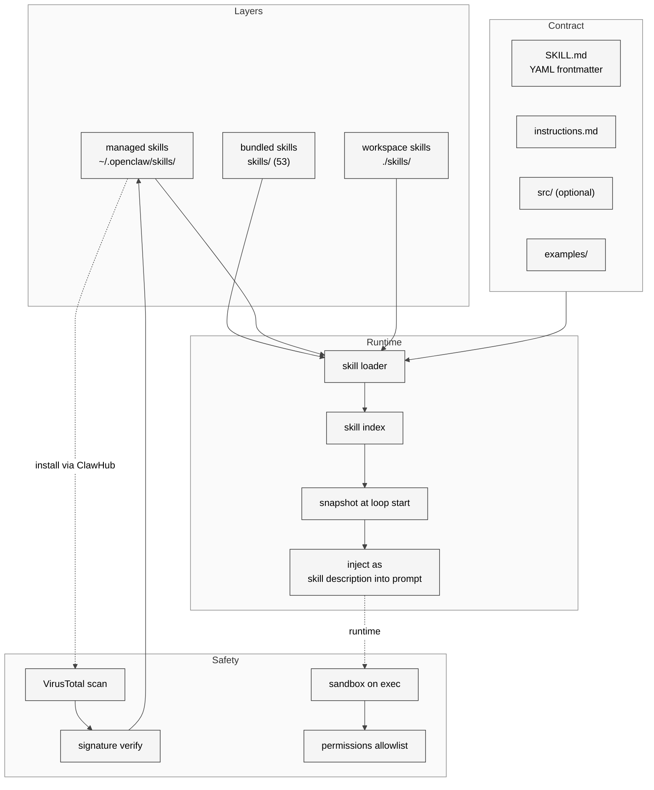

# 06 Skill 体系与 ClawHub

## 本章外部视角

[Learn OpenClaw 的 Skill 章节](https://learnopenclaw.com/core-concepts/skills)、[ClawHub 官方页](https://docs.openclaw.ai/tools/clawhub)、[DigitalApplied 开发者指南](https://www.digitalapplied.com/blog/clawhub-skills-marketplace-developer-guide-2026) 都强调 ClawHub 的规模（3k~15k skills，口径不一，见 [全网调研](../全网调研-社区认知地图.md) 2.4 节）。本章不再复述规模数字，而是聚焦两个更有价值的问题：一个 skill 在源码层怎么表达？ClawHavoc 供应链事件如何改变了 skill 设计？

## 一、本质是什么

在 OpenClaw 里，skill 是 **可被 LLM 动态发现和调用的能力载体**。它区别于 plugin：

- Plugin 是 TS 代码，注册 command/tool，对 LLM 暴露工具签名
- Skill 是 Markdown 指令 + 可选代码，**LLM 自己决定**何时用它、怎么用

换言之：**plugin 给 agent 提供"能做什么"，skill 给 agent 提供"该怎么做"**。

本地仓库有 53 个 bundled skill（[skills/](../../openclaw-repo/skills)），ClawHub 远端数量"数千级"（官方口径 10,000+ [Serenities AI](https://serenitiesai.com/articles/openclaw-deep-dive-2026)）。

## 二、核心问题和痛点

Skill 系统要解决五个问题：

1. **可发现性**：agent 在上下文里塞几十个 skill 描述就爆表，必须动态路由
2. **执行安全**：skill 的代码部分如果能执行 shell，相当于给 agent 任意命令权限
3. **版本化**：skill 可能被作者更新，已依赖它的 session 要不要自动升级？
4. **多语言**：SKILL.md 是英文为主，中日韩用户怎么办
5. **作者信任**：chawhub 上任何人能发布 skill，怎么防恶意（ClawHavoc 1,184 恶意 skill 事件）

## 三、解决思路与方案

<div style="background: #ffffff !important; background-color: #ffffff !important; padding: 16px; border-radius: 8px; margin: 16px 0;" bgcolor="#ffffff">



</div>

三层 skill（bundled / managed / workspace）与第 5 章的 plugin 层结构平行，权限递减。但 skill 的"可执行代码"部分 **始终走 sandbox**——即便 bundled。这是 2026-02 ClawHavoc 事件后强化的策略。

## 四、实现细节关键点

### 4.1 SKILL.md 的五段结构

从 [learnopenclaw skill 文档](https://learnopenclaw.com/core-concepts/skills) 和 [OpenClaw DC 教程](https://openclawdc.com/blog/openclaw-build-skill/) 交叉验证，标准 SKILL.md 包含：

```markdown
---
name: <id>
description: <一句话>
version: <semver>
tags: [...]
author: <github handle>
requirements: [...]
---

## Instructions
<step-by-step>

## Rules
<hard constraints>

## Examples
<input/output pairs>
```

frontmatter 可以扩展字段（例如 `trigger-words`、`requires-tools`）。Instructions/Rules/Examples 是 LLM 动态拼接到系统提示里的原材料。

### 4.2 53 个本地 skill 的主题分布

我统计 `skills/` 下的目录，按名字分类：

- **Content tools**: blogwatcher, summarize, nano-pdf, video-frames, gifgrep
- **Apple/macOS**: apple-notes, apple-reminders, bear-notes, things-mac, imsg
- **Messaging**: bluebubbles, slack, discord, session-logs
- **Productivity**: notion, obsidian, trello, taskflow, taskflow-inbox-triage
- **Hardware**: peekaboo (screen), camsnap (camera), sonoscli, spotify-player, openhue, sag
- **Dev**: coding-agent, clawhub, canvas, skill-creator, tmux, mcporter
- **Voice**: voice-call, sherpa-onnx-tts, openai-whisper, openai-whisper-api
- **Integrations**: github, gh-issues, 1password, oracle, himalaya, xurl, wacli
- **Info**: weather, songsee, model-usage, healthcheck, gog, goplaces, blucli, eightctl, ordercli

整体分布**偏生活化**（Apple 生态/语音/音乐/家庭设备等）而非 coding 工具。这与 OpenClaw "personal AI" 的定位一致。

### 4.3 Skill snapshot 在 loop 开头冻结

这一点在 [Ch03](./03-agent-and-session-model.md) 4.2 已提过：每次 agent loop 开始前，skill 目录被冻结成 snapshot 传给 pi-agent-core。中途用户 `openclaw skills update` 不影响本次 loop。

### 4.4 ClawHub 的安全链

[DigitalApplied 的 ClawHub 指南](https://www.digitalapplied.com/blog/clawhub-skills-marketplace-developer-guide-2026) 归纳：

1. 上传包走 `claw.json` manifest 校验
2. VirusTotal 自动扫描二进制 / 脚本
3. 作者 2FA + GitHub 关联
4. 安装时验证 publisher signature
5. 安装后的 skill 进 `~/.openclaw/skills/`（managed 层）

ClawHavoc 事件后还加了：

- 社区举报 endpoint（`openclaw skills report <id>`）
- 异常行为统计（skill 调 writeConfigFile 次数等）
- 强制 skill 只能通过 `tool_api` 而不是直接读系统目录

### 4.5 skill-creator 是 meta-skill

`skills/skill-creator` 自己是一个 skill，指导 agent 如何创建新 skill。这是 OpenClaw 的有趣 meta 设计——用户说"帮我写个连接 Notion 的 skill"，agent 先加载 `skill-creator` 的指令，然后按里面的步骤产出 SKILL.md。这个模式在 [Claude 的 agent-skill-creator](https://docs.openclaw.ai/tools/clawhub) 也类似。

### 4.6 requirement 字段与 plugin 联动

SKILL.md 的 `requirements` 字段可以声明依赖的 plugin（例如 `voice-call` skill 依赖 `elevenlabs` provider 扩展）。如果依赖不满足，skill 仍然可见，但 agent 调用时会提示用户先启用依赖。

## 五、易错点和注意事项

1. **SKILL.md 的 description 是搜索关键字**：description 写得含糊就意味着 agent 不知道何时该用这个 skill
2. **不要在 skill 里存 secret**：managed skill 安装目录不是机密存储；用 `openclaw secrets` 代替
3. **自定义 workspace skill 开发时注意 git 提交**：默认 `.openclaw/.gitignore` 不会忽略它们，别把 API key 带上 GitHub
4. **skill 更新不会自动 rollback**：新版本引入 bug 只能手动 `openclaw skills install <id>@<old-version>`
5. **skill snapshot 的冻结时间点**：是 loop 开始而不是 session 开始——一个 session 跨多次 loop 时可能遇到不同版本
6. **Trigger word 冲突**：多个 skill 的 description/triggers 关键词重合时，LLM 会随机挑；需要作者自律

## 六、竞品对比

| 维度 | OpenClaw Skill | Claude Code Slash Command | Cursor Rules | MCP Server |
|------|----------------|----------------------------|--------------|------------|
| 指令载体 | MD + optional code | slash command text | rule MD | tool manifest |
| 分发 | ClawHub（市场化） | GitHub 上 share | 项目内 .cursor/ | 各自 server |
| 执行 | sandbox + allowlist | CLI 进程内 | IDE 进程 | 独立进程 |
| 动态加载 | yes（session loop 开头 snapshot） | yes | yes | yes |
| 版本化 | semver + ClawHub | git-based | git-based | 各自 |
| 供应链审计 | VirusTotal + signing | 无 | 无 | 各自 |

ClawHub 是 agent skill 市场里**最接近 npm 成熟度**的——既有 registry、又有 signing、又有扫描。其他 agent 框架的 skill 分发基本还停留在 "git clone + copy to folder" 阶段。

## 七、仍存在的问题和缺陷

1. **skill 描述膨胀**：随着 ClawHub 规模扩大，每个 loop 往 prompt 里塞描述 token 成本不断上升；需要 "skill recommendation" 之类的二级路由（本研究 [Ch26](../Part%20V%20Issues%20and%20Roadmap/26-roadmap-recommendations.md) 中作为重点方向提出）
2. **ClawHavoc 根因未彻底解决**：即便过了 VirusTotal，作者可以后续推更新；没有 pin 到 commit 的机制
3. **多语言支持**：SKILL.md 没有 i18n 结构，description 写成双语 prompt 工程复杂度会变大
4. **skill 间互斥 / 互补关系没有声明**：两个相互冲突的 skill 同装会打架，目前靠用户自觉
5. **版本冲突**：skill A v1 要求 plugin B v0.9，skill A v2 要求 plugin B v1.0——用户升级 skill A 时 plugin B 没跟进就会报错

## 下一章预告

第七章跨入 **Part II Source Execution**，从启动与进程模型开始，顺着"一条消息的旅程"把 Gateway 内部拆到行号级别。首先从 `src/entry.ts` → bootstrap → daemon 这条启动链入手。
