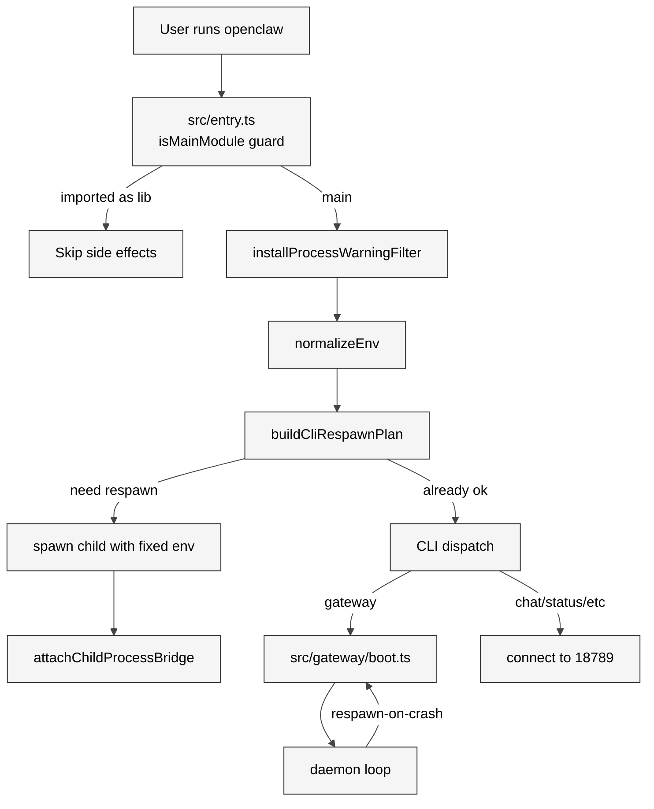

# 07 启动与进程模型

## 本章外部视角

[Peter Steinberger 的 v4.0 "Agent OS" 发布](https://remoteopenclaw.com/blog/openclaw-release-roundup-march-2026) 把 gateway daemon 架构列为旗舰特性；[OpenClaw DC 的 onboard 教程](https://openclawdc.com/blog/openclaw-build-skill/) 把 `openclaw onboard` 视为首个该走的路径。但少有人拆过启动链上真正做了什么。本章回到 [src/entry.ts](../../openclaw-repo/src/entry.ts) 213 行 + [src/bootstrap/](../../openclaw-repo/src/bootstrap) + [src/daemon/](../../openclaw-repo/src/daemon) + [Dockerfile](../../openclaw-repo/Dockerfile) 系列，梳理 respawn / daemon / Docker 三态。

## 一、本质是什么

OpenClaw 的启动模型是"**用户敲 `openclaw` → 决定当前要做什么形态 → 可能 respawn 自己 → 最终只有一个 Gateway**"。三个形态：

1. **CLI 模式**：`openclaw chat` / `openclaw status` / `openclaw skills *` —— 连上 Gateway 发 WS 请求
2. **Gateway 模式**：`openclaw gateway` —— 成为那个长跑 daemon
3. **Daemon wrapper**：`openclaw onboard --install-daemon` —— 把自己装进 launchd/systemd，由 OS 调度

## 二、核心问题和痛点

启动链要处理四件事：

1. **单例**：两个 Gateway 抢 18789 端口会死得很惨
2. **respawn**：macOS Spotlight 或 shell alias 可能以奇怪的方式调起 CLI，要能识别并 respawn 到"正常路径"
3. **Docker vs Host**：同一份代码既要能在 Dockerfile 里作为 image 入口，也要能作为 npm global 命令
4. **冷启动性能**：213 行 entry.ts 不能一次把所有 extension import 进来——会卡 10 秒

## 三、解决思路与方案

<div style="background: #ffffff !important; background-color: #ffffff !important; padding: 16px; border-radius: 8px; margin: 16px 0;" bgcolor="#ffffff">



</div>

关键设计是 **respawn 优先于业务启动** —— 检测到环境不对（NODE_OPTIONS 缺失、路径错、版本错）立刻 spawn 子进程用正确的 env 重来，父进程不参与业务。

## 四、实现细节关键点

### 4.1 isMainModule guard（src/entry.ts:40-48）

```ts
if (!isMainModule({ currentFile: fileURLToPath(import.meta.url), wrapperEntryPairs: [...ENTRY_WRAPPER_PAIRS] })) {
  // Imported as a dependency — skip all entry-point side effects.
}
```

wrapperEntryPairs 里有 `openclaw.mjs` 和 `openclaw.js` 两种 wrapper。这是为了应付"bundler 把 entry.js 打进 dist/index.js 然后两者都可能被执行"的场景，防止 Gateway 启动两次撞 lock。

### 4.2 normalizeWindowsArgv 的 Windows 兼容

[src/entry.ts:8](../../openclaw-repo/src/entry.ts) import 了 `normalizeWindowsArgv`。Windows 上 argv 的空格转义和 Unix 不同——不做 normalize 的话 `openclaw chat "hello world"` 会变成三个参数。这层细节不处理，Windows 用户会遇到大量莫名其妙的 parse 错误。

### 4.3 shouldForceReadOnlyAuthStore（src/entry.ts:20-28）

```ts
function shouldForceReadOnlyAuthStore(argv: string[]): boolean {
  const tokens = argv.slice(2).filter((token) => token.length > 0 && !token.startsWith("-"));
  for (let index = 0; index < tokens.length - 1; index += 1) {
    if (tokens[index] === "secrets" && tokens[index + 1] === "audit") {
      return true;
    }
  }
  return false;
}
```

`openclaw secrets audit` 在 entry 层就被判定为"只读模式运行"——强制设置 `OPENCLAW_AUTH_STORE_READONLY=1`。这是一种**前置 guard**：即便后续代码写了敏感操作，audit 命令在任何路径都不能改写 auth store。

### 4.4 CLI respawn plan

[src/entry.respawn.ts](../../openclaw-repo/src/entry.respawn.ts) 的 `buildCliRespawnPlan()` 检查环境是否需要重跑：

- 是否已经设置 `OPENCLAW_EXEC_MARKER`（表示"这是 respawn 后的子进程"）
- 是否缺失必要的 `NODE_OPTIONS`（比如 `--enable-source-maps`）
- 当前 Node 版本是否 ≥ 22.16

如果要 respawn，`spawn(process.execPath, plan.argv, { stdio: "inherit", env: plan.env })`，父进程把 child 的 exit code 原样返回。

### 4.5 attachChildProcessBridge

[src/process/child-process-bridge.ts](../../openclaw-repo/src/process/child-process-bridge.ts) 的桥把父进程的 signal（SIGINT / SIGTERM）转发给 child，同时把 child 的 `process.send`-style IPC 消息桥接出来。这在 respawn 时重要——Ctrl+C 要能正确传播。

### 4.6 Dockerfile 分层

[Dockerfile](../../openclaw-repo/Dockerfile) 基镜像；[Dockerfile.sandbox](../../openclaw-repo/Dockerfile.sandbox) 是 per-session 沙箱镜像；[Dockerfile.sandbox-browser](../../openclaw-repo/Dockerfile.sandbox-browser) 加了 headless Chromium + CDP；[Dockerfile.sandbox-common](../../openclaw-repo/Dockerfile.sandbox-common) 是公共 layer。四个 Dockerfile 分工清晰，层复用度高——build sandbox-browser 时 sandbox-common 的层是缓存的。

## 五、易错点和注意事项

1. **NODE 版本**：Node 22.16 是下限，24 推荐。低于 22 会在 respawn 阶段被拒
2. **不要直接删 gateway lock**：`~/.openclaw/gateway.lock` 是 Gateway 独占标记；Gateway 正常退出会清掉；手动删可能撞到双实例
3. **respawn 后的 exit code**：child 非 0 退出时父返回 1；如果要区分信号原因，要看 `process.exitCode` 加 signal
4. **Docker 内默认 bind 127.0.0.1**：容器内 localhost 意味着 host 访问不到，除非显式 `-p 18789:18789` 或设 `listen: 0.0.0.0`（和 [Ch02](../Part%20I%20Architecture%20and%20Philosophy/02%20Gateway%20%E6%8E%A7%E5%88%B6%E9%9D%A2%E6%80%BB%E8%A7%88.md) 的"不要乱绑 0.0.0.0"矛盾——docker 场景是例外）
5. **launchd 日志**：`openclaw onboard --install-daemon` 在 macOS 建的 plist 日志落 `~/Library/Logs/openclaw.log`；systemd 落 `journalctl --user -u openclaw`

## 六、竞品对比

- **Claude Code**：无 daemon 概念，每次 CLI 调用独立进程
- **Cursor**：Electron 主进程常驻，但不是"系统级 daemon"
- **Codex CLI**：本地 CLI 过一层 auth 然后直连云端
- **OpenClaw 特点**：把 daemon 形态作为一等形态，并通过 launchd/systemd 自动起——这和 Docker Desktop、Tailscaled 的做法更像

## 七、仍存在的问题和缺陷

1. **crash loop 保护缺失**：如果 Gateway 因 config 错反复 crash，launchd 会不断重启——用户桌面可能被警告弹窗轰炸
2. **respawn 带来日志对齐难**：父子 pid 不同，外部日志收集器（`journalctl`）可能拼不到完整 trace
3. **Windows 的 launcher 还偏弱**：没有 Windows Service 等价安装脚本（社区有人写了，但不是官方）
4. **Docker 模式下 bundled 语音/摄像头 skill 失效**：容器里没有麦克风/摄像头 device——官方没做降级指示

## 下一章预告

第八章进入 **CLI 与命令体系**，从 entry.ts 路径之后分裂到的几百个子命令（`src/cli` 369 files、`src/commands` 528 files）入手，拆 openclaw 命令树的组织方式和 interactive TUI。
