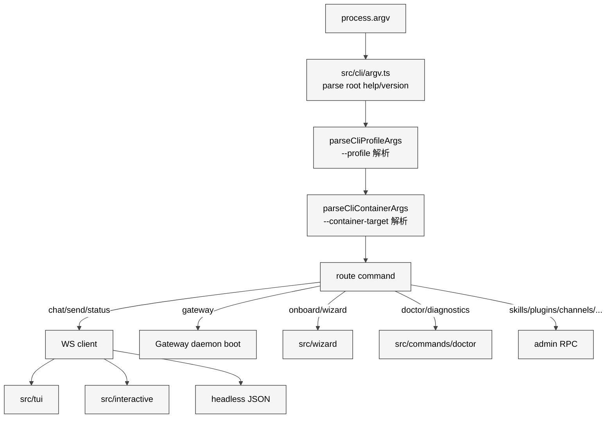

# 08 CLI 与命令体系

## 本章外部视角

社区很少专门讨论 `openclaw` CLI 的命令树——多数教程只覆盖 `onboard / chat / status / gateway`（[OpenClaw DC](https://openclawdc.com/blog/openclaw-build-skill/)、[掘金配置指南](https://juejin.cn/post/7613330850830843954)）。但 [src/cli/](../../openclaw-repo/src/cli) 369 个 TS 文件、[src/commands/](../../openclaw-repo/src/commands) 528 个 TS 文件意味着背后的命令体系远比 README 呈现的复杂。本章做一次"命令地图"梳理。

## 一、本质是什么

OpenClaw CLI 是 **面向 Gateway 的客户端集合**。命令分三类：

1. **local-only**：不需要 Gateway 就能跑（`openclaw --version`、`openclaw doctor --offline`）
2. **client-to-gateway**：默认操作类（`openclaw chat`、`openclaw status`、`openclaw send`、`openclaw skills install`）
3. **daemon-mode**：启动/停 Gateway（`openclaw gateway start`、`openclaw daemon restart`）

这三类共享一个 argv 解析器，但分派到不同的运行时。

## 二、核心问题和痛点

CLI 层要解决：

1. **命令发现**：几百个子命令如何让用户发现——既要短的 `chat`、又要专业的 `secrets audit --since 2026-03-01`
2. **交互 vs 非交互**：同一个 `chat` 命令，在 TTY 里要启 TUI、在 pipe 里要流式输出 JSON
3. **错误信息质量**：JSON5 配置改错了不能只告诉用户 "parse error"，要指出是哪一行哪个字段
4. **i18n**：[docs/zh-CN/](../../openclaw-repo/docs/zh-CN) 暗示中文文档权重高，CLI 本身也要支持中文提示

## 三、解决思路与方案

决定路由的关键变量：是否 TTY、是否 `--json`、`--profile` 指向哪个 config、`--container-target` 是否要进容器。

## 四、实现细节关键点

### 4.1 argv 先行判定

[src/cli/argv.ts](../../openclaw-repo/src/cli/argv.ts) 里 `isRootHelpInvocation` / `isRootVersionInvocation` 直接在 entry 中被引用（[src/entry.ts:6](../../openclaw-repo/src/entry.ts)）。这是为了 `openclaw --help` / `--version` **不启动任何副作用**——连 respawn 都不走。

### 4.2 profile 机制

[src/cli/profile.ts](../../openclaw-repo/src/cli/profile.ts) 的 `parseCliProfileArgs` + `applyCliProfileEnv`，把 `--profile foo` 映射到 `OPENCLAW_PROFILE=foo` 环境变量。Gateway 启动时根据 profile 决定读哪个 config 目录（`~/.openclaw/profiles/foo/openclaw.json`）。这让用户可以跑多个独立 instance（例如"工作"和"家庭"分开）。

### 4.3 container-target

[src/cli/container-target.ts](../../openclaw-repo/src/cli/container-target.ts) 的 `resolveCliContainerTarget` 把 `--container-target docker` / `ssh` / `openshell` 映射到对应的 sandbox backend，作用于需要进沙箱的子命令（典型是 `openclaw exec`、`openclaw browser invoke`）。

### 4.4 interactive TUI

[src/tui/](../../openclaw-repo/src/tui) 是基于 Ink（React for CLI）实现的。`openclaw chat` 默认进入 TUI：左侧 session 列表、中间消息流、右侧 tools 调用可视化。[src/interactive/](../../openclaw-repo/src/interactive) 是更轻量的 REPL，适合 SSH 场景。两者共享消息渲染组件。

### 4.5 wizard

[src/wizard/](../../openclaw-repo/src/wizard) 是 `openclaw onboard` 背后的向导流。它是一个有状态的问答链：

- 检测 Node 版本
- 检测 Docker 是否可用（为 sandbox 准备）
- 选择主 channel（跳过/WhatsApp/Telegram/Slack/…）
- 选择主 model provider
- 写入初始 `openclaw.json`
- 可选：`--install-daemon` 装系统服务

每步是一个独立 "wizard step"，失败可以 resume。

### 4.6 doctor

[src/commands/doctor/](../../openclaw-repo/src/commands/doctor) 是诊断命令合集，对应 [docs/gateway/doctor.md](../../openclaw-repo/docs/gateway/doctor.md)。它的检查包括：config schema、端口冲突、Docker daemon 可达、MD 文件损坏、sandbox image pull 状态等。`openclaw doctor --fix` 会尝试修复能自动修的。

## 五、易错点和注意事项

1. **`openclaw doctor --fix` 不是万能的**：[Issue #6028](https://github.com/openclaw/openclaw/issues/6028) 明确 doctor 修不了所有 config 崩溃，严重时要手动 `openclaw onboard --reset`
2. **TTY 检测**：`openclaw chat | cat` 会自动走 headless 模式不启 TUI——这对 CI 场景友好，但新手容易以为 "没进聊天"
3. **profile 与 secrets 分离**：不同 profile 之间的 secrets 不共享；切 profile 后 API key 要重配
4. **sub-command alias 有限**：`openclaw skills list` 不支持 `ls` alias；简记要背
5. **`--json` 输出格式不保证稳定**：文档里明确只有 `--json@v1` 才承诺稳定（目前版本）；脚本要 pin
6. **wizard resume**：中断后 `openclaw onboard --resume` 可以继续，不要 `onboard --reset` 除非真要从头来

## 六、竞品对比

- **Claude Code CLI**：命令数量少（~20 个），靠 subcommand tree 组织
- **Cursor CLI**：更聚焦"从 IDE 调起"的少量命令
- **OpenClaw**：命令数量最多、层级最深，类似 `kubectl`——代价是学习曲线陡
- **aider**：CLI 以对话为主，几乎没有管理命令

## 七、仍存在的问题和缺陷

1. **help 输出过载**：`openclaw --help` 打印所有 top-level 命令会铺满几屏；没有分组导航
2. **autocomplete 弱**：zsh/fish 的 completion 脚本覆盖不全，对 `openclaw skills install <tab>` 不能补 ClawHub 列表
3. **错误 UX 不均匀**：`doctor` 错误信息很好，但 `openclaw send --channel foo` channel 不存在的错误是 stack trace 而不是友好提示
4. **TUI 在 Windows Terminal 偶有渲染错位**：Unicode 宽字符 + TUI 组件对齐问题，[Issue #8731](https://github.com/openclaw/openclaw/issues/8731) 有间接反映

## 下一章预告

第九章进入 **路由、Hooks 与 Auto-reply**，沿着一条消息从 channel 进入 Gateway 后，拆它是怎么被分派到 agent 的、哪些 hook 可以拦截、auto-reply 策略如何决定"要不要自动回应"。
