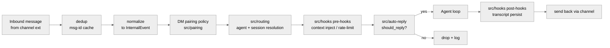

# 09 路由 Hooks 与 Auto-reply

## 本章外部视角

[技术栈飞书分析](https://jishuzhan.net/article/2036009670641516546) 描述"验单—分单"阶段用了 `dispatchReplyFromConfig()`；[人人都是产品经理拆解](https://www.woshipm.com/it/6350530.html) 把"反共识"中的其中一条放在"auto-reply 默认 off"——这是 OpenClaw 与很多 chatbot 框架的分水岭。本章基于 [src/routing/](../../openclaw-repo/src/routing)、[src/hooks/](../../openclaw-repo/src/hooks)（54 files）、[src/auto-reply/](../../openclaw-repo/src/auto-reply)（458 files）和 [extensions/thread-ownership](../../openclaw-repo/extensions/thread-ownership) 补齐。

## 一、本质是什么

一条消息从 channel extension 抵达 Gateway 之后，必须经过四道闸：

1. **dedup**：是不是已经处理过（webhook 重试是家常便饭）
2. **routing**：该派给哪个 agent / session
3. **hooks**：各插件注册的前置/后置钩子（mutate 消息、注入 context、拒绝等）
4. **auto-reply policy**：到底要不要回应（群聊里没 @ 我的消息不应该被回应）

没走完这四步就进 agent loop 会造成"回错人""刷屏""泄密"——因此这层是 channel 适配之外最需要保证正确的部分。

## 二、核心问题和痛点

1. **多 channel 去重**：同一条消息在 Slack 可能触发 `message.im` 和 `message.channels` 两个 event，webhook 还可能重发
2. **多用户共享一个 channel**：飞书群里 20 人都在说话，哪些是对 agent 说的
3. **线程归属**：Slack 的线程 mid-conversation 加入 agent，它该不该回当前线程所有历史
4. **auto-reply 在不同场景**：DM 默认回；群聊默认只回 @；广播频道默认不回

## 三、解决思路与方案

四个阶段（dedup / routing / hooks / auto-reply）的核心 insight 是：**auto-reply 在 agent loop 之前，不是之后**。也就是说"要不要回应"不是模型的决定，是 Gateway 的策略决定——这是 OpenClaw 与 "LLM 想回就回" 这类框架的本质区别。

## 四、实现细节关键点

### 4.1 dedup 的策略

去重 key 通常是 `channelType + channelId + eventId`。webhook 重试、client retry 都会让同一 event 到达两次。[src/routing](../../openclaw-repo/src/routing) 维护 in-memory LRU + 持久化到 session transcript。

### 4.2 dispatch 配置

[技术栈文档](https://jishuzhan.net/article/2036009670641516546) 提到的 `dispatchReplyFromConfig()` 对应 `config.routing.rules`——一个数组，每条 rule 有 `match`（channel/user/group）和 `agent`。运行时顺序匹配，第一个命中即分派。没命中走 `default.agent`。

### 4.3 hooks 层的双向钩子

[src/hooks](../../openclaw-repo/src/hooks) 的 54 个文件里有至少两类钩子：

- **pre-hooks**：loop 开始前执行；可以 mutate event（比如为飞书的 cardActionEvent 解包）、可以 reject（比如 rate-limit 超限）
- **post-hooks**：loop 结束后执行；可以做 transcript persist / analytics / notification

这是标准的 "Filter + Pipeline" 模式，类似 Express 的 middleware。

### 4.4 auto-reply 策略由 channel 决定默认值

[src/auto-reply](../../openclaw-repo/src/auto-reply) 的 458 files 说明它是个复杂模块。关键策略：

- **DM**：默认 `reply-all`，但对陌生人（未配对）走 pairing 流程
- **group/channel**：默认 `reply-when-mentioned`（@bot 或回复 bot 消息）
- **broadcast / announcement**：默认 `reply-never`
- **thread**：有 `thread-ownership` 插件（[extensions/thread-ownership](../../openclaw-repo/extensions/thread-ownership)）可决定"agent 是不是这个 thread 的主要回复者"

### 4.5 thread-ownership 的设计

[extensions/thread-ownership](../../openclaw-repo/extensions/thread-ownership) 单独成扩展，因为"谁拥有 thread" 对应不同 channel 的语义（Slack thread / WhatsApp group / Discord channel / Feishu threadable message），不能一概而论。它维持一个 per-channel mapping 告诉 Gateway 哪些 thread 归哪个 agent 回复。

### 4.6 pairing 与 routing 的交互

[docs/gateway/pairing.md](../../openclaw-repo/docs/gateway/pairing.md)：当 unknown DM 进来时，先走 pairing flow（agent 给对方发 "I'm OpenClaw, do you want to pair?"），对方同意后才能进 routing。未配对的消息进 routing 前就被 drop。这是 "身份优先安全模型" 在消息入口的落地。

## 五、易错点和注意事项

1. **不要绕过 dedup 直接触发 agent**：webhook 重试会被 agent "答两次"
2. **DM pairing 的关闭**：`dmPolicy="open"` 会关掉 pairing——极度不推荐
3. **rule 顺序敏感**：`config.routing.rules` 顺序重要；写错顺序会让 "具体 channel 的 override" 被 "general default" 抢走
4. **群聊里 agent 不应自言自语**：auto-reply 策略里要排除 "上一条消息是 agent 自己发的" 的情况，否则 hook 链错用容易死循环
5. **hook 可以阻塞 event**：pre-hook 抛异常等于 reject；写 hook 时不要吃异常
6. **thread-ownership 失效**：extension 被禁用时，thread reply 会退回到 `mention-only` 策略

## 六、竞品对比

- **Claude Code**：没有 channel，不存在 routing/auto-reply
- **Typical chatbot framework (Rasa / Botkit)**：routing 和 auto-reply 是"回答用户问什么"维度；OpenClaw 是"要不要回答"维度，属于前置逻辑
- **Slack bot / Telegram bot**：各自 SDK 自带基础路由，但没有 "跨 channel 统一策略" 的抽象
- **OpenClaw 独特性**：auto-reply 不是 LLM 决策，而是策略层决策——这在 agent 框架里是独有设计

## 七、仍存在的问题和缺陷

1. **routing rule DSL 太弱**：只有 match-field + equals，没有正则、没有组合条件（and/or）；复杂场景要自己写 custom rule plugin
2. **hook 顺序没有 topological 解析**：多个 hook 都声明 "run before X" 时顺序会飘
3. **auto-reply strategy 与用户预期不一致**：新用户装完 agent 发现群聊 "不理我"，多数是 auto-reply 策略正确工作但没人告诉用户
4. **thread-ownership 在 channel 频繁 rename/rearchive 时会漂**：Slack 归档线程后再激活，thread owner 可能丢
5. **rate-limit 与 channel 自身 rate-limit 不同步**：两边独立；极端场景会互相抵消

## 下一章预告

第十章进入 **Tools Canvas 与 Nodes**，离开消息路由层，进入 agent 执行过程中真正"做事"的 tools 系统——包括 Live Canvas（A2UI）、browser 工具、远程 Node 能力调用。
