# 10 Tools Canvas 与 Nodes

## 本章外部视角

几乎所有同类项目都有 "tool calling"，但 OpenClaw 拉开差距的是 **Live Canvas**（把 tool 输出渲染成可交互 UI）和 **Nodes**（把手机/平板/浏览器/SSH 机器接入成一个"远端能力"）。[Peter Steinberger 3 月直播](https://x.com/steipete) 重点演示的就是这两个——前者让 agent 有"屏幕"，后者让 agent 有"手"。本章基于 [src/canvas-host](../../openclaw-repo/src/canvas-host)、[src/node-host](../../openclaw-repo/src/node-host)、[src/browser-lifecycle-cleanup.ts](../../openclaw-repo/src/browser-lifecycle-cleanup.ts) 和 [vendor/a2ui](../../openclaw-repo/vendor/a2ui) 补齐。

## 一、本质是什么

agent 执行过程里的 "做事" 分三类：

1. **内置 tools**：文件读写、命令执行、搜索——跑在 Gateway/sandbox
2. **Live Canvas 输出**：agent 返回的 "UI 组件"，在 client 侧渲染成可点击 UI（例如聊天里出现 "选择文件 / 查看图表 / 审批" 按钮）
3. **Nodes 代为执行**：把命令 dispatch 到一个注册过的节点（手机、家里的 Mac、另一台 SSH 机）执行

Canvas 扩展 "输出" 的维度；Nodes 扩展 "执行" 的维度——而它们共享同一条 WebSocket 通道。

## 二、核心问题和痛点

1. **tool 结果不是 JSON 就能表达**：让 agent 帮选图、比对方案时，纯文字描述效率太低
2. **user 环境多样**：真正干活的"手"可能在手机相册、家里的 Mac、工位的 Linux——Gateway 跑在云或笔电，怎么接过去
3. **browser 工具生命周期**：headless browser、Playwright、Chrome 实例非常容易残留进程
4. **信任边界**：远端节点能执行多危险的操作？（rm / shell 都能做，怎么限制？）

## 三、解决思路与方案

```mermaid
%%{init: {'theme': 'neutral', 'themeVariables': {'background': '#ffffff', 'primaryColor': '#f5f5f5', 'primaryTextColor': '#000000', 'primaryBorderColor': '#333333', 'lineColor': '#444444', 'textColor': '#000000', 'mainBkg': '#f5f5f5', 'nodeBorder': '#333333', 'clusterBkg': '#fafafa', 'clusterBorder': '#888888', 'edgeLabelBackground': '#ffffff', 'actorBkg': '#f5f5f5', 'actorBorder': '#333333', 'actorTextColor': '#000000', 'actorLineColor': '#444444', 'signalColor': '#444444', 'signalTextColor': '#000000', 'noteBkgColor': '#f0f0f0', 'noteTextColor': '#000000', 'noteBorderColor': '#888888'}}}%%
flowchart TB
    subgraph Client["Client / UI layer"]
        WebUI[web-ui]
        MacApp[macOS app]
        iOSApp[iOS app]
        AndroidApp[Android app]
    end
    subgraph Gateway["Gateway + Agent loop"]
        Agent[Agent Think-Act-Observe]
        CanvasHost[canvas-host<br/>A2UI renderer bridge]
        NodeHost[node-host<br/>remote capability router]
        BrowserLC[browser-lifecycle-cleanup]
    end
    Agent -->|emit UI JSON| CanvasHost
    CanvasHost -->|render component tree| Client
    Client -->|user action| CanvasHost
    CanvasHost --> Agent
    Agent -->|dispatch cmd| NodeHost
    NodeHost -->|WS channel| iOSApp
    NodeHost -->|WS channel| AndroidApp
    NodeHost -->|WS channel| MacApp
    NodeHost --> BrowserLC
    BrowserLC -->|cleanup| Agent
```

三个关键设计决定：

- **Canvas 走 A2UI 协议**（[vendor/a2ui](../../openclaw-repo/vendor/a2ui)）：一种 "agent to UI" 的 JSON 描述格式，类 React 组件树，平台独立
- **Node 协议沿用 Gateway WebSocket**：手机 App 注册成 node 相当于 "既是 UI client 又是 execution provider"
- **browser 工具生命周期单独抽一个模块**（[src/browser-lifecycle-cleanup.ts](../../openclaw-repo/src/browser-lifecycle-cleanup.ts)）：因为这是历史上最多 leak 的东西

## 四、实现细节关键点

### 4.1 A2UI 的最小构件

[vendor/a2ui](../../openclaw-repo/vendor/a2ui) 把 agent 返回的 JSON 解释成一棵组件树。支持 `text / button / image / list / form / chart`。组件只有 descriptive props（没有 JS），所以客户端渲染是安全的。

### 4.2 Canvas 如何回传 user action

渲染出的 "approve/deny/select" 按钮，每个都绑定了一个 `actionId`。用户点击后走 Gateway 回到 agent 的 tool result，形成 "agent 出题—user 作答—agent 继续" 的循环。

### 4.3 Canvas 的 main vs non-main 差异

跟 session 一致：`main session` 的 canvas 有更高的 UI 能力（例如可以直接显示文件系统选择器）；`non-main` 只能显示 "inert" 组件，防止恶意外部消息通过 canvas 让用户误操作。

### 4.4 Node 注册流程

手机 App 启动后：扫二维码 → 获得 pairing token → WebSocket 连 Gateway → 注册能力清单（camera / photos / contacts / shell）。Gateway 把这些能力作为可调用 tool 加入 agent 的工具集。

### 4.5 Node 能力声明

每种 node 在 [src/node-host](../../openclaw-repo/src/node-host) 里有 capability schema。例如 Android node 可以 `sendSms / readNotifications / runShell`，iOS node 只能 `sendSms / getLocation / takePhoto`（因为 iOS 不允许 shell）。

### 4.6 browser 清理的韧性

[src/browser-lifecycle-cleanup.ts](../../openclaw-repo/src/browser-lifecycle-cleanup.ts) 在进程退出前 `tryKillBrowsers()`，并在每次 agent 结束时回收。代码里有多条 OS-specific 兜底（macOS `killall`、Linux `pkill`），说明历史上真的出过残留。

## 五、易错点和注意事项

1. **canvas 组件不是无限的**：A2UI 支持的组件列表有限；超出范围会 fallback 成 text
2. **canvas action 没有 debounce**：用户狂点会让 agent 重复触发；该在 client 侧节流
3. **node 注册 token 是一次性**：丢失需重新扫码；这是设计选择，不是 bug
4. **node 执行需要 per-session 沙箱**：即便能力声明允许 shell，实际执行也要经 session 层的 "main vs non-main" 再次校验
5. **browser 泄漏的常见诱因**：tool 调用 `browser.close` 漏掉 / debug 模式切短路径 / agent crash 未触发 cleanup
6. **canvas 的敏感数据**：发到 client 的 UI JSON 就是明文，敏感字段（API key、token）绝对不能放 canvas props

## 六、竞品对比

- **Claude Code**：没有 canvas，输出全是文本；没有 node 概念
- **Cursor / Continue**：有"在 IDE 里渲染特殊 UI"，但绑定 IDE；A2UI 是跨客户端的
- **OpenAI ChatGPT**：有 canvas 概念（Canvas、DALL-E 预览），但不是开源协议
- **Telegram bot API**：InlineKeyboard 类似，但只有按钮；没有 form/chart
- **OpenClaw 独特**：A2UI + Node 把"UI 输出"和"远端执行"都做成可扩展协议

## 七、仍存在的问题和缺陷

1. **A2UI 组件演化**：新增组件需要同时更新 web/ios/android/macOS 客户端，发布节奏对齐困难
2. **node 能力 drift**：iOS 新版系统可能限制某些 API；声明侧无法自动感知
3. **browser-lifecycle-cleanup 只处理已知浏览器**：第三方 browser tool 装进 skill 后不受它管
4. **canvas 无法表达流式内容**：chart 一旦送出就是静态；"边跑边画"要靠多次 canvas 更新
5. **node WS 断开重连**：长期挂载的手机 node 在网络波动时会错过指令；需要补齐离线队列

## 下一章预告

第十一章进入 **实时语音与转写**——OpenClaw 的 Voice Wake、Talk Mode、Deepgram/ElevenLabs/Sherpa-ONNX 三路 TTS，以及实时转写流式管道。
