# 11 实时语音与转写

## 本章外部视角

Peter 在 2026-03 直播开头用的是"按住说话 → 立刻回答"的 Talk Mode，而不是打字。这是 OpenClaw 与大多数 coding agent 的分水岭——它是**为语音优先设计的**个人助手。本章基于 [src/realtime-voice](../../openclaw-repo/src/realtime-voice)、[src/realtime-transcription](../../openclaw-repo/src/realtime-transcription)、[src/tts](../../openclaw-repo/src/tts)、[extensions/deepgram](../../openclaw-repo/extensions/deepgram)、[extensions/elevenlabs](../../openclaw-repo/extensions/elevenlabs)、[extensions/talk-voice](../../openclaw-repo/extensions/talk-voice)、[extensions/voice-call](../../openclaw-repo/extensions/voice-call)、[extensions/speech-core](../../openclaw-repo/extensions/speech-core) 和 [skills/sherpa-onnx-tts](../../openclaw-repo/skills/sherpa-onnx-tts) 补齐。

## 一、本质是什么

语音链路在 OpenClaw 拆成三层：

1. **采集层**：客户端（macOS 按快捷键 / iOS 按 PTT / 电话 voice-call）把 PCM 流回传
2. **STT 层**：[src/realtime-transcription](../../openclaw-repo/src/realtime-transcription) 接收音频帧，经 provider 转成文字
3. **TTS 层**：[src/tts](../../openclaw-repo/src/tts) 把 agent 回复合成为音频流推回

整条链的底层是**流**，而不是"录完再转"。这是 "实时" 的关键。

## 二、核心问题和痛点

1. **延迟预算**：人对语音回应容忍 < 500ms；STT + LLM + TTS 三跳加起来容易超
2. **唤醒与误触发**：不能一直监听，也不能错过真正想说话的时刻
3. **provider 多样**：Deepgram、ElevenLabs、Sherpa-ONNX 能力和价格差异大
4. **电话 channel**：voice-call 要对接 SIP/WebRTC，属于完全不同协议

## 三、解决思路与方案

```mermaid
%%{init: {'theme': 'neutral', 'themeVariables': {'background': '#ffffff', 'primaryColor': '#f5f5f5', 'primaryTextColor': '#000000', 'primaryBorderColor': '#333333', 'lineColor': '#444444', 'textColor': '#000000', 'mainBkg': '#f5f5f5', 'nodeBorder': '#333333', 'clusterBkg': '#fafafa', 'clusterBorder': '#888888', 'edgeLabelBackground': '#ffffff', 'actorBkg': '#f5f5f5', 'actorBorder': '#333333', 'actorTextColor': '#000000', 'actorLineColor': '#444444', 'signalColor': '#444444', 'signalTextColor': '#000000', 'noteBkgColor': '#f0f0f0', 'noteTextColor': '#000000', 'noteBorderColor': '#888888'}}}%%
flowchart LR
    Mic[mic / PTT / SIP] --> WakeOrPTT["wake word OR push-to-talk"]
    WakeOrPTT --> STTClient[realtime-transcription client]
    STTClient --> STTProvider{STT provider}
    STTProvider -->|deepgram| Deepgram
    STTProvider -->|openai-realtime| OAIRT[OpenAI Realtime]
    STTProvider -->|sherpa-onnx local| Sherpa
    Deepgram --> PartialText[partial text stream]
    OAIRT --> PartialText
    Sherpa --> PartialText
    PartialText --> Agent[Agent loop]
    Agent --> TextOut[streamed answer]
    TextOut --> TTSRouter{TTS provider}
    TTSRouter -->|elevenlabs| EL[ElevenLabs]
    TTSRouter -->|openai-tts| OAITTS[OpenAI TTS]
    TTSRouter -->|sherpa-onnx local| SherpaTTS
    EL --> SpeakerOut[speaker / SIP]
    OAITTS --> SpeakerOut
    SherpaTTS --> SpeakerOut
```

四个设计选择：

- **默认 push-to-talk，而非 wake-word**：减少误触发（用户的 "嘿 Siri" 疲劳）
- **provider 可替换**：同 provider router 模式，云端 / 本地都能跑
- **partial text stream 直接喂给 agent**：agent 可以 "边听边准备回复"
- **TTS/STT 同源 provider 不是必须**：Deepgram STT + ElevenLabs TTS 是常见组合

## 四、实现细节关键点

### 4.1 Push-to-Talk 在不同平台的实现

- **macOS**：全局快捷键 + menubar overlay（[apps/macos](../../openclaw-repo/apps/macos)）
- **iOS**：系统 shortcut 绑定 + 通话 UI
- **Android**：Accessibility 服务 + notification PTT
- **电话**：SIP inbound 视为隐式 PTT（接通即开始录）

### 4.2 wake-word（选项）

不是默认启用。[extensions/speech-core](../../openclaw-repo/extensions/speech-core) 有关键词检测实现，本地模型运行。启用需要用户显式打开。

### 4.3 partial text 的边听边答

Deepgram 等 provider 会推送 `is_final: false` 的 partial 结果。agent 可以选择等 `final` 再开始（稳定），或者在 partial 就启动（更快但偶尔重来）。默认 final-only。

### 4.4 barge-in

[src/realtime-voice](../../openclaw-repo/src/realtime-voice) 支持 barge-in：用户在 agent 说话时打断 → TTS 立即停止 → 进入新的 STT 循环。这是电话体验里极重要的细节。

### 4.5 本地 fallback：Sherpa-ONNX

[skills/sherpa-onnx-tts](../../openclaw-repo/skills/sherpa-onnx-tts) 提供完全离线的 TTS 路径。搭配 [extensions/speech-core](../../openclaw-repo/extensions/speech-core) 本地 STT，可以在无网环境跑完整语音链。

### 4.6 voice-call 电话通道

[extensions/voice-call](../../openclaw-repo/extensions/voice-call) 把 agent 接到电话：inbound 电话响铃 → agent 接听 → 接入 STT/TTS → 作为一个新的 channel。

## 五、易错点和注意事项

1. **采样率 / 编码不统一**：macOS 默认 48kHz；多数 STT provider 要 16kHz PCM；客户端要 resample
2. **PTT 按键释放时机**：过早释放会截断句尾；加 100ms grace
3. **TTS 开始前的 chunking**：一次性生成整段再播，会损失流畅度；应流式 chunk
4. **多人环境**：没有说话人分离（speaker diarization）情况下，背景声会被当成用户输入
5. **本地模型 CPU 峰值**：Sherpa-ONNX 在低端 Mac 上 CPU 飙高时会掉帧
6. **voice-call 的 legal notice**：某些地区电话录音需要告知；是合规而非工程问题

## 六、竞品对比

- **Claude Code / Cursor**：无语音
- **Siri / Google Assistant**：wake-word-first；OpenClaw 反其道而行（PTT-first）
- **OpenAI Realtime / ChatGPT voice**：端到端 voice model，最低延迟；OpenClaw 是 pipeline 架构，换 provider 灵活
- **Rasa / Dialogflow CX**：有 voice 集成但主要是电话 IVR；与个人助手差距大

## 七、仍存在的问题和缺陷

1. **延迟抖动**：provider 负载波动会让一次"慢 2 秒"；没有自动 failover 到本地
2. **TTS 语种覆盖**：中文场景 ElevenLabs 表现一般，Sherpa-ONNX 中文声音偏机械
3. **speaker diarization 缺位**：家庭/办公多人场景体验差
4. **realtime 日志过大**：partial transcription 每 100ms 一条，很容易把 transcript 吃爆
5. **barge-in 在 SIP 场景不稳**：voice-call 的 G.711 编解码使得 half-duplex 场景难以立即停 TTS

## 下一章预告

第十二章进入 **多媒体生成与理解**——image/video/music 三条生成链、media-understanding、link-understanding（URL/PDF/图片解析）。
