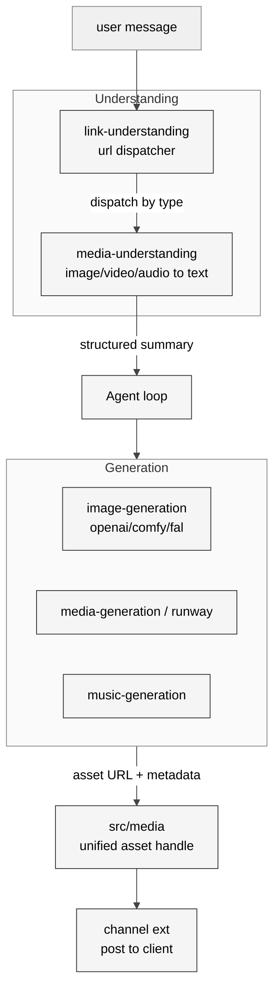

# 12 多媒体生成与理解

## 本章外部视角

技术自媒体常把 OpenClaw 定位成 "聊天助手"，但它其实在源码里为每一种模态都留了 first-class 支持：图像生成（ComfyUI/FAL/OpenAI）、视频生成（Runway）、音乐生成（Suno/MusicGen），以及反向的 "文件/链接 → 文本" 的 understanding。本章基于 [src/image-generation](../../openclaw-repo/src/image-generation)、[src/media](../../openclaw-repo/src/media)、[src/media-generation](../../openclaw-repo/src/media-generation)、[src/media-understanding](../../openclaw-repo/src/media-understanding)、[src/music-generation](../../openclaw-repo/src/music-generation)、[src/link-understanding](../../openclaw-repo/src/link-understanding)、[extensions/comfy](../../openclaw-repo/extensions/comfy)、[extensions/runway](../../openclaw-repo/extensions/runway)、[extensions/fal](../../openclaw-repo/extensions/fal) 补齐。

## 一、本质是什么

多媒体能力在 OpenClaw 分两条主动脉：

1. **Generation**（输出）：agent 给定 prompt，provider 返回媒体资源（image/video/music）
2. **Understanding**（输入）：用户发来 URL / PDF / 图片 / 视频，系统把它转成 agent 可读的结构化上下文

两条动脉都走"可替换 provider"模式，和模型 provider 的思路同构。

## 二、核心问题和痛点

1. **模态异构**：image 是单帧 blob，video 是时序流，music 是 audio；存储、传输、预览方式各异
2. **provider 价格和能力差异大**：Runway 好看但贵；FAL 快但可控性差；Comfy 本地灵活但需要显卡
3. **链接里有太多种东西**：URL 可能是网页、PDF、图片、甚至另一个 agent 的 canvas 分享
4. **结果回传给 channel 的适配**：Slack 一张图 OK，QQ 群就要改协议发送

## 三、解决思路与方案

三个核心设计：

- **统一 asset 抽象**（[src/media](../../openclaw-repo/src/media)）：所有 generated / uploaded 资源归一成 `{id, mimeType, url, previewUrl, exifOrProbe}`
- **link-understanding 是 dispatcher**：先识别链接类型，再派给子 handler（HTML scraper / PDF extractor / image vision）
- **understanding 输出 "token 节省" 视图**：长 PDF 不全塞进 context，而是 summary + per-page outline + 可按需拉全文

## 四、实现细节关键点

### 4.1 image-generation 的 provider 选择

[src/image-generation](../../openclaw-repo/src/image-generation) 按 skill 指定 or 按配置默认选择 provider。典型：

- **OpenAI gpt-image / DALL-E**：通用，API 稳定
- **FAL**：速度快，多款 SOTA 开源模型
- **Comfy**：本地 workflow，最灵活但需运维

### 4.2 视频生成的异步模型

video 不是同步生成。[src/media-generation](../../openclaw-repo/src/media-generation) 把 Runway 任务轮询包装成 "异步 tool call" + 通知：agent 发出任务 → 立即返回 "正在生成 (job: xxx)" → 完成后通过 hook 把结果注入后续 context。

### 4.3 link-understanding 的类型识别链

[src/link-understanding](../../openclaw-repo/src/link-understanding) 顺序：

1. HEAD 请求拿 `Content-Type`
2. 匹配成 `image/* / application/pdf / video/*` 就派给对应 media handler
3. 否则当 HTML：fetch + readability + 标题 + 正文 outline
4. YouTube、Reddit、GitHub、Twitter 等热门站点走专用 scraper

### 4.4 PDF 抽取策略

[src/media-understanding](../../openclaw-repo/src/media-understanding) 对 PDF 使用 "骨架 + 按需拉取"：先用 text layer 抽取目录 + 每页前若干字作为 summary 入 context；用户 / agent 继续追问时按页号拉详情。避免一次性塞几万 token。

### 4.5 图片/视频理解

调用 vision 模型（OpenAI vision、Gemini、Claude vision）生成描述；结果 cache by file hash，防止重复花费。视频做抽帧 + 汇总。

### 4.6 asset 的持久化

generated asset 存 `~/.openclaw/assets/<hash>.<ext>`（本地）或配置的对象存储；channel 发送时优先复用，避免上传两次。

## 五、易错点和注意事项

1. **不要把原始 media blob 塞进 context**：应该把 URL / structured summary 塞，blob 留给 attachment 通道
2. **link-understanding 要做 SSRF 校验**：file:// / localhost / 私网网段必须拒绝
3. **PDF 中文字体缺 embed 时抽取会乱码**：需要 OCR fallback
4. **video 任务轮询失败**：Runway 偶尔会 timeout；必须有 "已失败" 终态通知而不是无限轮询
5. **vision cache 按 hash**：hash 算错（例如没去 EXIF）会导致 cache miss 大量
6. **channel 尺寸限制**：Slack image < 1GB、Discord < 8/25/100MB 分档、QQ 更严格；发送前要检查

## 六、竞品对比

- **Claude / ChatGPT**：内置 image/video，但 provider 不可替换
- **Cursor / Codex**：几乎无媒体生成关注
- **ComfyUI**：本身是视觉工具；OpenClaw 调用它作为 backend
- **OpenClaw 独特**：media 与 channel 解耦 + understanding 与 generation 对称，这种整洁结构在开源 agent 里少见

## 七、仍存在的问题和缺陷

1. **provider price 监测缺失**：用户不知道这次生图是 $0.01 还是 $0.5
2. **异步任务失败无标准通知**：Runway 失败有时需要 user 追问才知道
3. **link-understanding cache 未共享**：同一 URL 不同 session 要重新抓
4. **OCR / 视频抽帧参数不可调**：高清文档扫描遇上稀疏表格会漏
5. **asset 存储无 retention policy**：长期累积会打满磁盘

## 下一章预告

第十三章进入 **安全、沙箱与配对**，这是 OpenClaw 最敏感的模块，也是 CVE-2026-25253 的背景与后续加固的方向。
