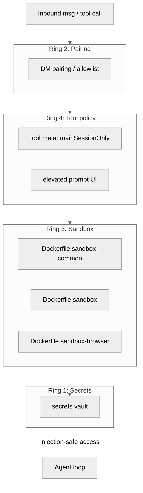

# 13 安全 沙箱与配对

## 本章外部视角

[NVD CVE-2026-25253](https://nvd.nist.gov/vuln/detail/CVE-2026-25253) 把 OpenClaw 拉入公共视线——一个 non-main session 越权触发主会话级 tool 的 RCE，CVSS 9.1。官方的修复就落在本章涉及的三个目录：[src/security](../../openclaw-repo/src/security)、[src/pairing](../../openclaw-repo/src/pairing)、[src/secrets](../../openclaw-repo/src/secrets) + `Dockerfile.sandbox` 系列。[SECURITY.md](../../openclaw-repo/SECURITY.md) 是官方声明，[docs/gateway/sandbox-vs-tool-policy-vs-elevated.md](../../openclaw-repo/docs/gateway/sandbox-vs-tool-policy-vs-elevated.md) 是矩阵化的说明。

## 一、本质是什么

OpenClaw 的安全模型可以拆成四个同心环：

1. **secrets**：密钥不在代码 / 配置里，在 secrets vault 里
2. **pairing**：未知来源消息必须经人肉确认（DM pairing）
3. **sandbox**：高危 tool 跑在 Docker 容器，不跑在 host
4. **tool policy**：即使在沙箱里，仍有 "main session only" 的策略门

四环叠加形成 "在 channel 里诱骗 agent 运行恶意命令" 这类攻击的纵深防御。

## 二、核心问题和痛点

1. **通道 = 新的攻击面**：任何 channel 进来的消息都是不受信的输入
2. **main session 的高权能被非 main 诱导**：这是 CVE-2026-25253 的根因
3. **skill 生态 = 供应链攻击面**：`ClawHavoc` 事件说明社区 skill 必须当不受信代码对待
4. **secrets 既要方便 agent 使用，又要防止 prompt injection 泄漏**

## 三、解决思路与方案

三个核心原则：

- **"main-only" 是 tool 元数据属性**，而不是靠代码分支里检查
- **sandbox 分层**：`-common` → `-base` → `-browser` 依次 extend，镜像瘦身且便于更新
- **elevated 操作必须 UI prompt**：改 config、写系统目录、写 ssh key 这类动作，总是弹框

## 四、实现细节关键点

### 4.1 pairing 的三档策略

[docs/gateway/pairing.md](../../openclaw-repo/docs/gateway/pairing.md) 定义：

- `strict`（默认）：未 pair 的 DM 被 drop，要求 user 主动 `/pair`
- `open`：所有 DM 走 agent（极度不推荐，面向开发）
- `allowlist`：预置白名单；非白名单走 strict

### 4.2 DM pairing 的握手

未知来源第一条 DM → agent 返回 pairing 邀请（带一次性 code）→ 用户在 CLI 或 macOS App 确认 → 对方加入 pair 表。之后的 DM 才进 agent。

### 4.3 sandbox 的三层 Dockerfile

- [Dockerfile.sandbox-common](../../openclaw-repo/Dockerfile.sandbox-common)：最小 base（node + 基础库）
- [Dockerfile.sandbox](../../openclaw-repo/Dockerfile.sandbox)：在 common 上装 agent runtime + skill runner
- [Dockerfile.sandbox-browser](../../openclaw-repo/Dockerfile.sandbox-browser)：在 sandbox 上再装 Playwright/Chromium

### 4.4 tool policy vs sandbox vs elevated

[docs/gateway/sandbox-vs-tool-policy-vs-elevated.md](../../openclaw-repo/docs/gateway/sandbox-vs-tool-policy-vs-elevated.md) 是矩阵：

|  | sandbox | tool policy | elevated |
|---|---|---|---|
| 作用对象 | 执行环境 | tool 调用 | 敏感资源 |
| 谁定义 | Docker | tool meta | user settings |
| 举例 | `runShell` 在容器 | `systemAdmin` main-only | 改 ssh key 弹框 |

三层是串联的：先过 policy，再过 sandbox；sandbox 内再过 elevated。

### 4.5 secrets 的 injection-safe 访问

[src/secrets](../../openclaw-repo/src/secrets) 提供 `getSecret(name)` API，但 **不把 secret 实际值放到 agent context**。tool 侧 "以 name 使用"，由 Gateway 在 tool exec 时替换。这样模型不会直接看到 secret。

### 4.6 ClawHub + VirusTotal

[extensions/kilocode](../../openclaw-repo/extensions/kilocode) 和 [skills](../../openclaw-repo/skills) 的分发链路里，ClawHub 在 install 阶段把 skill 包交 VirusTotal 扫；known malicious 不允许装。这是 `ClawHavoc` 后的应急加固。

### 4.7 CVE-2026-25253 的后续修复

基于 commit 2026-03 到 2026-04 的提交密度（`security-sandbox` 类 PR 在 2026-04 占 96 / ~900 合并 PR），可以看到集中补洞期：tool policy 从字符串改 schema + 默认值从 `any` 改 `mainOnly` + 引入 pairing strict。

## 五、易错点和注意事项

1. **自写 tool 忘记声明 policy**：没声明等于 `default: any`；修复后默认改 `mainOnly`
2. **sandbox 镜像漂移**：本地 `pull` 慢 / 离线时会用上旧镜像，潜在 CVE 窗口
3. **secrets 被 skill 间接暴露**：skill 把 secret echo 到日志 / 错误消息 → 再被模型看到
4. **pairing allowlist 同步**：多 device 情况下 allowlist 写本地，多端要同步
5. **elevated prompt 被连发**：UX 上不能 spam prompt，否则用户会习惯性点"允许"
6. **Dockerfile.sandbox-browser 膨胀**：Chromium 带 1GB+，镜像维护要慎重

## 六、竞品对比

- **Claude Code**：有自己的沙箱（但以"单机 coding"为边界）
- **Cursor**：IDE 级信任（没有 channel）
- **Rasa / LangChain**：不做 sandbox；依赖用户自己包 Docker
- **OpenClaw 独特**：纵深防御 + main/non-main 会话分层，这是针对 channel 攻击面的专属设计

## 七、仍存在的问题和缺陷

1. **pairing UX 粗糙**：第一次 pair 对非技术用户来说仍繁琐
2. **sandbox 启动冷**：首次 `docker run` 有秒级延迟，影响"立刻能用"的感知
3. **skill 仍以信任安装**：VirusTotal 覆盖有限，行为级检测尚未成型
4. **tool policy 非全量**：老 extension 仍在逐步迁移；默认 fallback 期间存在灰色地带
5. **secrets rotation** 缺少标准流程：rotate 需要重启 / 重 pair

## 下一章预告

Part II 收官；第十四章进入 Part III，展开 **Channels 抽象与 DM 策略**——把安全模型落到具体通道（WhatsApp/Telegram/Slack/Discord 等）上。
