# 14 Channels 抽象与 DM 策略

## 本章外部视角

[awesome-openclaw-usecases](https://github.com/VoltAgent/awesome-openclaw-skills) 里用户关心的第一件事就是 "它能装哪些通道"。Channels 是 OpenClaw 区别于 "只在 IDE 里聊天" 的 coding agent 最明显的能力。本章基于 [src/channels](../../openclaw-repo/src/channels)、[src/channel-web.ts](../../openclaw-repo/src/channel-web.ts) 和 [extensions/whatsapp / telegram / slack / discord / signal / matrix / msteams / googlechat](../../openclaw-repo/extensions) 汇总——也会引用 PR 数据（channel: telegram 78 / discord 54 / msteams 41 / matrix 38 / whatsapp-web 36 / slack 35，见 Appendix B）。

## 一、本质是什么

Channel 是一个抽象——把任何"可以双向发消息"的 messenger 归一成 OpenClaw 能理解的通道。每个 extension 实现的是：

- **inbound**：监听 webhook / long-poll / SDK event
- **normalize**：转换成 Gateway 统一的 `InternalEvent`
- **outbound**：把 agent 回复变回 channel 原生格式
- **capability matrix**：声明该 channel 支持 text/image/file/voice/thread/reaction 等

DM 策略（pairing）就是在 inbound 到 normalize 之间挡一道。

## 二、核心问题和痛点

1. **每个 messenger 的 API 都不一样**：Telegram bot API、Slack Block Kit、WhatsApp Cloud API、iMessage BlueBubbles，十来种协议
2. **DM vs group 在每家平台语义不同**：有的"频道"其实是群，有的"私信"其实是机器人订阅
3. **媒体附件尺寸上限和格式差距大**：Discord 图片 25MB、飞书 30MB、Telegram 50MB、WhatsApp 16MB
4. **绝大多数 channel webhook 需要 HTTPS + 公网**：但 OpenClaw 是 local-first

## 三、解决思路与方案

```mermaid
%%{init: {'theme': 'neutral', 'themeVariables': {'background': '#ffffff', 'primaryColor': '#f5f5f5', 'primaryTextColor': '#000000', 'primaryBorderColor': '#333333', 'lineColor': '#444444', 'textColor': '#000000', 'mainBkg': '#f5f5f5', 'nodeBorder': '#333333', 'clusterBkg': '#fafafa', 'clusterBorder': '#888888', 'edgeLabelBackground': '#ffffff', 'actorBkg': '#f5f5f5', 'actorBorder': '#333333', 'actorTextColor': '#000000', 'actorLineColor': '#444444', 'signalColor': '#444444', 'signalTextColor': '#000000', 'noteBkgColor': '#f0f0f0', 'noteTextColor': '#000000', 'noteBorderColor': '#888888'}}}%%
flowchart LR
    subgraph Platforms[Messenger platforms]
        Tg[Telegram]
        Sl[Slack]
        Dc[Discord]
        Wa[WhatsApp]
        Fs[Feishu]
        Imsg[iMessage / BlueBubbles]
        Tm[MS Teams]
    end
    Platforms -->|webhook/poll/SDK| ExtAdapters[channel extensions]
    ExtAdapters --> Tunnel["optional HTTPS tunnel"]
    Tunnel --> Normalize[src/channels normalize]
    Normalize --> PairPolicy[DM pairing check]
    PairPolicy --> Routing[routing / auto-reply]
    Routing --> Agent[Agent loop]
    Agent --> Outbound[channel ext outbound]
    Outbound --> Platforms
```

三个关键决定：

- **extensions = 每通道一个包**：版本/依赖独立，能独立升级
- **pairing 内置到 channel 层上方**：不是每个 extension 自己实现，而是 Gateway 公共层
- **tunnel 可选**：本地跑的用户通过 ngrok / cloudflared 暴露 webhook；也有 poll 模式可选

## 四、实现细节关键点

### 4.1 capability matrix

每个 channel extension 在 `openclaw.plugin.json` 里声明能力：`text / image / file / audio / video / thread / reaction / typing / editing / mentions`。Gateway 按能力决定发送什么。

### 4.2 pairing 三档策略的落地

- **strict**（默认）：`PairingService.isPaired(user, channel)` → false 则 drop；agent 不感知
- **open**：无条件放行；仅开发用
- **allowlist**：`settings.channels.<ch>.allowlist` 白名单

飞书、QQ bot 这类企业通道，现实里几乎都用 allowlist。

### 4.3 webhooks 与 long-poll

Telegram / Slack 支持 webhook；Discord 支持 gateway WS；WhatsApp Cloud API 必须 webhook。local-first 场景：

- 有公网：[extensions/telegram](../../openclaw-repo/extensions/telegram) 和 [extensions/slack](../../openclaw-repo/extensions/slack) 都支持 cloudflared
- 无公网：Telegram 有 long-poll 模式兜底

### 4.4 媒体下行适配

channel extension 接到 agent 的 media asset 后要做：尺寸缩放（Discord 25MB 限制）、格式转换（飞书不接 webp）、必要时上传到各家自有存储。

### 4.5 message edit & delete

部分 channel 支持 edit；agent 流式回复时可以 "先出占位再编辑" 减少感知延迟。不支持 edit 的（如 WhatsApp）直接等完整回复。

### 4.6 PR 聚类数据（2026-02 至 04 合并 PR）

channel 类 PR 共 250+ 条，大头：

| label | PR 数 |
|---|---|
| channel: telegram | 78 |
| channel: discord | 54 |
| channel: msteams | 41 |
| channel: matrix | 38 |
| channel: whatsapp-web | 36 |
| channel: slack | 35 |
| channel: feishu | 23 |
| channel: bluebubbles | 20 |
| channel: imessage | 17 |
| channel: mattermost | 13 |
| channel: qqbot | 13 |

telegram/discord 领先与它们 API 稳定、社区活跃有关；msteams/matrix 近月快速增长，对应企业向诉求。

## 五、易错点和注意事项

1. **webhook 鉴权**：多数平台带 HMAC 签名；忘记验证会让任何人冒充 channel 发消息
2. **DM strict 关掉后果**：CVE 相关；除非研发环境，生产别动
3. **capability 声明不准**：声明了不支持的功能，agent 会发送失败
4. **附件流量**：默认 inbound 都完整下载到本地会撑爆；对大文件要 stream
5. **iMessage BlueBubbles 要 macOS**：bridge 方案有平台依赖
6. **QQ/WeChat 的协议稳定性**：官方接口常有变动，channel extension 要勤升级

## 六、竞品对比

- **Rasa / Botpress**：channel adapter 概念存在，但数量远少于 OpenClaw
- **chatwoot / erxes**：以客服为中心，channel 是核心，但缺 agent/session 模型
- **Claude/ChatGPT**：自己的产品界面为主，不追求 "进任何 channel"
- **OpenClaw 独特**：12+ 主流 messenger + 中国生态 + 电话 voice-call，一体化

## 七、仍存在的问题和缺陷

1. **channel health monitoring 不统一**：某个 webhook 下线，问题要等用户反馈
2. **capability fallback 链不完善**：flash reactions 不支持时的替代行为不一
3. **webhook 持久化**：重启 gateway 后 webhook 事件丢失窗口
4. **多设备同一用户识别弱**：不同 channel 同一个人会被当成不同 user；没有身份合并
5. **inbound 大文件流式处理**：音视频大附件目前走下载→本地缓存，并发多时压力大

## 下一章预告

第十五章展开 **模型提供方接入全景**——从 OpenAI / Anthropic / Google 到 failover、copilot-proxy、llm-task，共 50+ 个 provider 扩展的治理。
