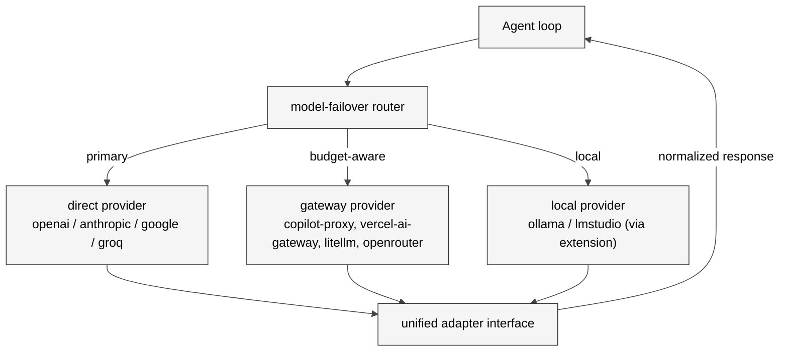

# 15 模型提供方接入全景

## 本章外部视角

一个开源 agent 框架最容易"做烂"的地方就是模型接入：太严格一家都接不上，太松会 drift 成 50 个不互通的 provider。OpenClaw 的解法是**统一的 `model-provider` 抽象 + 失败切换（model-failover） + 共享缓存/配额/日志**。本章基于 [extensions/openai / anthropic / anthropic-vertex / google / groq / openrouter / vercel-ai-gateway / litellm / copilot-proxy / llm-task](../../openclaw-repo/extensions) 和 [docs/concepts/models.md](../../openclaw-repo/docs/concepts/models.md)、[docs/concepts/model-failover.md](../../openclaw-repo/docs/concepts/model-failover.md)、[docs/concepts/model-providers.md](../../openclaw-repo/docs/concepts/model-providers.md) 补齐。

## 一、本质是什么

模型提供方在 OpenClaw 里分三层：

1. **adapter 层**：把各家 API 映射到统一 `chat/stream/tool-call` 接口
2. **gateway 层**：copilot-proxy、vercel-ai-gateway、litellm 是"provider of provider"，把自身行为再聚合一层
3. **failover 层**：在 agent/session 看来只有"模型族" + 优先级列表，底层由 model-failover 策略选具体 provider

agent 无需关心"这次调 GPT-5.3 还是 Claude 4.7"。

## 二、核心问题和痛点

1. **API 分化严重**：OpenAI function calling、Anthropic tool_use、Google functionResponse 细节不同
2. **rate limit 不同**：GPT 有 TPM/RPM、Anthropic 不同计费表、Groq 偏低但便宜
3. **cost 差异大**：一条 agent trajectory 跑 o-series 能贵 10x 于 turbo
4. **身份/计费路径分叉**：copilot-proxy 用 GitHub Copilot token、vercel-ai-gateway 用 vercel key、直连用 OpenAI key

## 三、解决思路与方案

三个关键决定：

- **unified adapter 是契约**：每个 provider 必须实现 `chat(messages, tools) / stream / embeddings`
- **model-failover 有策略**：按 cost / latency / availability 选，失败自动下移
- **gateway provider 受同等对待**：copilot-proxy 与 OpenAI 直连在 agent 眼里等价

## 四、实现细节关键点

### 4.1 provider plugin 结构

每个 provider 是独立 extension，导出 `provider: ModelProvider` 对象。`openclaw.plugin.json` 声明支持的 models 列表。安装后 Gateway 自动注册。

### 4.2 model-failover 的策略

- **ordered**：按用户配置列表，优先第一个
- **latency-first**：最近 N 次统计的平均 latency
- **cost-first**：选便宜且 capability 足够的
- **fallback-on-error**：429/500 立刻切下一档

### 4.3 多 provider 抽象的 tool_call 兼容

OpenAI / Anthropic / Google 都支持 tool calling 但字段不同。adapter 把它们归一到 OpenClaw 统一 schema。不支持 tool_call 的模型（老 Llama）走 ReAct 文本 trick 实现。

### 4.4 copilot-proxy 的特殊性

[extensions/copilot-proxy](../../openclaw-repo/extensions/copilot-proxy) 把 GitHub Copilot 作为 provider：复用 Copilot 的配额。实质是 "GitHub 付费 → OpenClaw 消费"，商业上敏感。OpenClaw 在 UX 上明确说明这是 "Use at your own risk"。

### 4.5 litellm 作为中央 gateway

[extensions/litellm](../../openclaw-repo/extensions/litellm) 连的是用户自己运行的 LiteLLM 网关。这适合企业场景：统一审计、统一配额、统一计费。OpenClaw 只需"一个 endpoint"。

### 4.6 llm-task

[extensions/llm-task](../../openclaw-repo/extensions/llm-task) 把 "一个 agent 要完成的子任务" 独立为任务单元，有自己的 provider 选择策略（例如分类任务走便宜模型，代码生成走 o1）。这是 cost 优化最直接的路径。

### 4.7 PR 数据：provider 侧热度

2026-02 至 04 `models-providers` 类 PR 172 条。`extensions: openai` 16 条最高，但加起来各家都在往前推。`model-providers` 在 2026-04 激增到 129 条（见 Appendix B），与新模型发布节奏对齐。

## 五、易错点和注意事项

1. **API key leak**：不要 `env` 里裸放；该走 [src/secrets](../../openclaw-repo/src/secrets) 注入
2. **tool_call schema 细节差异**：别 assume 两家行为一致
3. **temperature/max_tokens 默认值**：不同 provider 差异大；统一 default 要测
4. **rate-limit 对齐**：failover 触发得快慢取决于对 429 的解读；要和 provider 实际 header 对齐
5. **cost tracking 不透明**：Gateway 侧做 usage 估算容易偏差；建议定期对账
6. **local model 的 tool_call fallback**：质量差别大；小模型不建议走 tool loop

## 六、竞品对比

- **LangChain / LlamaIndex**：provider 抽象强，但对 UI/Channel 概念弱；OpenClaw 是一个面向"全栈个人助手"的框架
- **LiteLLM**：是 provider gateway 专用工具；OpenClaw 可内嵌 LiteLLM
- **Claude Code / Codex**：锁定自家模型
- **OpenClaw 独特**：failover + gateway + direct 三路并存，是这一层最完整的开源方案之一

## 七、仍存在的问题和缺陷

1. **provider 治理缺"版本冻结"**：新 provider 常静默引入 breaking change
2. **cost 实时展示弱**：console UI 很少显示 "本次花费"，对 budget 无感
3. **embedding provider 选择分散**：memory 多个后端各自选自己的 embedding，浪费
4. **容量估算不准**：例如 Claude 的 context 会受 tools schema 长度影响，估算没并入
5. **gateway provider 循环风险**：OpenRouter → Anthropic → OpenRouter 循环的保护还不够显式

## 下一章预告

第十六章聚焦 **中国区生态适配**——Feishu/QQ/WeChat/LINE/Zalo 通道 + DeepSeek/Moonshot/Kimi/Qwen/Qianfan/Volcengine/ZhipuAI 模型矩阵。这是英文资料里最稀缺的章节，也是 OpenClaw 实际"出海→归中"的一条主线。
