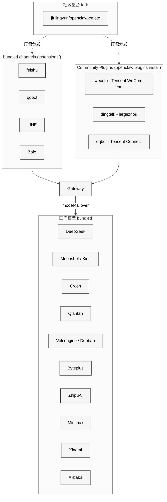

# 16 中国区生态适配

## 本章外部视角

从 fork 榜前 20 看，排名第一的 [jiulingyun/openclaw-cn](https://github.com/jiulingyun/openclaw-cn)（4695 ★）就是"中文社区版"，描述直截了当——"内置钉钉 / 企业微信 / 飞书 / QQ / 微信 + 国内网络优化"。同时原仓库自身也合入了 feishu/qqbot/line/zalo 通道以及 deepseek/moonshot/kimi-coding/qwen/qianfan/volcengine/byteplus/zai/minimax/stepfun/xiaomi/alibaba 一长串国产模型。对海外同类研究来说这是最被忽视的一条主线。

本章基于 [extensions/feishu](../../openclaw-repo/extensions/feishu)、[extensions/qqbot](../../openclaw-repo/extensions/qqbot)、[extensions/line](../../openclaw-repo/extensions/line)、[extensions/zalo / zalouser](../../openclaw-repo/extensions)、[extensions/deepseek / moonshot / kimi-coding / qwen / qianfan / volcengine / byteplus / zai / minimax / stepfun / xiaomi / alibaba](../../openclaw-repo/extensions) 等补齐。

## 一、本质是什么

中国区适配不是"多装一个 extension"，而是**整条链路每一层都要换掉默认选择**：

1. **channel**：主力 messenger 是飞书 / QQ / 企业微信，Slack/Discord/Telegram 都用不上
2. **model**：DeepSeek / Qwen / Moonshot / ZhipuAI 等国产，GPT/Claude 需要代理或不可用
3. **network**：npm 仓库、model 下载需要国内镜像或代理
4. **compliance**：数据本地化、内容审核、合规备案要求

## 二、核心问题和痛点

1. **API spec 国产化差异**：OpenAI-compatible 伪装普遍但细节常断（function calling、stream、tool_choice）
2. **通道认证**：飞书 / 企业微信的"自建应用" vs "市场应用"权限模型复杂
3. **SSL 与网络**：国内服务要求 HTTPS + 备案域名；本地开发用 cloudflared 不顺
4. **模型质量不均**：小 context 模型 / 旧指令版 / 无 tool call 仍在流通，agent loop 容易崩

## 三、解决思路与方案

<div style="background: #ffffff !important; background-color: #ffffff !important; padding: 16px; border-radius: 8px; margin: 16px 0;" bgcolor="#ffffff">



</div>

三个关键决定：

- **channel 与 model 对称实现**：两侧都是 plugin，官方仓库承担主力 channel / model，社区 fork 承担剩余（微信 / 钉钉）
- **DM pairing 仍强制**：国内通道不因为"内部"就降级 pairing
- **provider 里"pseudo-OpenAI"单独分类**：国产"OpenAI 兼容"模式需要额外的兼容层而不是 adapter 直连

## 四、实现细节关键点

### 4.1 飞书通道（[extensions/feishu](../../openclaw-repo/extensions/feishu)）

- inbound：Event V2（加签验证）+ Card Action
- outbound：文本 / markdown / card / interactive message
- 配对：群里 `@bot pair` 或 DM 触发；需要企业管理员批准应用安装

### 4.2 QQ bot（[extensions/qqbot](../../openclaw-repo/extensions/qqbot)）

- 使用官方 QQ 频道机器人 / Go-CQHTTP 兼容模式
- channel 能力：文本 / 图片 / 表情 / at / 频道 vs 私聊
- 特别：签名校验频繁更新

### 4.3 企业微信 / 钉钉 / 微信——三条链路共存

这一条是很多源码研究者容易忽视的细节：OpenClaw 主仓 `extensions/` 下确实**没有** `wecom / dingtalk / wechat`，但这不等于"官方空白"，而是走了 [docs/plugins/community.md](../../openclaw-repo/docs/plugins/community.md) 的 **Community Plugin** 机制（见 [第 5 章 4.5 节](../Part%20I%20Architecture%20and%20Philosophy/05%20%E6%8F%92%E4%BB%B6%E4%B8%8E%E6%89%A9%E5%B1%95%E6%9C%BA%E5%88%B6.md)）。实际上现在有 **三条并行链路**：

| 平台 | 链路 A：bundled 主仓 | 链路 B：Community Plugin（`openclaw plugins install`） | 链路 C：社区 fork 整包 |
|---|---|---|---|
| **企业微信 WeCom** | 无 | `@wecom/wecom-openclaw-plugin`，**腾讯企业微信官方团队**维护（WebSocket 长连接、私聊/群聊/流式/主动消息/Markdown/access control + 文档/会议/消息 skill） | `luolin-ai/openclawWeComzh` 等 |
| **钉钉 DingTalk** | 无 | `@largezhou/ddingtalk`，社区开发者维护（Stream 模式企业机器人） | 少量 |
| **微信 WeChat** | 无 | 2025 年曾由 Tencent iLink Bot 插件提供，2026 年初被 `remove dead WeChat listing` 从 docs 中移除（commit `483926a6fb`），当前**无官方入口** | `jiulingyun/openclaw-cn` 等社区 fork 自带非官方接入 |
| **QQbot** | `extensions/qqbot` | `@tencent-connect/openclaw-qqbot`（**腾讯连接团队**）| — |

几个容易误读的事实：

- **WeCom 已经由腾讯官方 own**：链路 B 里的 WeCom 插件是腾讯企业微信团队自家发的，一条 `openclaw plugins install @wecom/wecom-openclaw-plugin` 即可装上——所以"企业微信支持"**不是**空白，只是不在主仓 `extensions/` 里
- **QQbot 有双实现**：主仓的 `extensions/qqbot` + 腾讯连接的 `@tencent-connect/openclaw-qqbot` 并行存在，后者是"官方渠道更权威"的版本，文档层面两套签名校验方式略有差异
- **WeChat 是"官方曾经列过但撤了"**：这是生态政策最敏感的一项（个人号接入风险高），连 Tencent 自己后来都选择不再推
- **社区 fork 不是"补空白"，是"补整合"**：`jiulingyun/openclaw-cn` 等 fork 并非在重写 WeCom，而是把"WeCom + WeChat + DingTalk + 飞书 + 国产模型 + 国内网络优化"**打包成一个开箱即用版本**，省去用户逐个 install + 配置的麻烦

这一点直接决定了 [第 26 章 R4 中国生态官方化](../Part%20V%20Issues%20and%20Roadmap/26%20%E9%87%8D%E7%82%B9%E4%BC%98%E5%8C%96%E6%96%B9%E5%90%91%E5%BB%BA%E8%AE%AE.md) 的方向——真正该谈的不是 "官方补内置 WeCom/DingTalk"，而是 "把 Community Plugin 层的厂商官方版本 **bundle 成一等公民** vs 继续保持热插拔" 的取舍。

### 4.4 国产模型 adapter 的两类

- **真 OpenAI 兼容**（Moonshot、DeepSeek、Qwen DashScope OpenAI 模式）：复用 openai adapter
- **自有协议**（百度 Qianfan、火山引擎 Volcengine）：独立 adapter

每个 extension 都会声明它属于哪类，并在 tool_call / stream 不一致时做翻译。

### 4.5 tool calling 兼容性

国产模型 tool calling 成熟度参差：DeepSeek/Kimi 稳定；Qwen 在 function 边界条件不一致；一些旧版需要走 ReAct fallback。OpenClaw 在 adapter 层做 detection + 自动 fallback。

### 4.6 配置示例（典型中文团队）

```
primaryModel: deepseek-chat
fallbackModels: [qwen-plus, kimi-k2-chat]
primaryChannel: feishu
secondaryChannels: [qqbot]
network.proxy: socks5://127.0.0.1:1080
secrets.feishu.app_secret: <vault>
```

用户侧最常见的 "跑不通" 原因是 proxy 未对 npm / docker pull / huggingface 镜像都生效。

### 4.7 PR 数据：中国通道合入节奏

label 统计里 `channel: feishu 23 / channel: qqbot 13`；与 forks 活跃度（4k+ ★ 的 `openclaw-cn`、`openclaw-china`）相比，官方 PR 明显滞后——社区先做 fork，官方逐步择优收录。

## 五、易错点和注意事项

1. **飞书 event v2 加签**：校验差一位会全 drop；必须用 SDK 或严格按官方示例
2. **QQ bot signature 更新频繁**：生产要留出"更新 signature key"的运维通道
3. **国产模型 max_tokens 不透明**：需要显式读 docs 而非 trust API
4. **npm 国内源**：用 `npm config set registry` + 对 sharp 等原生包另走 binary mirror
5. **数据合规**：有些企业要求 "消息不得出境"；需确认 vercel/openai 直连完全关闭
6. **时区与节假日**：国内 cron 要按北京时区；别 trust UTC default

## 六、竞品对比

- **FastGPT / Dify**：原生中文，但通道覆盖偏企业；OpenClaw 是个人 + 多端
- **LobeChat / NextChat**：中文 UI 极好，但不是 agent 框架，是 chat UI
- **coze / 扣子**：字节生态，闭源；OpenClaw 开源可私有化
- **n8n / Dify workflow**：偏 workflow；OpenClaw 是 agent loop

OpenClaw 在中文区的独特位置：**开源 + 个人 + 多通道 + 国产模型**四合一。

## 七、仍存在的问题和缺陷

1. **企业微信 / 钉钉 / 微信** 主仓未 bundle，而是放在 Community Plugin 层由厂商或第三方维护。好处是主仓压力小、厂商可独立节奏；坏处是安装链路比 bundled 多一步、首次体验不如"开箱自带"，中文新用户容易误判为"不支持"
2. **模型描述缺本地化**：provider README 多为英文，团队上手慢
3. **合规配置选项扁平**：没有 "仅使用境内 provider" 的总开关
4. **文档中文化**：`docs/` 基本英文；中文教程依赖 fork/awesome 仓库
5. **Sherpa-ONNX 中文 TTS 质量** 仍是短板，影响语音优先体验

## 下一章预告

第十七章进入 **Skills 实战剖析**，挑 6-8 个代表性 skill 做深度阅读：coding-agent / clawhub / canvas / voice-call / gh-issues / obsidian / trello / skill-creator。
