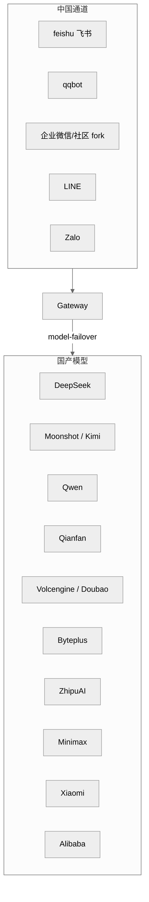

# 16 中国区生态适配

## 本章外部视角

从 fork 榜前 20 看，排名第一的 [jiulingyun/openclaw-cn](https://github.com/jiulingyun/openclaw-cn)（4695 ★）就是"中文社区版"，描述直截了当——"内置钉钉 / 企业微信 / 飞书 / QQ / 微信 + 国内网络优化"。同时原仓库自身也合入了 feishu/qqbot/line/zalo 通道以及 deepseek/moonshot/kimi-coding/qwen/qianfan/volcengine/byteplus/zai/minimax/stepfun/xiaomi/alibaba 一长串国产模型。对海外同类研究来说这是最被忽视的一条主线。

本章基于 [extensions/feishu](../../openclaw-repo/extensions/feishu)、[extensions/qqbot](../../openclaw-repo/extensions/qqbot)、[extensions/line](../../openclaw-repo/extensions/line)、[extensions/zalo / zalouser](../../openclaw-repo/extensions)、[extensions/deepseek / moonshot / kimi-coding / qwen / qianfan / volcengine / byteplus / zai / minimax / stepfun / xiaomi / alibaba](../../openclaw-repo/extensions) 等补齐。

## 一、本质是什么

中国区适配不是"多装一个 extension"，而是**整条链路每一层都要换掉默认选择**：

1. **channel**：主力 messenger 是飞书 / QQ / 企业微信，Slack/Discord/Telegram 都用不上
2. **model**：DeepSeek / Qwen / Moonshot / ZhipuAI 等国产，GPT/Claude 需要代理或不可用
3. **network**：npm 仓库、model 下载需要国内镜像或代理
4. **compliance**：数据本地化、内容审核、合规备案要求

## 二、核心问题和痛点

1. **API spec 国产化差异**：OpenAI-compatible 伪装普遍但细节常断（function calling、stream、tool_choice）
2. **通道认证**：飞书 / 企业微信的"自建应用" vs "市场应用"权限模型复杂
3. **SSL 与网络**：国内服务要求 HTTPS + 备案域名；本地开发用 cloudflared 不顺
4. **模型质量不均**：小 context 模型 / 旧指令版 / 无 tool call 仍在流通，agent loop 容易崩

## 三、解决思路与方案

<div style="background: #ffffff !important; background-color: #ffffff !important; padding: 16px; border-radius: 8px; margin: 16px 0;" bgcolor="#ffffff">



</div>

三个关键决定：

- **channel 与 model 对称实现**：两侧都是 plugin，官方仓库承担主力 channel / model，社区 fork 承担剩余（微信 / 钉钉）
- **DM pairing 仍强制**：国内通道不因为"内部"就降级 pairing
- **provider 里"pseudo-OpenAI"单独分类**：国产"OpenAI 兼容"模式需要额外的兼容层而不是 adapter 直连

## 四、实现细节关键点

### 4.1 飞书通道（[extensions/feishu](../../openclaw-repo/extensions/feishu)）

- inbound：Event V2（加签验证）+ Card Action
- outbound：文本 / markdown / card / interactive message
- 配对：群里 `@bot pair` 或 DM 触发；需要企业管理员批准应用安装

### 4.2 QQ bot（[extensions/qqbot](../../openclaw-repo/extensions/qqbot)）

- 使用官方 QQ 频道机器人 / Go-CQHTTP 兼容模式
- channel 能力：文本 / 图片 / 表情 / at / 频道 vs 私聊
- 特别：签名校验频繁更新

### 4.3 企业微信 / 钉钉 / 微信

官方仓库暂未内置，主要靠社区 fork（如 `luolin-ai/openclawWeComzh`、`BytePioneer-AI/openclaw-china`）。这是中国生态适配里"官方未覆盖"的显著空白，也是 fork 榜活跃的主因。

### 4.4 国产模型 adapter 的两类

- **真 OpenAI 兼容**（Moonshot、DeepSeek、Qwen DashScope OpenAI 模式）：复用 openai adapter
- **自有协议**（百度 Qianfan、火山引擎 Volcengine）：独立 adapter

每个 extension 都会声明它属于哪类，并在 tool_call / stream 不一致时做翻译。

### 4.5 tool calling 兼容性

国产模型 tool calling 成熟度参差：DeepSeek/Kimi 稳定；Qwen 在 function 边界条件不一致；一些旧版需要走 ReAct fallback。OpenClaw 在 adapter 层做 detection + 自动 fallback。

### 4.6 配置示例（典型中文团队）

```
primaryModel: deepseek-chat
fallbackModels: [qwen-plus, kimi-k2-chat]
primaryChannel: feishu
secondaryChannels: [qqbot]
network.proxy: socks5://127.0.0.1:1080
secrets.feishu.app_secret: <vault>
```

用户侧最常见的 "跑不通" 原因是 proxy 未对 npm / docker pull / huggingface 镜像都生效。

### 4.7 PR 数据：中国通道合入节奏

label 统计里 `channel: feishu 23 / channel: qqbot 13`；与 forks 活跃度（4k+ ★ 的 `openclaw-cn`、`openclaw-china`）相比，官方 PR 明显滞后——社区先做 fork，官方逐步择优收录。

## 五、易错点和注意事项

1. **飞书 event v2 加签**：校验差一位会全 drop；必须用 SDK 或严格按官方示例
2. **QQ bot signature 更新频繁**：生产要留出"更新 signature key"的运维通道
3. **国产模型 max_tokens 不透明**：需要显式读 docs 而非 trust API
4. **npm 国内源**：用 `npm config set registry` + 对 sharp 等原生包另走 binary mirror
5. **数据合规**：有些企业要求 "消息不得出境"；需确认 vercel/openai 直连完全关闭
6. **时区与节假日**：国内 cron 要按北京时区；别 trust UTC default

## 六、竞品对比

- **FastGPT / Dify**：原生中文，但通道覆盖偏企业；OpenClaw 是个人 + 多端
- **LobeChat / NextChat**：中文 UI 极好，但不是 agent 框架，是 chat UI
- **coze / 扣子**：字节生态，闭源；OpenClaw 开源可私有化
- **n8n / Dify workflow**：偏 workflow；OpenClaw 是 agent loop

OpenClaw 在中文区的独特位置：**开源 + 个人 + 多通道 + 国产模型**四合一。

## 七、仍存在的问题和缺陷

1. **企业微信 / 钉钉 / 微信** 官方未内置，是能力明显缺口
2. **模型描述缺本地化**：provider README 多为英文，团队上手慢
3. **合规配置选项扁平**：没有 "仅使用境内 provider" 的总开关
4. **文档中文化**：`docs/` 基本英文；中文教程依赖 fork/awesome 仓库
5. **Sherpa-ONNX 中文 TTS 质量** 仍是短板，影响语音优先体验

## 下一章预告

第十七章进入 **Skills 实战剖析**，挑 6-8 个代表性 skill 做深度阅读：coding-agent / clawhub / canvas / voice-call / gh-issues / obsidian / trello / skill-creator。
