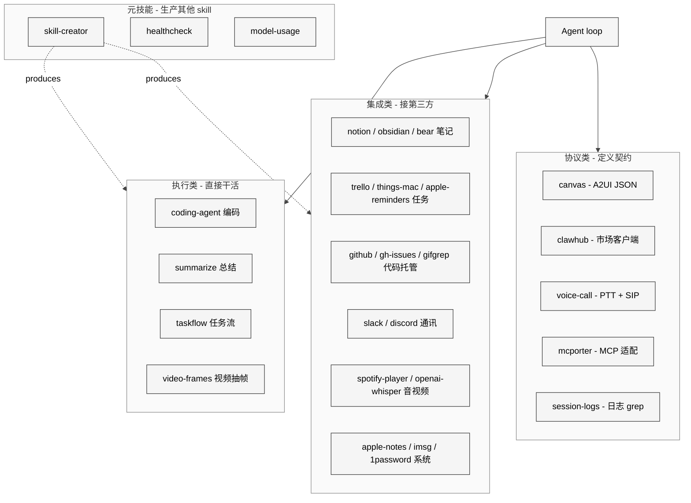

# 17 Skills 实战剖析

## 本章外部视角

"Skill" 是 OpenClaw 用户感知度最高的概念——[VoltAgent/awesome-openclaw-skills](https://github.com/VoltAgent/awesome-openclaw-skills) 社区聚合了 5400+ 第三方 skill，[openclaw/skills](https://github.com/openclaw/skills) 官方归档 4k+ ★。本章挑 8 个代表性 skill 做深度剖析，分布在"执行类 / 集成类 / 协议类 / 元技能"四个维度。源码位于 [skills/](../../openclaw-repo/skills)。

## 一、本质是什么

每个 skill 目录必须有：

- `SKILL.md`：给 LLM 的"使用说明书"——描述 + 触发条件 + 输入输出
- 可选：`scripts/` 辅助脚本、`assets/`、`references/`

skill 加载时 Gateway 读取 SKILL.md 注入到 agent 的能力池；LLM 自行决定何时调用。

## 二、Skill 四维分类图

`skills/` 下 53 个本地 skill 按职责大致分四类——执行类做事、集成类对接第三方、协议类定义交互契约、元技能用于生产其他 skill。

本章挑 8 个代表性 skill 做深度剖析，每类选 2 个。

### 2.1 coding-agent（执行类）

**目标**：把 openclaw 变成 coding assistant，功能对标 Claude Code / Cursor。

**关键点**：
- 定义了 plan/edit/test 的循环 prompt
- 使用 bash / grep / read / write 基础 tool
- 明确 "do not commit without approval" 的 elevated 规则

**对比 Claude Code**：coding-agent 以 "能在任何 channel 触发" 见长——Telegram 上就能 review PR；Claude Code 绑定 IDE。

### 2.2 clawhub（协议类）

**目标**：skill 市场的客户端。可搜索、查看、安装 skill。

**关键点**：
- 调用 `clawhub.dev` 列表 API
- 安装前走 VirusTotal 扫描
- 安装后写入 `workspace/skills/<name>/` 并注册 SKILL.md

**与 ClawHavoc 的关系**：事件后加入 `--verify-signature` 选项 + 发布者信誉字段。

### 2.3 canvas（协议类）

**目标**：给 agent 生成 A2UI canvas 的快速模板。

**关键点**：
- SKILL.md 给出 A2UI 语法 quick ref
- 内置 presets: form / chart / approval / gallery
- 触发条件：用户要求 "给我做个面板 / 表单 / 图表" 时

### 2.4 voice-call（集成类）

**目标**：agent 接电话 / 拨电话（结合 [extensions/voice-call](../../openclaw-repo/extensions/voice-call)）。

**关键点**：
- dial-out prompt 模板：告诉 agent 如何礼貌、识别对方、识别挂断意图
- 给出 "不得冒充人类" "录音合规" 的硬性约束
- 触发：user "给 X 打电话问 Y"

### 2.5 gh-issues（集成类）

**目标**：管理 GitHub issue（创建 / 分类 / 回复）。

**关键点**：
- 使用 `gh` CLI 作为 tool
- 模板化 issue 填报格式
- 与 cron 搭配可定期 triage

### 2.6 obsidian（集成类）

**目标**：把 agent 的笔记写入本地 Obsidian vault。

**关键点**：
- 把 vault path 作为 workspace 资源
- 与 memory 系统互补：memory 是 per-session，obsidian 是人自己的 PKM

### 2.7 trello（集成类）

**目标**：与 Trello 看板交互。

**关键点**：
- 用 Trello API key（走 secrets）
- 常用动作：create card / move to column / add member

### 2.8 skill-creator（元技能）

**目标**："让 LLM 自己造 skill"。

**关键点**：
- 指导模型生成 SKILL.md 结构
- 要求产出 "触发描述 / 步骤 / 失败回退"
- 提示词里强调 "Skills 必须针对具体任务，不要发明抽象框架"

这是 OpenClaw 生态能快速扩张的关键——让 LLM 降本产能加入。

## 三、共性与差异

### 3.1 共性

- **SKILL.md 全用 Markdown**：可版本、可 diff、可 LLM 自解析
- **都走 "能力 + 硬约束" 模式**：先写能做什么，再写绝对禁止
- **tool call 都不重复发明**：直接用 bash / web / channel 基础工具

### 3.2 差异

- **执行类**（coding-agent）：偏控制流、步骤模板
- **集成类**（gh-issues / obsidian / trello）：偏 API 包装
- **协议类**（clawhub / canvas）：偏 schema 和 UI
- **元技能**（skill-creator）：偏二阶生成

## 四、易错点和注意事项

1. **SKILL.md 过长**：LLM 读不完 / 被挤占 context；目标 2-3 KB
2. **skill 之间触发冲突**：两个 skill 都说 "写笔记时用我"；需显式优先级
3. **测试路径**：skill 是 prompt 不是代码，测试是 "对话 eval" 而非 unit test
4. **依赖工具存在性**：skill 要求 `gh` / `playwright` 等；安装时应 doctor 检查

## 五、仍存在的问题和缺陷

1. **skill 版本治理弱**：没有 `skill@semver`，ClawHub 发布后名字覆盖
2. **skill reputation 体系粗糙**：star 与 virusTotal 结果互不关联
3. **skill sandbox 层级不清**：该 skill 是否能调 shell，有时看 tool policy 有时看 sandbox
4. **skill-creator 易生成空壳**：LLM 喜欢写 "abstract framework"，skill-creator 需要更强约束

## 下一章预告

第十八章转向**客户端 App**——macOS 菜单栏 App 如何把 CLI / Gateway 的能力前台化（push-to-talk / canvas / SSH 远控 Gateway）。
