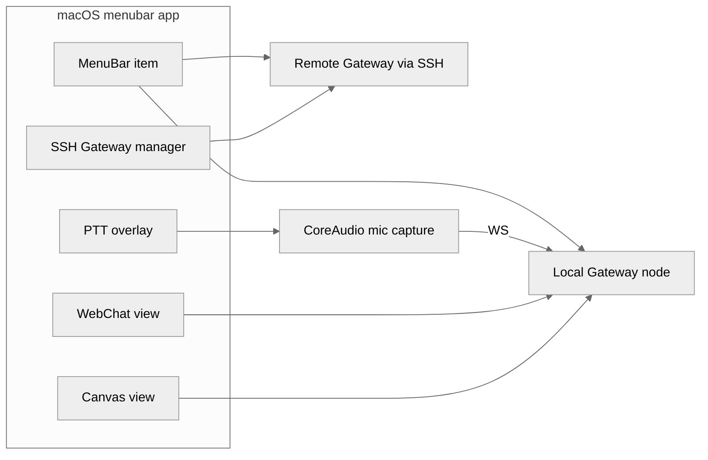

# 18 macOS 菜单栏 App

## 本章外部视角

绝大多数 agent 框架的"桌面版"就是一个 Electron 壳；OpenClaw 是原生 Swift + 菜单栏栖居的产物。这跟主作者 Peter Steinberger 长期 iOS/macOS 背景一致。本章基于 [apps/macos](../../openclaw-repo/apps/macos)、[apps/shared](../../openclaw-repo/apps/shared)、[Swabble](../../openclaw-repo/Swabble) 补齐。

## 一、本质是什么

macOS App 承担三类职责：

1. **Gateway lifecycle 前台化**：启动/停止 gateway、查看状态、切换 profile
2. **Push-to-talk overlay**：按快捷键悬浮语音 UI，与 realtime-voice 串联
3. **WebChat & Canvas 承载**：把 Gateway 的 web-ui 嵌在原生窗口里
4. **远端 Gateway 管理**：通过 SSH 接入远程 host，在本地菜单栏操作远端 Gateway

## 二、核心问题和痛点

1. **macOS 权限繁杂**：麦克风、屏幕录制、辅助功能、自动化全要授权
2. **按键捕获全局快捷键**：需要 Accessibility；被沙箱 App Store 策略卡
3. **和 Gateway 的沟通**：Gateway 是 node 进程，需要 IPC
4. **远端 host Gateway**：SSH + port forward + 状态同步要简洁可靠

## 三、解决思路与方案

三个核心决定：

- **原生 Swift App**：低延迟、系统键盘事件可控
- **Gateway 不在 App 内**：App 管生命周期，不包含 agent runtime，避免 App Store 规则 + 升级节奏错配
- **Web UI 以 WKWebView 承载**：UI 快速迭代用 web 技术，shell 用 native

## 四、实现细节关键点

### 4.1 菜单栏条目的状态语义

icon 颜色代表 gateway 状态：灰=未启动、绿=运行、橙=有告警、红=错误。点击展开 session 列表 / skill / settings。

### 4.2 Push-to-talk overlay

- 快捷键默认 Fn / Right Option（可改）
- 按下时出现 floating window + waveform
- 释放即发送 final PCM；若 barge-in 则中断上次 TTS

### 4.3 WebChat & Canvas

内置 WKWebView 指向 gateway 的 `/web-ui`。当 agent 返回 canvas 时直接渲染；user 交互通过同一 websocket 回到 agent。

### 4.4 SSH Gateway 管理

- 在 settings 添加 host+user+port+key path
- App 启动后台 SSH session，拉取状态
- 可以在菜单栏"切换到 `homeserver.local` 的 Gateway"——完全 transparent
- 对 agent 来说没有本地/远端差别

### 4.5 自动更新

走 Sparkle 或同类 updater。Gateway 升级与 App 独立；App 能探测 gateway version mismatch 并提示升级 CLI。

### 4.6 Launch at login / LaunchAgent

App 用 SMAppService（新 API）注册 login item；同时生成 LaunchAgent plist 让 Gateway 进程自举。两层可独立开关。

### 4.7 与 iOS App 的共享层

[apps/shared](../../openclaw-repo/apps/shared) 是 Swift 代码的共享包：protocol 定义、A2UI 渲染、pairing logic 三端复用。避免 macOS / iOS 重复实现。

## 五、易错点和注意事项

1. **权限丢失**：用户误删隐私设置里的条目会让 PTT 失灵；需要友好的恢复引导
2. **多显示器 overlay 定位**：必须贴当前活动屏幕
3. **SSH 长连接超时**：必须有心跳 + 自动重连
4. **WebView 内 dark/light theme 跟随系统**：常因 CSS 覆盖被破坏
5. **App sandbox vs agent sandbox**：App 不应做危险操作，危险操作留给 Gateway 容器
6. **菜单栏过长**：session 列表会把 bar 挤爆，需要分组

## 六、竞品对比

- **Cursor / VSCode**：Electron / 跨端，菜单栏较弱
- **Claude Desktop / ChatGPT**：Electron，原生感一般
- **Raycast**：纯菜单栏+快捷键驱动，设计思路与 OpenClaw 相近但场景只在 Mac
- **OpenClaw 独特**：菜单栏 + PTT overlay + WebView canvas + SSH 远控四合一，没有同类

## 七、仍存在的问题和缺陷

1. **系统支持版本**：老 macOS（< 13）SMAppService 不可用；回退到 LaunchAgent 兼容较累
2. **App Store 分发**：PTT 全局快捷键 + accessibility 限制影响上架
3. **远端 Gateway 状态一致性**：断网重连后状态会短暂飘
4. **与 web-ui 版本锁定**：web-ui breaking change 时 App 可能 render 错
5. **多 profile 切换流畅度**：目前每次切换需要 session reset

## 下一章预告

第十九章进入 **iOS/Android 节点**——把手机变成 OpenClaw 的 "手"（相机、相册、通话、SMS、shell）。
