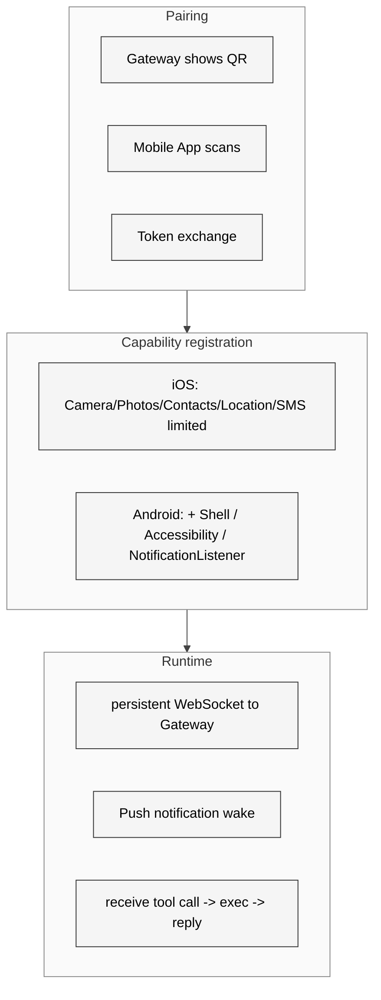

# 19 iOS 与 Android 节点

## 本章外部视角

fork 榜里 [OpenClawAndroid/openclaw-android-assistant](https://github.com/OpenClawAndroid/openclaw-android-assistant) 和 [bighamx/openclaw-android-node-apk](https://github.com/bighamx/openclaw-android-node-apk) 两个仓库都是"在 Android 上把 OpenClaw 变成一个真正能按键、发信息、操控手机的节点"。这正是本章的主题——把移动端变成 agent 的 "身体"。源码：[apps/ios](../../openclaw-repo/apps/ios)、[apps/android](../../openclaw-repo/apps/android)、[apps/shared](../../openclaw-repo/apps/shared)、[src/pairing](../../openclaw-repo/src/pairing)。

## 一、本质是什么

iOS 和 Android App 不是独立的 chatbot，而是 Gateway 的 **Node**：

- 对 user 来说：这是一个接受 agent 指令的设备
- 对 Gateway 来说：这是一个新注册的"能力提供者"
- 对 agent 来说：变成一组 tool（`phone.sendSms / phone.takePhoto / phone.openApp` 等）

本质上是 [第十章](../Part%20II%20Source%20Execution/10%20Tools%20Canvas%20%E4%B8%8E%20Nodes.md) 讲的 Node 协议的移动端实现。

## 二、核心问题和痛点

1. **iOS/Android 能力差异巨大**：iOS 不让跑 shell，Android 能
2. **后台驻留**：iOS 没真正后台进程；Android 要防被杀
3. **pairing 流程**：必须从零 pairing（不能 assume 用户之前登过）
4. **隐私权限**：通讯录、短信、位置全都是高敏感

## 三、解决思路与方案

四个关键决定：

- **pairing 必须带二维码 + 一次性 token**：防窃听
- **App 只声明能力而不提供"万能 shell"**：能力 schema 精细化，用户逐项授权
- **push + WS 混合**：平时 WS keepalive；被杀后用 push 唤醒
- **A2UI 渲染共用 [apps/shared](../../openclaw-repo/apps/shared)**：三端一致体验

## 四、实现细节关键点

### 4.1 pairing 协议

- Gateway 生成 `PairingCode`（含 nonce + 过期时间）
- mobile scan QR → POST `pair/init` → 获得 ws url + session token
- mobile WS connect + `capabilities` 消息
- Gateway 写入 nodes 表，agent 就能调用

### 4.2 iOS 能力

| 能力 | tool name | 备注 |
|---|---|---|
| 相册读取 | `photos.query` | 限定 album / 时间 |
| 拍照 | `camera.take` | foreground 需要展示 UI |
| 通讯录 | `contacts.search` | 限 readonly |
| 定位 | `location.current` | one-shot 模式 |
| 发短信 | `sms.send` | 只能跳转 iMessage 预填，不能后台发送 |
| 文档 | `files.share` | 通过 Files picker |

### 4.3 Android 能力（更广）

额外支持：
- `shell.run`（需 root 或 termux bridge）
- `accessibility.action`（点击 UI）
- `notifications.listen`（读应用通知）
- `apps.launch`（打开指定应用）

正是这些让 Android node 能做"真正的 phone automation"。

### 4.4 WebSocket 重连策略

- 指数退避（1s → 30s → 5min 封顶）
- 每 30s ping
- 断线期间 user 可见"离线"icon；agent 调用会立即失败而不是 hang

### 4.5 Push 唤醒

- iOS：APNs + silent push 唤起 WS short window
- Android：FCM + foreground service
- 作用：agent 长时间不用时手机不吃电；被触发时几秒内上线

### 4.6 pairing 与 settings 同步

一旦 paired，settings / skill / provider 这类"用户偏好"通过 Gateway 下发到 App cache——App 退出后重登也能恢复。

## 五、易错点和注意事项

1. **pairing QR 过期**：一次性 + 5min 有效；扫晚了就失败
2. **权限 opt-in**：App 不要启动就索要所有权限；按能力按需要时才 prompt
3. **Android 省电策略**：厂商（小米/华为）默认杀后台；文档必须提示加白
4. **iOS background 限制**：不能跑常驻任务；依赖 push + short burst
5. **敏感能力用 confirm prompt**：发短信、拨电话、打开 app，node 侧也要二次确认
6. **capability drift**：iOS 升级系统后某 API 可能被裁；需要运行时 detect

## 六、竞品对比

- **Shortcuts / Tasker**：本地 automation，缺 agent
- **Home Assistant**：智能家居倾向
- **Claude / ChatGPT mobile app**：chatbot 交互，不是 node
- **OpenClaw 独特**：mobile = agent 的 "身体"，不是"另一个对话入口"

## 七、仍存在的问题和缺陷

1. **iOS 能力 ceiling 受限**：想做"真正 automation"仍需 Shortcut bridge
2. **Android 厂商差异**：国产 ROM 杀后台策略各异，需社区补偿文档
3. **capability discoverability**：用户不知道手机装上后能做什么；需要 "what can my phone do for agent now?" 指南
4. **多设备同 account 管理**：一个用户三台设备，pair 表扩张；缺少可视化管理
5. **电池 / 流量 透明度**：常驻 WS 的耗电和流量没有仪表盘

## 下一章预告

Part III 收官。第二十章进入 Part IV——用 Appendix B 的量化数据盘点 **活跃 fork 与变种生态**。
