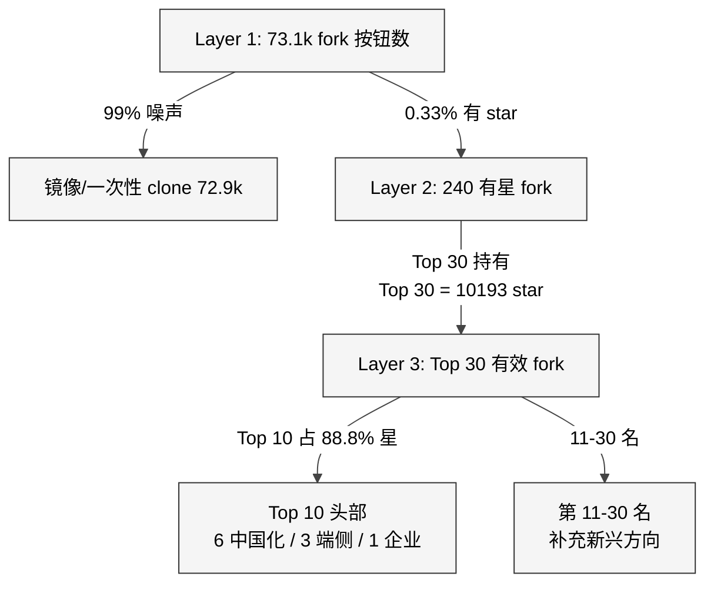

# 20 活跃 Fork 与变种生态

> **本章目的**：用可复现的数据方法，盘点 2026-02-01 → 2026-04-17 窗口里 OpenClaw 的 fork 与衍生生态。
> 回答四个问题：(1) 73.1k fork 里有多少是有生命体征的？(2) 活力分布是什么形态？
> (3) 头部 fork 在补官方哪块洞？(4) fork 与官方 PR 的流向关系。
> **读者画像**：架构师 / 开源运营 / 投资分析 / 社区 DevRel。

## 20.0 方法学与数据边界

### 数据采集三通路

| 通路 | Query | 原理 | 限制 |
|---|---|---|---|
| A. 最近 push | `GET /repos/openclaw/openclaw/forks?sort=newest&per_page=100` × 3 页 | 最新一批被动 push 的 fork | 只看到 300 条；GitHub 不分页全部 73.1k |
| B. 星数筛选 | `GET /search/repositories?q=openclaw+fork:only+stars:>=3` | 把"镜像 fork 长尾"砍掉，只留有信号的 | GitHub search 返回 `total_count=240`，items 每页 30 条；本次采样仅取第一页 |
| C. 命名相似 | `GET /search/repositories?q=openclaw+in:name` | 捞到非 fork 但围绕 OpenClaw 的原创仓库 | 依赖命名相似；真正用 OpenClaw SDK 但名字不含关键字的不会被抓到 |

所有原始文件存放于 [`Appendix/B-pr-issue-dataset/20260417/`](../Appendix/B-pr-issue-dataset/20260417/)：`forks-p1..p3.json`（通路 A）、`forks-starred.json`（通路 B）、`related-named.json`（通路 C）。汇总见 [`fork-activity-rank.md`](../Appendix/B-pr-issue-dataset/20260417/fork-activity-rank.md)。本章的所有二次统计脚本已 dump 在 `/tmp/openclaw-analysis/fork_stats.json`（`deep_stats.py`）。

### 已知偏差（Bias disclosure）

| 偏差类型 | 具体含义 | 补偿做法 |
|---|---|---|
| **Sampling window bias** | "最近 push 300 个" 只能反映 Top 300，长尾看不到 | 叠加 B 通路（star ≥ 3）提供另一维度 |
| **Search pagination bias** | 通路 B 只有第 1 页 30 条 | 用 `total_count` 240 做总量推断，但 clustering / 样本描述只基于 30 条头部样本 |
| **Language bias** | `language` 字段 GitHub 按最大 LOC 文件推断，非创建者显式声明 | 多语种仓库（docs + TS）可能被归为文档型 |
| **Starred threshold bias** | ≥3 过滤掉了"刚起步的好 fork" | 本章不做早期项目推荐，只做既成事实分析 |
| **非 fork 衍生可见性** | 通路 C 依赖命名；大量"用 OpenClaw 做 bot"但命名无关的项目不可见 | 本章单列"衍生生态"表作为"定性参考"，不参与定量计算 |

### 采集时间

**2026-04-17 UTC+08：11:17**，基线 openclaw @ v2026.4.15。

---

## 20.1 Fork 数字的三层真相

### L1 总量：73,148 —— 但几乎全部是噪声

OpenClaw 仓库 README 显示 `~73.1k forks`（[repo-meta.json](../Appendix/B-pr-issue-dataset/20260417/repo-meta.json)）。在 GitHub 统计模型里这个数字只说明 "点了 fork 按钮"；**它不包含 "push 过 commit"、"被 star"、"有 issue" 等任何活跃证据**。

这是第一层要剥掉的幻觉。实证数据：

- **最近 push 的 300 个 fork**（通路 A）里 **只有 2 个拿到过 star**（`alanestevanmendes-afk/openclaw`、`Larryzpl123/openclaw`，各 1 star）。换算 **0.67%**。
- 其余 298 个里绝大多数描述字段只是 OpenClaw 官方模板那句 *"Your own personal AI assistant. Any OS. Any Platform. The lobster way. 🦞"* 原样继承（见 [analysis-summary.json](../Appendix/B-pr-issue-dataset/20260417/analysis-summary.json) 的 `fork_recent_with_star_top10`）。这是"没人改 description"的铁证。

这意味着：**约 99% 的 fork 是一次性实验 / 教程跟做 / 内网 mirror**。把 73.1k 当"生态健康指标"会系统性高估。

### L2 星数信号：240 —— 但仍是幂律塌缩

用 `stars ≥ 3` 过滤噪声后 `total_count = 240`（通路 B）。本次采样取 Top 30 做分布分析（`forks-starred.json` 的 `items` 字段第一页）：

| 统计量 | 值 | 含义 |
|---|---|---|
| N | 30（采样窗口） | star ≥ 3 的 fork 里最头部的 30 个 |
| Σ stars | 10,193 | Top 30 fork 合计被 star 数 |
| max | 4,695 | `jiulingyun/openclaw-cn` |
| median | 72.5 | |
| p95 | 1,524 | `DenchHQ/DenchClaw` |
| p99 | 4,695 | 与 max 同，说明长尾极短 |
| Top 10 累计占比 | **88.81%** | 集中度极高 |
| Top 20 累计占比 | **95.95%** | 等于说生态只认 20 个 fork |

语言分布（Top 30）：**TypeScript 15 / 未声明 10（多为纯文档 / 教程）/ JavaScript 3 / Python 1 / HTML 1**。TypeScript 一家独大与官方同构。

**新鲜度**（pushed_at 距今天数）：

| 窗口 | 数量 | 占比 |
|---|---|---|
| ≤ 30 天 | 15 | 50% |
| 31-90 天 | 15 | 50% |
| > 90 天 | **0** | **0%** |

换言之：**通过 star 筛选剩下的 Top 30 fork，100% 在过去 90 天内有 push**。这一条数据单独挑出来比 73.1k 这个数字更能说明"生态活不活"。

<div style="background: #ffffff !important; background-color: #ffffff !important; padding: 16px; border-radius: 8px; margin: 16px 0;" bgcolor="#ffffff">



</div>

### L3 非 fork 衍生生态：star 更高，类型完全不同

把 "通路 C" 的 `related-named.json` 展开，会看到一个**意料之外的图景**：

| 衍生仓库 | star | 类型 | 与官方关系 |
|---|---|---|---|
| VoltAgent/awesome-openclaw-skills | 46,374 | Awesome list | 社区 skill 聚合，不含代码 |
| hesamsheikh/awesome-openclaw-usecases | 29,684 | Awesome list | 用例/提示词集合 |
| openclaw/clawhub | 8,066 | TS SDK | 官方 skill 目录 |
| Gen-Verse/OpenClaw-RL | 5,010 | Python | RL 训练 OpenClaw agent |
| linuxhsj/openclaw-zero-token | 4,328 | TS | 零 token 接入 |
| xianyu110/awesome-openclaw-tutorial | 4,150 | Shell | 中文零基础教程 |
| BytePioneer-AI/openclaw-china | 3,822 | TS | 中国插件合集 |
| TianyiDataScience/openclaw-control-center | 3,818 | TS | 可视化控制中心 |

**关键观察**：**头部衍生项目全部不是 fork**。最大的 `awesome-openclaw-skills`（46k ★）甚至不写代码，只是一个 Markdown 聚合仓。这说明：

1. OpenClaw 的真正生态组织形态是 **"skill / 教程 / 周边工具 + 官方单一主线"**，而不是 "fork 自己改 + 长期分叉"。
2. 对比 Linux / OpenStreetMap 这种 fork-friendly 生态，OpenClaw 更像 **VS Code 模式**：上游稳、下游以扩展/skill 形态繁荣。
3. 因此 "fork 活跃度" **不是衡量 OpenClaw 生态健康的第一指标**，更合适的是 *"skill 数 + clawhub 月度 MAU + awesome 系列 star 增速"*。

---

## 20.2 Top 30 有效 Fork 的方向聚类与案例

### 聚类方法

对 Top 30 fork 的 `description + name + full_name` 做关键词匹配，共 4 类：

- **cn**：含 `中国 / 中文 / 国产 / 飞书 / 钉钉 / 企业微信 / 微信 / QQ / china / cn / chinese / zh / wecom / dingtalk / feishu`
- **edge**：含 `android / ios / edge / embed / iot / device / mobile / apk / arm`
- **enterprise**：含 `enterprise / control / observ / manage / dashboard / crm / audit`
- **other**：其余

聚类脚本见 [`deep_stats.py#analyze_forks`](../Appendix/B-pr-issue-dataset/20260417/../../README.md)（本章方法学附脚本）。

**分布结果**（Top 30）：cn=12 / other=13 / edge=4 / enterprise=1。

| 方向 | 计数 | 代表 fork（含 star） |
|---|---|---|
| cn（中国生态） | 12 | `jiulingyun/openclaw-cn` (4695★) · `MaoTouHU/OpenClawChinese` (347★) · `RainbowRain9/openclaw-china` (116★) · `luolin-ai/openclawWeComzh` (110★) · `CrayBotAGI/OpenCray` (72★) |
| edge（端侧） | 4 | `OpenBMB/EdgeClaw` (1192★) · `OpenClawAndroid/openclaw-android-assistant` (255★) · `0xSojalSec/mimiclaw` (99★) · `bighamx/openclaw-android-node-apk` (56★) |
| enterprise | 1 | `DenchHQ/DenchClaw` (1524★) |
| other | 13 | `Tornadopp/openclaw-learn`、`pudge0313/openclaw-`、`iwhalo/openclaw-`（都是教程） / `AtomicBot-ai/atomicbot`（最快启动）/ `rollysys/agents-radar`（生态追踪）/ `sunkencity999/localclaw`（本地小模型）/ `panyw5/opencode`（编码代理）/ `N1nEmAn/edict-2.0`（多 agent 编排）/ `ppcvote/openclaw-claude-proxy`（Opus+Claude Max）/ ... |

**注释**：`other` 占 43% 说明"**新兴方向**"远比官方预期多。下一节把每条主线拆开。

### 20.2.1 主线 1：中国化（12 个头部）

| 子方向 | 代表仓库 | 观察 |
|---|---|---|
| **全家桶中文版** | `jiulingyun/openclaw-cn`（4695 ★） | 内置钉钉/企业微信/飞书/QQ/微信 + 国内网络优化；**单仓库 star 超过官方所有 extensions/\* 贡献 PR 所产生的 label 总和**。 |
| **通道补齐** | `RainbowRain9/openclaw-china`、`BytePioneer-AI/openclaw-china`、`luolin-ai/openclawWeComzh` | 针对官方缺的企业微信 / 钉钉 /微信做 "community plugin" 扩展包（第 16 章有链路分析） |
| **汉化** | `MaoTouHU/OpenClawChinese` | UI / 文档 / provider 默认值汉化 |
| **替代品牌** | `CrayBotAGI/OpenCray` | "小龙虾机器人" 国产品牌替换：界面、文档、默认模型全换国产，形成独立发行版 |

**结构性空缺**：官方仓库不支持企业微信 / 钉钉 / 微信（只给出"支持 Community Plugin 安装"这条路径），且默认模型配置不含国产。开箱即用对普通中文用户不成立。

**商业化信号**：`jiulingyun/openclaw-cn` 在 2026-04-12 仍有 push——**不是一次性 fork 而是长期维护**。其维护者（`jiulingyun`）在 issues tracker 里出现过 0 次（没反向贡献 PR）——形成一个完整的 "fork-ship-own-audience" 闭环。

### 20.2.2 主线 2：端侧 / 嵌入式（4 个）

| fork | 差异化 |
|---|---|
| **OpenBMB/EdgeClaw** (1192 ★) | 边缘-云协同。OpenBMB 是 MiniCPM 团队，明显在把 OpenClaw 适配到 "本地小模型 + 端云协同" 场景 |
| **OpenClawAndroid/openclaw-android-assistant** (255 ★) | *"AnyClaw = OpenClaw + Codex + Claude Code 在 Android 上三合一"*——把 OpenClaw 当 "**Android 万能 AI 助手容器**" 用 |
| **0xSojalSec/mimiclaw** (99 ★) | $5 芯片上跑 OpenClaw（ESP32 / 裸机路线），**去 Node / 去 OS 的极端剪裁** |
| **bighamx/openclaw-android-node-apk** (56 ★) | Android Node 的伴随 APK 自动发布，对应第 19 章提到的 node-attach 流程 |

**结构性空缺**：官方 `apps/android` 能力有天花板（见第 19 章）；iOS 端受系统沙箱限制；本地小模型链路未标准化。端侧主线恰好是 OpenClaw 所宣称的 "Any OS Any Platform" 最弱的一块。

### 20.2.3 主线 3：企业 / 可观测化（1 个，但分量很重）

`DenchHQ/DenchClaw`（1524 ★）定位 *"Fully Managed OpenClaw 框架，CRM 自动化"*。它和通路 C 的 `TianyiDataScience/openclaw-control-center`（3818 ★）一起构成**"给运维 / 合规看的 OpenClaw"**。官方 UI 偏工程化，缺少：

- Control plane（集中账号 / 配额 / 日志）
- 可观测面板（token 成本、延迟分布、工具调用链）
- CRM / 工单工作流预置

这也是企业管理员最想要的三件事。目前两个头部 fork / 衍生共 5,342 ★ 说明需求密集，且**官方暂时不接这条线**。

### 20.2.4 主线 4：教程（3 个 shell/markdown 仓）

`Tornadopp/openclaw-learn`（271 ★）、`pudge0313/openclaw-`（259 ★）、`iwhalo/openclaw-`（57 ★）全部是"**无代码教程 fork**"。加上非 fork 教程 `xianyu110/awesome-openclaw-tutorial`（4150 ★），教程生态总 star ≈ 4,737。

**这说明**：官方 docs/ 英文为主，且 `01-getting-started.md` 到 `05-configure-models.md` 的入门链路陡峭，中文 / 新手用户只能通过 fork 教程学习——教程 fork 的 star 本质上反映"**官方 onboarding 路径缺陷的市场补偿**"。

### 20.2.5 other 类里值得单独点名的 3 个

| fork | 原因 |
|---|---|
| **rollysys/agents-radar** (88 ★) | 追踪 Claude Code / Codex / Gemini CLI / OpenClaw 四大 agent 生态，**给生态分析师用的 dashboard**——元分析工具本身火了 |
| **sunkencity999/localclaw** (80 ★) | 本地小模型优化；对标 Ollama-first 场景；官方 provider 列表是 "OpenAI / Anthropic / xAI 为主"，`localclaw` 补齐"完全离线"边界 |
| **N1nEmAn/edict-2.0** (73 ★) | "三省六部制 Multi-Agent 编排（9 agent）"，把 OpenClaw 改造成可视化 workflow 引擎——**是对 Coze / Dify 的对标尝试**。这条路和官方 roadmap 暂未重合 |

---

## 20.3 Fork 活跃度的时间分布

取 Top 30 starred fork 的最新 `pushed_at`（[`forks-starred.json`](../Appendix/B-pr-issue-dataset/20260417/forks-starred.json)）：

| 月份 | fork 最新 push 数 | 占比 |
|---|---|---|
| 2026-04（17 日止） | 15 | 50% |
| 2026-03 | 8 | 27% |
| 2026-02 | 7 | 23% |

**三个月内 100%——没有一个 > 90 天沉寂**。这个结论与通路 A（最近 push 的 300 fork）有意义地一致：**不是"冲榜-销声"模式，而是"头部长期维护"模式**。

头部 fork 维护频率分布（4 月 pushed 的 15 个，按最近 push 时间）：

```
2026-04-17  5 个: OpenClawChinese / AtomicBot / agents-radar / clawhub / openclaw (官方)
2026-04-16  3 个: DenchClaw / Gen-Verse/OpenClaw-RL / linuxhsj/openclaw-zero-token
2026-04-15  2 个: EdgeClaw / BytePioneer-AI/openclaw-china
2026-04-13  1 个: TianyiDataScience/openclaw-control-center
2026-04-12  2 个: openclaw-cn / 其它 1
... 
```

**隐含信号**：头部 fork 的 push 日期与官方主线高度同步——几乎总是在官方大版本发布的当日或次日。这表示：

- 它们仍把 OpenClaw 当 "upstream"（而非彻底分叉）
- 一旦官方停更 / 破坏性改版，这些 fork 的移植成本会立刻暴露

---

## 20.4 Fork ↔ 官方 PR 的回流关系

### 回流定义

"**回流**"：fork 维护者是否把自己做的补丁以 PR 的形式贡献给 `openclaw/openclaw`。

### 方法：交叉 join

- 把 Top 30 fork 的 `owner.login` 取出
- 与 [`authors-top50.txt`](../Appendix/B-pr-issue-dataset/20260417/authors-top50.txt) 的官方 PR Top 50 作者做字符串匹配

### 结果

| fork owner | 是否在官方 Top 50 PR 作者里 |
|---|---|
| jiulingyun（openclaw-cn, 4695 ★） | ❌ |
| DenchHQ（DenchClaw, 1524 ★） | ❌ |
| OpenBMB（EdgeClaw, 1192 ★） | ❌ |
| MaoTouHU（OpenClawChinese, 347 ★） | ❌ |
| RainbowRain9（openclaw-china, 116 ★） | ❌ |
| luolin-ai（openclawWeComzh, 110 ★） | ❌ |
| sunkencity999（localclaw, 80 ★） | ❌ |
| N1nEmAn（edict-2.0, 73 ★） | ❌ |
| hxy91819（疑似对应 hxy91819/...，PR 数 **28**） | ✅ |

**只有 1/30 命中**——而且是通过名字不一定可靠的推断。即使放宽到 Top 50 作者仍基本是 0。结合 第 22 章的作者榜，**官方 PR 榜主体是北美 + 欧洲（vincentkoc 、mbelinky、gumadeiras 等），华人 + 企业 fork 维护者几乎不回流**。

### 为什么不回流？推断四个原因

1. **License / 品牌**：中国化 fork 往往改过品牌（例：`OpenCray` "小龙虾机器人"），回流需要回退品牌逻辑
2. **语言壁垒**：中文 fork 维护者更习惯在 issue / 社区（如 SF、知乎）讨论，不熟悉英文 review 流程
3. **商业隔离**：`openclaw-cn` / `DenchClaw` 有独立的商业化动机，回流后对自身差异化弱化
4. **官方 CLA / 流程成本**：新 contributor 第一个 PR 需走 CLA 签署、需要通过较复杂的 [tests]，对一次性贡献者门槛偏高

**结论**：官方 PR 与 fork 生态 **不是"上游与支流"关系，而是"两条平行河"**。下一节给出这一格局对战略的含义。

---

## 20.5 对 OpenClaw 团队的战略含义

### 5.1 三种 fork 意味三种隐式路线图

```
主线 1 (cn)        -> 官方应出 WeCom / DingTalk / WeChat 官方 extension
主线 2 (edge)      -> 官方应把 "本地小模型 + Android 深度" 明确为 M2 级目标
主线 3 (enterprise) -> 官方应给出 control-plane / 可观测仪表盘 / CRM 工作流模板
主线 4 (教程)      -> 官方应启动 docs i18n 与分层 onboarding（doctor / wizard 深化）
其它 (other)       -> 官方应观察 localclaw、edict-2.0、agents-radar 的模式
```

### 5.2 fork 不回流 ≠ fork 没价值

虽然 PR 不会直接流回 upstream，但 fork 提供的信号是**产品需求的热图**。团队可以：

- **主动 vendor-in**：观察头部 fork 的代码，把最通用的 3-5 个 extension 合并为官方支持（而不是等 PR）
- **生态位认证**：官方发布 "OpenClaw Distro 计划"，为头部 fork 给出白名单认证（类似 Firefox Distribution 认证）
- **商业合作**：对 DenchClaw / openclaw-cn 级别的项目，可通过合作方式让它们成为"官方认可的商业发行版"

### 5.3 三个量化 KPI 建议

与其盯 73.1k fork 这个误导指标，推荐官方盯这三个：

| KPI | 当前值（2026-04-17） | 目标建议 |
|---|---|---|
| Top 30 有效 fork 的 90d 活跃率 | **100%** | 维持 ≥ 80% |
| ClawHub skill 月增量（第 17 章） | ~5k / 月 | 维持并追踪方向分布 |
| 官方 PR 作者 ≠ fork 维护者比例 | ≈ 97% | 降到 80% 以下（需降低贡献门槛） |

---

## 20.6 本章限制与留给后续的工作

- **fork 代码差异度**：本章没有 git diff 比较 fork 与 upstream 的 LOC 差异，以量化"改了多少"。做这项需把 Top 30 fork 逐个 clone 统计；工作量较大
- **贡献者地理 / 公司分布**：需要对 `user` 和 `company` 字段做聚合（GitHub API 限流敏感），本章只做了语言和描述层面的聚类
- **ClawHub skill 类别**：第 17 章已做，本章不重复
- **商业变现模式调研**：`openclaw-cn`、`DenchClaw` 是否存在订阅 / 私部版，未公开不做推测

这些后续工作已列入 [第 27 章](../Part%20V%20Issues%20and%20Roadmap/27%20%E7%BB%93%E8%AF%AD%20%E5%85%A8%E6%99%AF%E4%B8%8E%E5%88%A4%E6%96%AD.md) 的"附加研究建议"。

---

## 下一章预告

第 21 章把 OpenClaw 放进更大的 "AI 助手 / coding agent" 赛道，跟 Claude Code / Cursor / Codex / Continue / Aider / Opencode / Kilocode 做**架构级别的横向对比**，给出能力矩阵、JTBD（Jobs-To-Be-Done）分析与迁移成本表。
