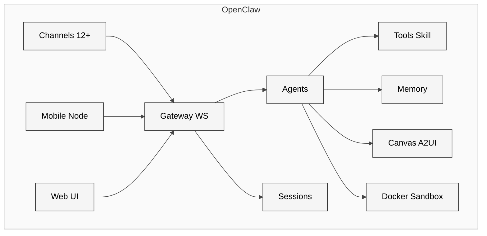
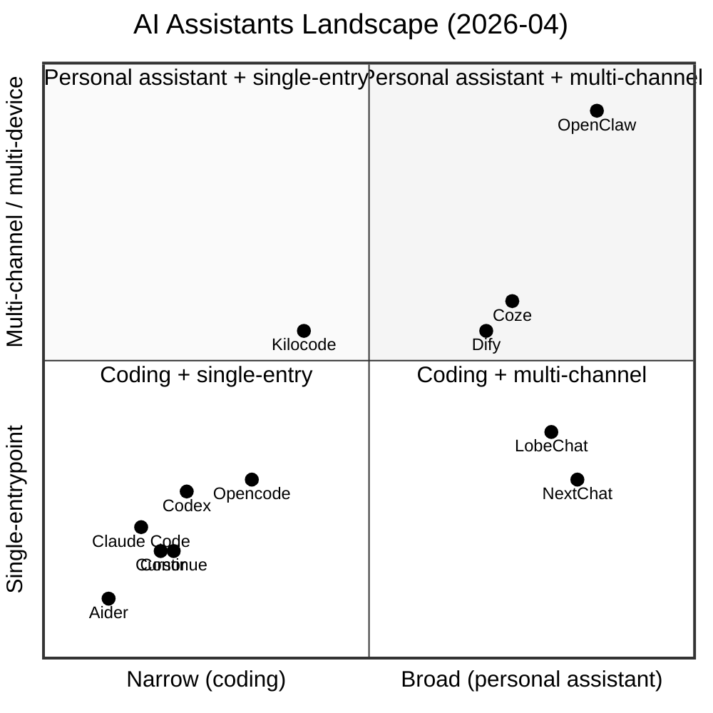

# 21 同类 AI 助手横向对比

> **本章目的**：把 OpenClaw 放进"AI 助手 / coding agent"这个赛道，给出**架构级**（不是 feature-bullet 级）的横向对比，让读者能回答：
> （a）OpenClaw 在整个赛道里占据什么生态位？
> （b）它与主流 coding agent 的**根本差异**是什么？
> （c）在什么场景应该"换用"？切换成本如何？
> **读者画像**：产品经理 / 技术选型负责人 / 平台架构师。

## 21.0 方法学与评估边界

### 对比样本及版本基线

| 代号 | 项目 | 类型 | 版本快照 | 可见性 |
|---|---|---|---|---|
| **OC** | OpenClaw | 开源 monorepo | v2026.4.15（本研究基线） | 全开源 |
| **CC** | Claude Code | 闭源 CLI + Skill | 2026-04 窗口版本 | 公开 docs + 用户可观察 |
| **CU** | Cursor | 闭源 IDE | 2026-04 稳定通道 | 公开 docs |
| **CX** | Codex（OpenAI CLI） | 部分开源 harness | 2026-04 | [extensions/codex](../../openclaw-repo/extensions/codex/src) 有适配层可观察 |
| **CT** | Continue | 开源 IDE 插件 | 2026-04 | 全开源 |
| **AI** | Aider | 开源 CLI | 2026-04 | 全开源 |
| **OP** | Opencode | 开源 CLI | 2026-04 | [extensions/opencode](../../openclaw-repo/extensions/opencode/api.ts) 适配器可观察 |
| **KC** | Kilocode | 开源 | 2026-04 | [extensions/kilocode](../../openclaw-repo/extensions/kilocode) 适配器可观察 |

> "适配器可观察" 含义：OpenClaw 的 `extensions/{opencode,codex,kilocode}` 目录里封装了如何把这些项目当作 "子进程 / 远端 agent" 调用的胶水代码——这提供了**直接的架构侧证据**，不用全部依赖它们的官方文档。

### 评估维度

本章按五个**结构性维度**评价，而不是按 "feature clicker"：

| 维度 | 定义 | 为什么重要 |
|---|---|---|
| **D1 入口拓扑** | 单进程 / 多通道 / 多设备 | 决定"AI 能在哪儿接触到用户" |
| **D2 控制面** | 是否有常驻 Gateway / 是否中心化 | 决定 agent 能否被多入口复用 |
| **D3 能力面** | coding / 生活 / 工作流 / 语音 / media | 决定 AI 能"做什么" |
| **D4 扩展面** | Skill / 插件 / Rule / MCP | 决定生态可以"附加什么" |
| **D5 安全面** | 沙箱 / 凭据 / 配对 / 审计 | 决定企业能否"部署它" |

### 偏差声明

- **闭源项目黑盒偏差**：Cursor、Claude Code、Codex 内部代码不可见，只能依赖公开 docs + 用户观察 + OpenClaw 的适配层胶水代码反向推理
- **更新漂移偏差**：AI agent 赛道每月都有大改动，本章快照为 2026-04-17；3 个月后这张表可能需要刷新
- **语言 / 文化偏差**：对 coding 项目的熟悉度（本研究作者偏向 CLI），对 IDE-first（Cursor / Continue）的体验描述相对浅

---

## 21.1 架构层次：五个项目 vs OpenClaw

### 21.1.1 OpenClaw 的架构（复盘自 Part I–III）

| 层 | 形态 | LOC（TS，非测试） |
|---|---|---|
| 主进程 | **Gateway（常驻 WebSocket 服务）** + agent runtime | `src/gateway` ~ **67k** |
| 入口 | CLI / webUI / native app（macOS/iOS/Android）+ **12+ channel** | `src/channels` + `extensions/{telegram,discord,...}` ~ **180k+** |
| Agent 层 | agent + session + skill | `src/agents` ~ **139k**（Part II 最大块） |
| 扩展层 | plugin / extension / community plugin / skill | `src/plugins` + `src/plugin-sdk` ~ **64k** + `skills/` |
| 本地命令 | doctor / wizard / dashboard | `src/commands` + `src/cli` ~ **77k** |
| Sandbox | three-tier Docker + main/non-main policy | `src/security` ~ **7.8k** |

> 规模：src 总约 **669k LOC**（非测试 TS），extensions **414k**，apps **138k**，合计 **1.22M LOC**。这是一个**"操作系统级别"**的 agent 项目。

核心运行形态图：

这是一个**带"控制面" + "多入口" + "多 agent 角色切换"** 的分布式 agent 系统。

### 21.1.2 Claude Code（CC）：以 CLI 进程为中心

| 层 | 形态 |
|---|---|
| 主进程 | 单 CLI 进程，直接起 agent loop |
| 入口 | 终端；subagent 是同进程 fork |
| Agent 层 | agent + skill + sub-agent（轻量）|
| 扩展层 | Skill（本地 / Anthropic 上传）+ MCP server |
| Sandbox | 内置，具体沙箱方式未完全公开 |

**核心差异**：CC 没有常驻 Gateway。每次 `claude` 启动一个新进程，**"多会话复用"依赖 shell 会话**而不是 agent server。它也没有 "channel 进入 Telegram" 这种拓扑。

### 21.1.3 Cursor（CU）：IDE 为唯一入口

Cursor 是一个 VSCode fork 加 AI 侧 channel。入口是 **IDE 窗口**。它有：

- 文件感知（光标周围、选区、diff view）
- Rules 系统（`.cursorrules` / `AGENTS.md`）
- MCP 支持
- Background Agent / Bugbot（闭源服务）

但它**没有**：多 channel（只有 IDE）、语音、移动端 agent、常驻 Gateway。

### 21.1.4 Codex（CX）：OpenAI harness

| 层 | 形态 |
|---|---|
| 主进程 | harness 进程 + sandbox 子进程 |
| 入口 | CLI / 代理 API |
| Agent 层 | 单 agent，用 `update_plan` / `tool_call` 协议 |
| 扩展层 | 较少，主要是内置 tool |
| Sandbox | 自带 "workspace-write" 等 mode |

**OpenClaw 适配证据**：[`extensions/codex/harness.ts`](../../openclaw-repo/extensions/codex/harness.ts) 把 Codex 当 *"外部 agent 引擎"* 调用，把它的 `apply_patch` / `shell` 工具转换为 OpenClaw 的 tool schema。这一层揭示 **Codex 本身缺 Gateway / channel 设计**——OpenClaw 补齐的正是这块。

### 21.1.5 Continue（CT）：IDE 插件 + open provider

- 入口：VSCode / JetBrains 插件窗口
- agent 层：较轻，偏 *"in-editor copilot"*
- 扩展：slash 命令 + 上下文 provider
- 特色：**开源、多 provider、可替换 embedding**——社区改版多

Continue 的价值是**"开源版 Cursor"**，但它没有 Gateway / 多 channel / 语音设计。

### 21.1.6 Aider（AI）：git-native pair programming

- 入口：终端
- agent：single-threaded，**强关联 git commit**（每次 edit 都 stage/commit）
- 扩展：较少，主打 "正确性 + 版本控制"
- 特色：在 "coding correctness + minimal hallucination" 上调校极细

Aider 定位是 "**会 git 的结对程序员**"，与 OpenClaw 完全不重合——它**不关心 chat / 生活 / 多设备**。

### 21.1.7 Opencode（OP）& Kilocode（KC）：开源 coding agent

这两个都是 "**受 OpenClaw 启发的 coding-focused fork / reimplement**"。OpenClaw 把它们当 "外部 coding engine" 调用：

- [`extensions/opencode/api.ts`](../../openclaw-repo/extensions/opencode/api.ts)、[`extensions/opencode/index.ts`](../../openclaw-repo/extensions/opencode/index.ts)：把 Opencode 当 HTTP / IPC 后端
- [`extensions/kilocode/provider-catalog.ts`](../../openclaw-repo/extensions/kilocode/provider-catalog.ts)：Kilocode 的 provider 目录

**隐含信号**：OpenClaw 自认在 "coding 深度"上并非第一梯队，**反而以"让所有 coding agent 都能挂到我这个 Gateway 下"** 作为战略——把自己做成 meta-controller。

---

## 21.2 结构性能力矩阵

**打分规则**：✅ full support · ⚠️ partial / 需配置 · ❌ 缺失。同一维度下任一能力 = 栏内主列。证据列给出代码路径或公开 URL。

### D1 入口拓扑

| 能力 | OC | CC | CU | CX | CT | AI | OP | KC | 证据 |
|---|---|---|---|---|---|---|---|---|---|
| CLI | ✅ | ✅ | ⚠️ | ✅ | ❌ | ✅ | ✅ | ✅ | 各自主 entry |
| IDE 插件 | ⚠️ VSCode companion | ❌ | ✅ IDE 本体 | ❌ | ✅ | ❌ | ❌ | ⚠️ | — |
| **多 channel（IM）** | ✅ **12+** | ❌ | ❌ | ❌ | ❌ | ❌ | ❌ | ❌ | `extensions/{telegram,discord,slack,feishu,qqbot,msteams,matrix,whatsapp-web,bluebubbles,imessage,mattermost,voice-call}` |
| **Voice**（实时语音） | ✅ | ❌ | ❌ | ❌ | ❌ | ❌ | ❌ | ❌ | `extensions/voice-call` + `extensions/deepgram` + Sherpa-ONNX |
| **Mobile node**（agent 在手机上） | ✅ iOS+Android | ❌ | ❌ | ❌ | ❌ | ❌ | ❌ | ❌ | `apps/ios`、`apps/android`（约 138k LOC） |

**结论**：在 D1 维度 OpenClaw 是**唯一的"进入到用户所有 channel"** 的项目。其他项目都是"在固定入口（终端 / IDE）等用户来"。

### D2 控制面

| 能力 | OC | CC | CU | CX | CT | AI | OP | KC | 证据 |
|---|---|---|---|---|---|---|---|---|---|
| **Gateway（常驻服务）** | ✅ WS + REST | ❌ | ⚠️ 云侧 | ❌ | ❌ | ❌ | ⚠️ | ⚠️ | `src/gateway` 67k LOC |
| 跨 session 共享 agent | ✅ | ⚠️ | ⚠️ | ❌ | ❌ | ❌ | ⚠️ | ⚠️ | — |
| 跨设备 pair | ✅ | ❌ | ❌ | ❌ | ❌ | ❌ | ❌ | ❌ | `extensions/device-pair` |

Gateway 是这张矩阵**唯一的质变差异**：有它 → agent 可以被多入口复用 → 产品形态从"一个工具"变成"一个随时在的数字分身"；没它 → agent 只能跟当前进程绑定。

### D3 能力面

| 能力 | OC | CC | CU | CX | CT | AI | OP | KC |
|---|---|---|---|---|---|---|---|---|
| coding（编辑 / patch / diff） | ✅ 中 | ✅ 强 | ✅ 强 | ✅ 强 | ✅ 强 | ✅ 顶 | ✅ 强 | ✅ |
| 浏览器自动化 | ✅ sandbox-browser | ⚠️ | ⚠️ | ⚠️ | ⚠️ | ❌ | ⚠️ | ⚠️ |
| 日常提醒 / cron | ✅ | ❌ | ❌ | ❌ | ❌ | ❌ | ❌ | ❌ |
| 生成图 / 视频 / 音频 | ✅ | ❌ | ❌ | ❌ | ❌ | ❌ | ❌ | ❌ |
| Canvas / A2UI | ✅ | ❌ | ⚠️ IDE pane | ⚠️ | ❌ | ❌ | ❌ | ❌ |
| Memory 多 backend | ✅ | ⚠️ | ⚠️ | ⚠️ | ⚠️ | ❌ | ⚠️ | ⚠️ |

OpenClaw 是**"coding 中等但生活能力最广"**；coding agent 是**"coding 顶尖但生活能力为零"**。这是**产品定位根本差别**。

### D4 扩展面

| 能力 | OC | CC | CU | CX | CT | AI | OP | KC |
|---|---|---|---|---|---|---|---|---|
| Skill 市场 | ✅ ClawHub 5k+ | ✅ | ⚠️ marketplace | ❌ | ⚠️ | ❌ | ❌ | ⚠️ |
| Plugin（npm 安装） | ✅ | ❌ | ⚠️ | ❌ | ✅ | ❌ | ⚠️ | ✅ |
| Extension（官方绑定通道） | ✅ 106+ | ❌ | ❌ | ❌ | ❌ | ❌ | ❌ | ❌ |
| MCP 客户端 | ✅ | ✅ | ✅ | ✅ | ✅ | ❌ | ⚠️ | ✅ |
| Community Plugin（第三方托管） | ✅ | ❌ | ❌ | ❌ | ⚠️ | ❌ | ❌ | ⚠️ |

OpenClaw 扩展层四层（plugin / extension / community plugin / skill；见第 5 章）**在这一赛道内最复杂**。代价是学习曲线——Skill 数虽然比 ClaudeCode 多（ClawHub 5k+ vs Anthropic Skills 约 ?），但"应该选哪层"的决策复杂度对开发者是负担。

### D5 安全面

| 能力 | OC | CC | CU | CX | CT | AI | OP | KC |
|---|---|---|---|---|---|---|---|---|
| Docker sandbox（三层） | ✅ | ⚠️ | ❌ | ⚠️ | ❌ | ❌ | ⚠️ | ⚠️ |
| main vs non-main session policy | ✅ | ❌ | ❌ | ❌ | ❌ | ❌ | ❌ | ❌ |
| Pairing 三档 DM | ✅ | ❌ | ❌ | ❌ | ❌ | ❌ | ❌ | ❌ |
| Secret 管理（SecretRef） | ✅ | ⚠️ | ⚠️ | ⚠️ | ⚠️ | ❌ | ⚠️ | ⚠️ |
| Tool policy schema | ✅ | ⚠️ | ❌ | ⚠️ | ❌ | ❌ | ❌ | ⚠️ |

安全面是 OpenClaw **2026-Q1 新增**的**绝对领先面**（见第 22 章 CVE 时间线）。CVE-2026-25253 后密集上的 Pairing / SSRF / exec-policy 让它在 open-source agent 里第一次建立了"企业级基本门槛"。

---

## 21.3 JTBD（Jobs-To-Be-Done）分析

### 为谁服务？

| 用户画像 | 典型 job | 首选项目 | 理由 |
|---|---|---|---|
| **硬核编程者** | "跟 AI pair programming、写 PR、跑 test、提 commit" | Aider / Cursor / Claude Code | coding 深度 + git 流程 |
| **开源开发者 / hacker** | "在 IDE 里嵌 AI、自由选 provider、不锁定厂商" | Continue / Kilocode / Opencode | 开源 + 可扩展 |
| **日常个人助手用户** | "生活提醒、cron、在 iMessage / Telegram 问 AI" | **OpenClaw** | 唯一覆盖 IM 多 channel + voice + 移动端 |
| **中国企业管理员** | "全员用上 AI 助手，嵌入飞书 / 企业微信 / 钉钉" | **OpenClaw（+ 中国化 fork / community plugin）** | 只有 OpenClaw 的 channel 抽象能复用 |
| **AI 研究者 / agent RL** | "给 agent 做自定义工具、回放、指标" | Codex harness / Claude Code | closed-box sandbox 一致性 |
| **做消费级 AI 产品的开发者** | "端到端搭 AI 伴侣 / 客服机器人" | **OpenClaw** | canvas + skill + voice 一齐具备 |

### JTBD 总结

OpenClaw 在**"个人 / 企业 AI 助手"** 这个 JTBD 上**实际上没有直接竞品**——它是开源赛道里**唯一跨 channel、跨设备、跨 media 的完整栈**。

Cursor / Claude Code / Aider / Continue 四个主流 coding agent 占据了**"程序员在工位上"** 这个 JTBD。它们与 OpenClaw 不是替代关系，而是**可以用 OpenClaw 的 codex / opencode / kilocode extension 把它们接进来作为 agent engine**。

---

## 21.4 定位四象限图（OpenClaw vs 其他）

两个轴：

- **X 轴**：coding-focus → personal-assistant-focus
- **Y 轴**：single-entrypoint → multi-channel/multi-device

读图要点：

- **左下密集**（coding + single-entry）：**同质化严重**的主流 coding agent，Q3 内很可能整合/互通
- **右下**（personal assistant + single-entry）：LobeChat / NextChat 等"**漂亮的 ChatGPT wrapper**"——UI 好，但缺 agent-loop
- **右上**（personal assistant + multi-channel）：**OpenClaw 近乎独占**；Kilocode 路线向右上走但仍偏 coding
- **中心**：Coze / Dify 之类的 "workflow 平台"——UI 好，workflow 强，但 channel 少、缺 coding / voice 深度

---

## 21.5 迁移成本分析（Switching Cost）

### From Claude Code / Cursor → OpenClaw

| 成本项 | 成本等级 | 说明 |
|---|---|---|
| 安装复杂度 | 中 | 需要 Node + Docker + 通道 token |
| skill / rule 迁移 | 低 | Claude Code Skill 格式与 OpenClaw Skill 相近；rules 可映射 |
| IDE 体验丢失 | **高** | diff view / IDE 面板是 IDE agent 核心体验 |
| "作为编程工具" 的能力 | **高** | coding 深度比 Cursor / CC 弱一截 |
| 新增"生活能力" | **大收益** | 通道 / voice / mobile / canvas 全部在官方支持 |

**建议**：**不要整体替换**；应该在 OpenClaw 里通过 `extensions/codex` 或 `extensions/opencode` 把 Claude Code / Codex 接成"我有时会用的 coding engine"，本体留 OpenClaw 当 "生活 + channel + 日常运营" 主力。

### From Continue / Aider → OpenClaw

| 成本项 | 成本等级 |
|---|---|
| 安装 | 中 |
| 无 IDE 插件体验 | **高**（Continue 用户核心 workflow 丢失） |
| coding "正确性"（Aider 的 strength） | **高** |
| 新增能力 | 高 |

**建议**：**纯 coding 用户不迁移**；需要跨 IDE / 跨 channel 才考虑。

### From LobeChat / NextChat → OpenClaw

| 成本项 | 成本等级 |
|---|---|
| 安装 | 中 |
| "聊天室 UX" 差异 | 中等（OpenClaw web UI 没 LobeChat 漂亮） |
| 大量 agent / tool / voice 能力增量 | **巨大收益** |
| 本地化中文体验 | **弱势**（需 community plugin） |

**建议**：**追求 agent 能力的 LobeChat 重度用户是 OpenClaw 最适合的目标群体**。

### From Coze / Dify → OpenClaw

| 成本项 | 成本等级 |
|---|---|
| visual workflow 丢失 | **高**（OpenClaw 没 workflow 画布） |
| self-host 自由度 | 增加 |
| 插件/skill 差异 | 中（需要重写 skill） |

**建议**：**Coze / Dify 提供 workflow，OpenClaw 提供 agent 能力**——二者互补而非替代。OpenClaw 未来可借鉴 Coze 的 workflow 画布（第 26 章 R9 建议）。

---

## 21.6 生态/数据指标对照

基于公开源数据（GitHub repo meta，截至 2026-04-17，[`repo-meta.json`](../Appendix/B-pr-issue-dataset/20260417/repo-meta.json)）和各项目公开页，用同量纲观测：

| 项目 | GH star 量级 | fork 量级 | 核心仓库贡献者规模 | skill / plugin 生态 |
|---|---|---|---|---|
| **OpenClaw** | 大（官方 `openclaw/openclaw` 本体 + clawhub 8k + awesome 46k + 29k + 周边） | 73.1k | PR 作者 465（2026-02–04） | ClawHub 5k+ skill |
| Claude Code | 闭源，star 不可见 | — | 内部团队 | Skill + MCP 生态 |
| Cursor | 闭源 | — | 内部团队 | MCP + Rules |
| Codex | 部分开源 | — | OpenAI 团队 | 有限 |
| Continue | 中（数万 star） | — | 开源社区活跃 | slash / context provider |
| Aider | 中（数万 star） | — | 开源社区活跃 | 较少 |
| Opencode | 小 | — | 较小社区 | 较少 |
| Kilocode | 小-中 | — | 较小社区 | 较少 |

> 这里不写具体数字是因为 GitHub 搜索接口对闭源项目不返回完整数据，且 Cursor / CC 的 star 反映的是 "marketing 仓库"，不一定反映产品真实使用量。相对大小更准确。

---

## 21.7 SWOT：四项目深度对比

### OpenClaw

- **S**：多 channel / 多设备 / 多 media 是唯一全开源实现；skill 生态繁荣；安全栈成熟
- **W**：coding 深度不如 Cursor / CC；web UI 不如 LobeChat；workflow 可视化缺席
- **O**：中国 channel 官方化（第 20 章主线 1）；企业可观测面板；端侧深度
- **T**：Claude Code 如果开放 Skill 市场 + 开 channel adapter，可能两边夹击

### Claude Code

- **S**：coding 体验顶尖；Skill 生态紧随 Anthropic 模型；sandbox 工程化好
- **W**：闭源；锁定 Anthropic 模型；无 channel / voice / mobile
- **O**：若 Anthropic 开放 SDK，可渗透到 IDE / workflow 领域
- **T**：开源 Continue + 多模型供应商竞争

### Cursor

- **S**：IDE 产品完成度极高；开发者付费意愿强；Background Agent 已初具 agent 能力
- **W**：单入口（IDE）；锁定 VSCode fork；非 coding 场景不可用
- **O**：扩展到移动 / web 全场景 IDE；MCP 生态
- **T**：Cursor 如果不扩展出 IDE 之外，会被 OpenClaw / Claude Code 合力蚕食

### Cohort "open coding agent"（Continue / Aider / Opencode / Kilocode）

- **S**：**完全开源**，无供应商锁定；给"模型 agnostic"用户绝佳选择
- **W**：单独用一个都有体验缺陷；维护者带宽分散
- **O**：有一个项目整合出 "Gateway + multi-channel" 可直接与 OpenClaw 正面碰
- **T**：OpenClaw 的 `extensions/{opencode,kilocode,codex}` 把它们当"子 engine"调度——**这恰好让它们失去独立成为一级产品的机会**

---

## 21.8 对 OpenClaw 团队的三个具体建议

基于上面的矩阵 + JTBD + 迁移成本，给官方的三条具体建议：

### 建议 1：**让 coding 深度补齐不要自己做，用 extension 的方式接**

- 已经做得很好：`extensions/codex`、`extensions/opencode`、`extensions/kilocode` 把外部 coding agent "借进来"
- 建议深化：做 "**IDE 协同模式**"——OpenClaw 本身不做 IDE 插件，但允许 Cursor / VSCode Continue 把 OpenClaw Gateway 作为 "后端大脑"

### 建议 2：**强化 "唯一生态位" 的叙事**

对比矩阵里 OpenClaw 四个**唯一**（channel / voice / mobile / multi-media）至今在营销侧没有被组织成明确的 "这些只有 OpenClaw 有" 的叙事。ClawHub 用户很可能不知道 OpenClaw 的 voice 能力。建议出一个 "**Only on OpenClaw**" 的 feature 矩阵 landing page。

### 建议 3：**加 workflow 画布补齐 Coze / Dify 的 gap**

- 现状：skills 和 extensions 解决"能做什么"，但普通运营者想"可视化串流程"时只能写 YAML / TS
- 建议：M2 季度加一个轻量 `src/workflow-canvas` 模块，对接现有 skill + tool + cron

---

## 21.9 方法学反思与后续研究

本章的局限：

- **闭源项目黑盒推断**：Claude Code / Cursor 的具体内部架构只能从 docs + 用户观察反向推
- **缺 performance 对比**：没跑 benchmark（latency、token 成本、任务成功率）。第 22 章 PR 里提到 [`#64441 benchmarks: add first-wave GPT-5.4 vs Opus 4.6 parity harness`](https://github.com/openclaw/openclaw/pull/64441) 显示官方内部已有 harness，未来可独立补一章
- **生态成熟度指标**：star 和 PR 数都是"输入"指标；真正的"产出"指标（skill 使用量、mobile 日活、voice 通话时长）需要官方出数据

这些延展留给 **第 27 章（结语）** 的 "附加研究建议" 部分。

---

## 下一章预告

第 22 章把视角从"项目横向"切回"OpenClaw 纵向"——用 [Appendix B 的 PR / commit / issue 数据集](../Appendix/B-pr-issue-dataset/20260417/)，做 **2026-02-01 → 2026-04-17 的 PR 演进全景**：
PR lifecycle 指标、月度 cohort、路径热点、CVE 时间线映射、reviewer / bus factor 分析。
