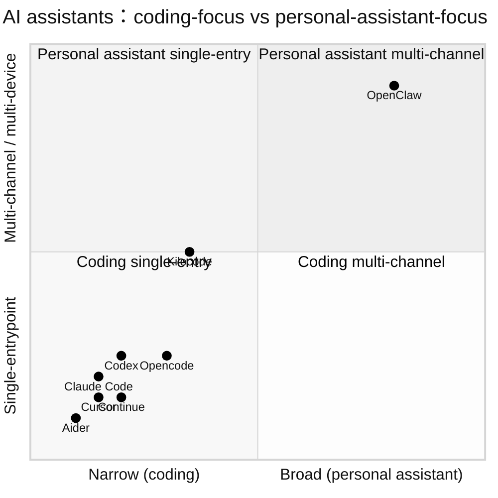

# 21 同类 AI 助手横向对比

## 数据源

- 本研究 Part I-III 源码阅读结论
- 已有本地研究：`/Users/hexiaonan/workspace/publish/hermes-agent-study`、`/Users/hexiaonan/workspace/publish/claude-code-source-analysis`
- [extensions/opencode](../../openclaw-repo/extensions/opencode)、[extensions/opencode-go](../../openclaw-repo/extensions/opencode-go)、[extensions/codex](../../openclaw-repo/extensions/codex)、[extensions/kilocode](../../openclaw-repo/extensions/kilocode)
- 各项目公开文档与官网

采集时间 2026-04-17。

## 一、对比选样

| 项目 | 类型 | 定位 |
|---|---|---|
| **OpenClaw** | 开源 + 个人助手 | 多 channel / multi-agent / 多端 |
| **Claude Code** | 闭源 CLI | 终端协同 coding |
| **Cursor** | 闭源 IDE | AI 优先 IDE |
| **Codex (OpenAI CLI)** | 闭源/部分开源 | 自主任务执行（coding） |
| **Continue** | 开源 IDE 插件 | IDE 自助 AI 开发 |
| **Aider** | 开源 CLI | git-native pair programming |
| **Opencode** | 开源 CLI | OpenClaw 风格编码代理 |
| **Kilocode** | 开源 | 以 clone / 灵感汲取自 OpenClaw |

## 二、能力矩阵

| 能力 | OpenClaw | Claude Code | Cursor | Codex | Continue | Aider | Opencode | Kilocode |
|---|---|---|---|---|---|---|---|---|
| 多 channel（chat messenger） | ✅ 12+ | ❌ | ❌ | ❌ | ❌ | ❌ | ❌ | ❌ |
| 多 agent（角色切换） | ✅ | ⚠️ subagent | ⚠️ | ⚠️ | ⚠️ | ❌ | ❌ | ✅ |
| 插件/扩展体系 | ✅ 106 | ⚠️ skill | ⚠️ rules/mcp | ⚠️ | ✅ | ❌ | ⚠️ | ✅ |
| Skill 目录 | ✅ ClawHub | ✅ | ⚠️ | ❌ | ⚠️ | ❌ | ❌ | ⚠️ |
| Live Canvas (UI output) | ✅ A2UI | ❌ | ⚠️ IDE | ⚠️ | ❌ | ❌ | ❌ | ❌ |
| Voice (real-time) | ✅ | ❌ | ❌ | ❌ | ❌ | ❌ | ❌ | ❌ |
| Mobile Node | ✅ iOS/Android | ❌ | ❌ | ❌ | ❌ | ❌ | ❌ | ❌ |
| 多 provider | ✅ 50+ | Anthropic | 多家 | OpenAI 家族 | ✅ | ✅ | ⚠️ | ✅ |
| Sandbox (Docker) | ✅ 三层 | ⚠️ | ❌ | ⚠️ | ❌ | ❌ | ⚠️ | ⚠️ |
| Pairing 安全 | ✅ DM 三档 | — | — | — | — | — | — | — |
| 中国生态原生 | ⚠️ 部分 | ❌ | ❌ | ❌ | ❌ | ❌ | ⚠️ | ⚠️ |
| Agent workspace（文件空间） | ✅ | ✅ | ✅ | ✅ | ⚠️ | ✅ | ✅ | ✅ |
| Memory 系统（多 backend） | ✅ | ⚠️ | ⚠️ | ⚠️ | ⚠️ | ❌ | ⚠️ | ⚠️ |

## 三、定位分层

- 左下密集（coding + single-entry）：主流 coding agent 同质化
- 右上只有 OpenClaw：**个人助手 + 多通道多设备**独占
- Kilocode 居中偏上：路线向 OpenClaw 靠拢但仍以 coding 为主

## 四、关键差异点深入

### 4.1 Gateway 控制面（OpenClaw 独有）

Claude Code / Codex / Aider / Continue 都是"agent 跑在当前进程"——没有常驻网关。OpenClaw 的 Gateway 让一个 agent 可以同时被多 channel、多设备、多 session 共享。

### 4.2 Channel 抽象（OpenClaw 独有）

coding-first 项目里没有"发 agent 到 Telegram"的设计。OpenClaw 的 12+ channel 把 "AI is a person I talk to in my messenger" 这种产品形态扎实落地。

### 4.3 Canvas 输出（半独有）

Cursor 的 IDE UI / Codex 的 web UI 可以渲染特定组件，但不是 agent-authored。OpenClaw 的 A2UI 是"agent 自主决定渲染什么 UI"。

### 4.4 Voice（独有）

OpenClaw 实时语音（PTT + TTS + SIP call）在开源 agent 里最完整。其他项目几乎都是 text-only。

### 4.5 Skill marketplace（与 Claude Code Skill 对标）

两者都叫 Skill 且 SKILL.md 格式接近。差别：

- Claude Code skill 是"本地或上传到 Anthropic"
- OpenClaw skill 是"本地 + ClawHub + 第三方目录"（开放生态）

### 4.6 Sandbox 策略

OpenClaw 三层 Docker sandbox + main/non-main session policy 是最精细的。Claude Code 有自身沙箱（closed）；其他开源项目普遍"自己包 Docker"。

## 五、与 Hermes-agent / claude-code-source-analysis 已有结论对照

（参考本地研究 `/Users/hexiaonan/workspace/publish/hermes-agent-study` 和 `/Users/hexiaonan/workspace/publish/claude-code-source-analysis`）

- **hermes-agent**：单 process、coding focus、tool 框架轻盈；没有 channel / voice / canvas
- **Claude Code**：工程上极度成熟，但产品定位仍是 "coding CLI"；skill / memory / sandbox 设计与 OpenClaw 呈现不同的收敛方向

**结论**：OpenClaw 和 Claude Code 的分野不是 "开源 vs 闭源"，而是 **"个人助手 vs 编程助手"** 的产品边界。从架构上两者选择的"Gateway / channel / canvas" 这套控件是根本差异，而不仅是外壳不同。

## 六、OpenClaw 在矩阵里的独特位置

1. **"让 agent 进到我已有的 channel 里"** —— 无替代
2. **"让 agent 用语音和我对话"** —— 无替代
3. **"让 agent 用我的手机完成行动"** —— 无替代
4. **"让 agent 有插件生态市场"** —— 与 Claude Code Skill 并列
5. **"让 agent 可以通过 Docker 沙箱安全跑任意 tool"** —— 较领先

## 七、仍存在的差距

- 相较 Cursor / Claude Code：**编程体验局部稍弱**（UI 交互、diff 视图、IDE 集成）
- 相较 Aider：**git-native 的 fine-grained commit 流程**较浅
- 相较 LobeChat / NextChat：**普通用户的 UI 漂亮度**不够
- 相较 Coze / Dify：**workflow 可视化**暂缺

## 下一章预告

第二十二章用 Appendix B 的 PR 数据盘点 **二月至今 PR 演进全景**——分类占比、月度曲线、Top 50 PR 主题。
