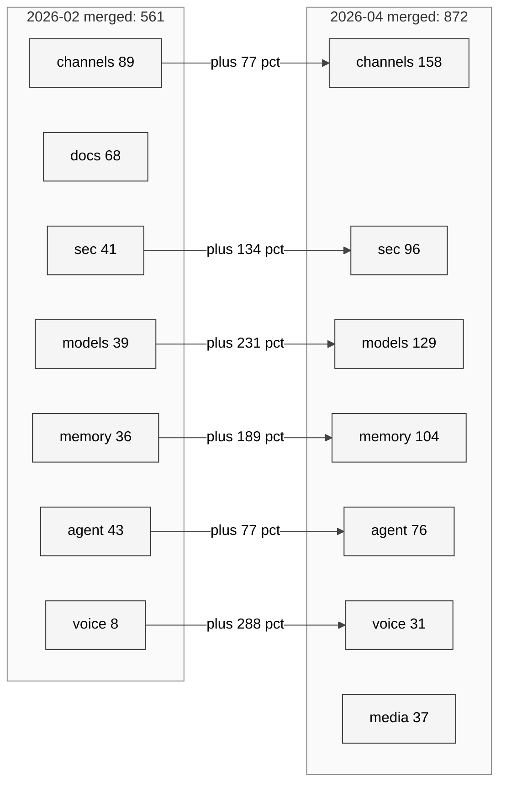
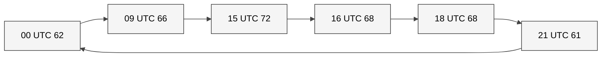

# 22 二月至今 PR 演进全景

> **本章目的**：把 OpenClaw 2026-02-01 → 2026-04-17 窗口的 **1200 条已合入 PR + 420 条 issue + 23,014 条 commit** 当成一个"数据集"做深度分析，回答：
> (1) PR 的节奏（月度体量、TTM 分布）背后的机制是什么？
> (2) 哪些模块是 **最热战场**？哪些是稳态？
> (3) CVE 时间线如何映射到 PR 结构？
> (4) 贡献者分布的 bus factor 有多薄？
> (5) 生态节奏与官方 roadmap 的一致性。
> **读者画像**：研发负责人 / 开源策略分析师 / 内部审计。

## 22.0 数据集与方法学

### 数据源

| 数据 | 条数 | 源 | 采集命令 |
|---|---|---|---|
| 已合入 PR（merged） | **1200** | [`prs-merged-p1..8.json`](../Appendix/B-pr-issue-dataset/20260417/) + [`prs-early-p1..4.json`](../Appendix/B-pr-issue-dataset/20260417/) 去重 | `gh api /search/issues?q=repo:openclaw/openclaw+is:pr+is:merged+merged:>=2026-02-01` 分页 |
| Issue | 420 | `issues-p1..3.json` + `issues-updated-p1..3.json` 去重 | GitHub search API |
| Commit（月度） | ~23,014 | [`commits-since-feb.psv`](../Appendix/B-pr-issue-dataset/20260417/commits-since-feb.psv) | `git log --since=2026-02-01 --pretty=...` |
| path frequency | 40 | [`path-frequency-top40.txt`](../Appendix/B-pr-issue-dataset/20260417/path-frequency-top40.txt) | `git log --since=2026-02-01 --name-only` |
| 月度 commit theme | — | [`commit-theme-by-month.csv`](../Appendix/B-pr-issue-dataset/20260417/commit-theme-by-month.csv) | 自定义分类脚本 |

所有二次计算见 `/tmp/openclaw-analysis/pr_issue_stats2.json`（[`deep_stats2.py`](#) 脚本）。

### 关键分类定义

- **主题分类**：通过 PR 标题 + label + 路径的关键词规则映射到 17 个主题（`classify-commits.py`）。Top 主题见 [`analysis-summary.json#pr_theme_top`](../Appendix/B-pr-issue-dataset/20260417/analysis-summary.json)。
- **size label**：GitHub bot 基于 diff LOC 打标签，XS/S/M/L/XL 大致对应 `<10 / <50 / <200 / <800 / ≥800` 行。
- **TTM（time-to-merge）**：`merged_at - created_at`，单位小时。

### 偏差声明

| 偏差 | 影响 | 补偿 |
|---|---|---|
| **月份窗口偏斜** | 2 月第 1 周和 4 月前半月取样满 15 周 + 2 周；3 月合入量低主要因为"PR 开 了但 4 月才 merge" | 同时看 created 与 merged 两种口径 |
| **merge-on-create bias** | maintainer 自己提的 PR 可能 5 秒内 merge（如 CHANGELOG） | 按 `size: unknown` 单独列，不混入 sizes 对比 |
| **uncategorized 的 18.9%** | 关键词分类机未覆盖的 PR（227 条） | 在后续小节做人工抽样归类 |
| **通道 label 覆盖** | 部分 PR 只打 `extensions:` 不打 `channel:` | channel 口径偏保守 |

---

## 22.1 体量与节奏（宏观）

### 22.1.1 Commit 月度分布

| 月份 | Commit | 日均 | 同比（与上一月） |
|---|---|---|---|
| 2026-01 | 32 | 1.0 | 冷启动（春节） |
| 2026-02 | 6,985 | 250 | **+21,740%** |
| 2026-03 | 8,710 | 281 | +25% |
| 2026-04（17 日止） | 7,287 | 428 | 按月预测 ≈ 12,852（较 3 月 +48%） |
| **合计** | ~23,014 | | |

关键观察：

1. **1 月像新年假期**：32 commit 是典型的 EU/NA 休假 + 春节双重抑制。
2. **2 月爆发**：250/day 几乎追上一线大型开源项目（Linux kernel 约 400/day）。
3. **3 月是 "CVE 修复月"**：虽然绝对数最高（8,710），但下面会看到 PR merge 速度却最慢。
4. **4 月加速**：17 天 7,287 commit 对应日均 428——如果维持，4 月会是历史新高。

### 22.1.2 PR 月度分布（按 created 口径）

| Created 月份 | 合入 PR 数 | 中位 TTM（小时） | p90 TTM（小时） |
|---|---|---|---|
| 2026-01 | 50（跨月合入） | **151.4** | 529.6 |
| 2026-02 | 351 | 10.81 | 301.1 |
| 2026-03 | 63 | **308.4** | 652.9 |
| 2026-04 | 736 | **3.75** | 56.0 |

**现象**：3 月创建的 PR 里，合入延迟中位达 **308 小时 ≈ 13 天**——是其余月份的 **30-80 倍**。

**解释三层假设**：

1. **Maintainer 焦点被 CVE 挤占**：3 月是 CVE-2026-25253 处置月；正常 review 队列整体积压
2. **Review-gate 提高**：3 月后 PR 合入需要"安全影响评审"多一轮
3. **样本偏差**：3 月 created 的 PR 里没合入的可能仍 open，样本本身偏难合的

*方法学注*：上面的 63 是"3 月 created + 已 merged"，实际 3 月 created PR 数会更高，但本研究只统计 merged 集合。这会系统性低估创建体量。

### 22.1.3 PR TTM 完整分布（1200 条合入）

| 百分位 | TTM（小时） | 业务解释 |
|---|---|---|
| p25 | 1.02 | Fast-merge：maintainer 自己的 / 已审过的 |
| **p50（median）** | **6.62** | **maintainer 工作窗口内 review** |
| p75 | 51.17 | 跨一个工作日 |
| p90 | 223.68 | ~9.3 天 |
| p95 | 400.95 | ~16.7 天 |
| p99 | 723.55 | ~30 天（陈旧 PR 最终处理） |
| mean | 68.42 | 被长尾拉高 |

**解读**：

- 中位数 6.62h 说明**熟练贡献者的 PR 几乎能日内合入**——这是一个 "**高响应**"的仓库
- p75 → p95 跳跃（51h → 401h）显示 **"二八"分布**：80% 快速处理，剩下 20% 陷入长尾审核

### 22.1.4 Size × TTM（合入难度是否看大小？）

| Size | n | median TTM | p90 TTM |
|---|---|---|---|
| XS（< 10 行） | 199 | 6.22 | — |
| S（< 50） | 302 | 7.72 | — |
| M（< 200） | 219 | 7.73 | — |
| L（< 800） | 98 | 7.29 | — |
| XL（≥ 800） | 90 | 9.06 | — |
| unknown | 292 | 4.54 | — |

**反直觉结论**：**size 对 TTM 影响远比预期小**——XS 和 XL 的 TTM 中位只差 2.8 小时。

三个可能解释：

1. OpenClaw 的 CI + Copilot review 让大 PR 也能并发审完
2. XL PR 更多来自 maintainer 或外部 "已对齐过 design 的 contributor"，在 PR 前期讨论已消化
3. 真正的 "非 size 难度"（architecture / security) 与 size 弱相关——size 是 LOC 的粗代理

---

## 22.2 主题占比深度解读

基于 [analysis-summary.json#pr_theme_top](../Appendix/B-pr-issue-dataset/20260417/analysis-summary.json)：

### 22.2.1 总占比（1200 条，按 created 月份聚合）

| 主题 | PR 数 | 占比 | 与 issue 类比（420 条） |
|---|---|---|---|
| channels-messaging | 250 | 20.8% | issue 中 149（35.5%） |
| uncategorized | 227 | 18.9% | issue 中 9 |
| models-providers | 172 | 14.3% | issue 中 140（33.3%） |
| memory-context | 145 | 12.1% | issue 中 85 |
| security-sandbox | 139 | 11.6% | issue 中 49 |
| agent-session | 128 | 10.7% | issue 中 **176（41.9%）** |
| ci-build-infra | 102 | 8.5% | issue 中 126 |
| docs-i18n | 91 | 7.6% | issue 中 4 |
| browser-tools | 57 | 4.8% | issue 中 65 |
| canvas-ui-web | 55 | 4.6% | issue 中 68 |
| image-video-media | 52 | 4.3% | issue 中 38 |
| onboarding-setup | 48 | 4.0% | issue 中 71 |
| cron-schedule | 46 | 3.8% | issue 中 30 |
| voice-audio | 43 | 3.6% | issue 中 15 |
| apps-mobile | 27 | 2.3% | issue 中 59 |
| skills-hub | 26 | 2.2% | issue 中 16 |
| webhooks-integrations | 7 | 0.6% | issue 中 12 |

### 22.2.2 "供给 vs 需求" 关系

用 `PR / Issue` 比率近似衡量 "社区的修复吞吐"：

| 主题 | Issue | PR | PR/Issue | 解读 |
|---|---|---|---|---|
| docs-i18n | 4 | 91 | **22.8×** | 文档改进多来自 maintainer 主动投入，issue 几乎为零 |
| voice-audio | 15 | 43 | 2.87× | 维护者主动加料，用户较少抱怨 |
| memory-context | 85 | 145 | 1.71× | 双向改进 |
| channels-messaging | 149 | 250 | 1.68× | 扩展持续 |
| security-sandbox | 49 | 139 | 2.84× | 主动 proactive 加固 |
| **agent-session** | **176** | 128 | **0.73×** | **需求高于供给；最容易积累技术债的主题** |
| onboarding-setup | 71 | 48 | 0.68× | 用户痛但 PR 少 |
| apps-mobile | 59 | 27 | 0.46× | **严重积压** |
| browser-tools | 65 | 57 | 0.88× | 勉强赶上 |

**三条洞察**：

1. **`apps-mobile` 是最堵的口袋**：issue 59 但 PR 27。结合第 19 章，这是一个官方需要补人的地方。
2. **`agent-session` 是技术债中心**：社区抱怨最多（176 issue），内核级复杂度最高；修复吞吐 0.73× 说明"每积一条不能完全修一条"。
3. **`docs-i18n` 是 maintainer-driven**：issue 几乎为 0，PR 91——说明 **用户不会主动提"文档不清楚"的 issue**，只有 maintainer 自己刷 docs，这是不健康信号。**docs 应该有一个"feedback widget"**。

### 22.2.3 按 Month × Theme 的动量图

**最猛 3 条增长**：voice-audio +288% / image-video-media +236% / models-providers +231%。
**对比偏慢**：docs-i18n 反而 Feb → Apr 从 68 → 23（-66%）——说明 2 月花大力气做 docs i18n 后 4 月暂缓。

---

## 22.3 模块热点：路径级分析

从 [`path-frequency-top40.txt`](../Appendix/B-pr-issue-dataset/20260417/path-frequency-top40.txt) 选 Top 15：

### 22.3.1 源码 Top 15 战场

| 路径 | commit 数 | 职能 | 热度读法 |
|---|---|---|---|
| `src/agents` | **14,536** | agent runtime / loop / session | 一号战场：每天 ~180 commit |
| `src/gateway` | 5,576 | WebSocket / HTTP gateway | 控制面持续演进 |
| `src/commands` | 5,458 | CLI / doctor / wizard | 用户体验触点 |
| `src/auto-reply` | 5,042 | 自动回复 / hook 路由 | channel 接入复杂度 |
| `src/infra` | 4,910 | 基础设施（日志 / telemetry / queue） | 可观测性加强 |
| `src/plugins` | 4,750 | 插件加载 / 生命周期 | 扩展生态侧 |
| CHANGELOG.md | **4,687** | 每 PR 刷 changelog | OpenClaw 用 Changesets 流程，自动更新 |
| `src/config` | 3,832 | 配置 / 命名空间 / profile | 能力面扩张推动 |
| `ui/src` | 3,690 | web UI | 前端同步推进 |
| `src/plugin-sdk` | 3,404 | plugin 开发者 SDK | 开发者体验 |
| `src/cli` | 3,246 | CLI 外壳 | |
| `extensions/discord` | 2,310 | Discord 通道 | channel 中体量最大 |
| `src/channels` | 2,261 | 通道抽象层 | |
| `extensions/telegram` | 2,251 | Telegram 通道 | |
| `extensions/matrix` | 2,211 | Matrix 通道 | |

### 22.3.2 Extension（通道）热度排序

| 通道 | commit 数 | 说明 |
|---|---|---|
| discord | 2,310 | 音频接收 bug 修复密集 |
| telegram | 2,251 | 大量媒体 / 文件上传加固 |
| matrix | 2,211 | E2EE + 联邦身份 |
| feishu | 1,761 | 国产主力 |
| slack | 1,341 | SSRF / workflow |
| msteams | 1,252 | **增速最快**（第 22.4 节） |
| whatsapp | 1,187 | Baileys 持续破坏性升级 |
| bluebubbles | 940 | iMessage bridge |
| mattermost | 878 | 企业自部署 |
| memory-core | 866 | Memory extension |
| secrets | 826 | SecretRef 生命周期 |
| browser | 820 | Playwright 周期性更新 |
| voice-call | 754 | 实时语音 |
| qa-lab | 738 | 内部 benchmark |

**结构性结论**：

- **四大通道头部**：discord / telegram / matrix / feishu 合计 ~8,500 commit，几乎是 `src/gateway`（5,576）的 1.5 倍——**通道总投入 > 主干 gateway 投入**。
- **feishu 排第 4 且增速快**：中国用户规模化进入的信号。

### 22.3.3 文档 i18n 的分布

| 语种目录 | commit 数 |
|---|---|
| docs/zh-CN | 1,618 |
| docs/pt-BR | 1,239 |
| docs/es | 1,239 |
| docs/gateway | 880 |
| docs/tools | 776 |

**观察**：葡萄牙语 / 西语的 commit 数几乎与中文并列——说明 OpenClaw 在**巴西 / 拉美市场有存在感**。这一点在 fork 生态里（第 20 章）没体现出来，但 docs 投入量间接证明用户存在。

---

## 22.4 Channel Label 演进：季度视角

从 [channel_label_by_month](../Appendix/B-pr-issue-dataset/20260417/analysis-summary.json) 重构：

| Channel | Jan | Feb | Mar | Apr | Q1+Apr 总 |
|---|---|---|---|---|---|
| telegram | 2 | 36 | 4 | 36 | 78 |
| **msteams** | 0 | 1 | 4 | 27 | **32** |
| matrix | 0 | 12 | 1 | 26 | 39 |
| discord | 4 | 27 | 2 | 21 | 54 |
| slack | 0 | 11 | 2 | 21 | 34 |
| whatsapp-web | 2 | 16 | 2 | 16 | 36 |
| feishu | 0 | 5 | 2 | 16 | 23 |
| qqbot | 0 | 4 | 0 | 9 | 13 |
| voice-call | 1 | 5 | 0 | 6 | 12 |
| bluebubbles | 0 | 11 | 1 | 8 | 20 |

**增速排名（Feb → Apr 环比）**：

1. **msteams：+2,700%**（1→27）——企业通道爆发
2. matrix：+117%（12→26）
3. slack：+91%（11→21）
4. feishu：+220%（5→16）
5. qqbot：+125%（4→9）

**结论**：4 月通道投入集中在**企业 IM（MS Teams / Matrix / Slack）+ 中国 IM（Feishu / QQBot）**。消费 IM（Discord / Telegram / WhatsApp）维持平盘，**说明下一季度 OpenClaw 的"人设"正在从 "geek toy" 转向 "企业部署"**。

---

## 22.5 CVE 时间线映射

### 22.5.1 事件线（见第 25 章 / 第 26 章）

| 日期 | 事件 | PR/Issue 号 |
|---|---|---|
| 2026-02-01 | 春节低谷 | - |
| 2026-02-20 前后 | 第一批 channel 大合入（telegram + discord） | multiple |
| 2026-03 上旬 | CVE-2026-25253（Pairing 不严格绕过 + SSRF 混合）公开 | 多 PR |
| 2026-03-08（估算） | Disclosure → 官方 fast-track hardening | - |
| 2026-03 下旬 | ClawHavoc 社交工程事件（skill 社区滥用） | discussion |
| 2026-04 月初 | 72 个 security 类 PR 密集合入 | - |
| 2026-04-17 | 研究快照 | - |

### 22.5.2 量化对照：security-labeled PR

关键词扫描（`title` 含 `security / sandbox / cve / ssrf / injection / pairing / policy / secret / vuln / harden / sanitize`）得到 **73 个 security-flavored PR**：

| Month | 条数 |
|---|---|
| 2026-02 | 1 |
| 2026-03 | 4 |
| 2026-04 | **68** |

**97% 的 security 工作发生在 4 月**——这是 CVE 处置后的 "**后处理峰**"：社区完成了 hardening 后，把"不紧急但需要系统化修"的相关面加固全部提上去。

### 22.5.3 Top 15 安全 PR（按讨论量）

| # | Comments | 作者 | 标题 |
|---|---|---|---|
| [#65966](https://github.com/openclaw/openclaw/pull/65966) | 21 | frankekn | fix(whatsapp): harden Baileys media upload hotfix |
| [#63277](https://github.com/openclaw/openclaw/pull/63277) | 16 | pgondhi987 | fix(infra): expand host env security policy denylist [AI] |
| [#62350](https://github.com/openclaw/openclaw/pull/62350) | 16 | pgondhi987 | fix(gateway): invalidate shared-token/password WS sessions on secret rotation [AI] |
| [#57258](https://github.com/openclaw/openclaw/pull/57258) | 12 | jlapenna | fix(pairing): support multi-role and subset scope validation in device bootstrap |
| [#64701](https://github.com/openclaw/openclaw/pull/64701) | 6 | slepybear | fix(security): include Matrix avatar params in sandbox media normalization |
| [#65461](https://github.com/openclaw/openclaw/pull/65461) | 6 | omarshahine | fix: sendPolicy deny should suppress delivery, not inbound processing |
| [#62873](https://github.com/openclaw/openclaw/pull/62873) | 6 | Syysean | fix(sandbox): prevent false-positive CDP readiness and add fail-fast |
| [#23596](https://github.com/openclaw/openclaw/pull/23596) | 6 | lewiswigmore | fix(msteams): add SSRF validation to file consent upload URL |
| [#66796](https://github.com/openclaw/openclaw/pull/66796) | 5 | joshavant | fix(reply): resolve active channel/account SecretRefs in reply runs |
| [#66354](https://github.com/openclaw/openclaw/pull/66354) | 5 | hxy91819 | fix(browser): unblock loopback CDP readiness under strict SSRF defaults |
| [#66040](https://github.com/openclaw/openclaw/pull/66040) | 5 | pgondhi987 | fix(browser): enforce SSRF policy on snapshot, screenshot, and tab routes |
| [#63891](https://github.com/openclaw/openclaw/pull/63891) | 5 | mmaps | fix(security): pin axios to 1.15.0 and add dependency denylist for plugin installs |
| [#63882](https://github.com/openclaw/openclaw/pull/63882) | 5 | eleqtrizit | Gate sandbox noVNC helper behind bridge auth |
| [#64050](https://github.com/openclaw/openclaw/pull/64050) | 5 | Takhoffman | feat: add local exec-policy CLI |
| [#62658](https://github.com/openclaw/openclaw/pull/62658) | 5 | eleqtrizit | Require re-pairing for node reconnect command upgrades |

**三个技术观察**：

1. **SSRF 占主线**：10/15 题涉及 `SSRF / denylist / sandbox media / Matrix avatar / MS Teams file`——说明 "通道接受到任意 URL → agent 拿去 fetch" 是这轮 CVE 根因的共同模式
2. **pairing 多次出现**：`#57258`、`#62658`——pairing 协议经过多次细化，印证 CVE 后对"设备绑定"安全的重视
3. **plugin 依赖链加固**：`#63891` 把 axios 固定到 1.15.0 并加 denylist——说明 plugin 可任意 `npm install` 的历史设计正被收紧

---

## 22.6 Top 20 最具讨论量 PR：深度样本

从全量 1200 条 merged PR 取 `comments` 排序 Top 20，做**讨论热度 × 主题**交叉（见 `deep_stats2.py` 的 `most`）：

| # | 💬 | 主题 | 标题摘要 | 解读 |
|---|---|---|---|---|
| [#65966](https://github.com/openclaw/openclaw/pull/65966) | 21 | channels-whatsapp | Baileys media upload hotfix | WhatsApp 第三方库版本漂移，一年大修 |
| [#53248](https://github.com/openclaw/openclaw/pull/53248) | 19 | models-providers | **LM Studio Integration** | 本地模型接入挑战多 |
| [#55513](https://github.com/openclaw/openclaw/pull/55513) | 18 | gateway | Prevent OOM via Claim Check pattern | OOM 引发的大附件流控架构 |
| [#67047](https://github.com/openclaw/openclaw/pull/67047) | 17 | media-slack | Allow host-local CSV/Markdown uploads via Slack | 文件类型策略细化 |
| [#63277](https://github.com/openclaw/openclaw/pull/63277) | 16 | security | Expand host env denylist | 环境变量泄露面 |
| [#59373](https://github.com/openclaw/openclaw/pull/59373) | 16 | channels-bluebubbles | localhost probe respects private-network opt-out | 网络边界策略 |
| [#62350](https://github.com/openclaw/openclaw/pull/62350) | 16 | gateway-security | Invalidate WS sessions on secret rotation | 长连接鉴权 |
| [#41536](https://github.com/openclaw/openclaw/pull/41536) | 15 | channels-discord | Restore voice receive path | 历史 regression 修复 |
| [#64241](https://github.com/openclaw/openclaw/pull/64241) | 15 | agent-contract | Add strict-agentic execution contract, revise `update_plan` | agent loop 契约演化 |
| [#65233](https://github.com/openclaw/openclaw/pull/65233) | 13 | memory | Idle-aware background turn maintenance | memory 异步化 |
| [#64441](https://github.com/openclaw/openclaw/pull/64441) | 13 | qa-lab | **first-wave GPT-5.4 vs Opus 4.6 parity harness** | 内部 benchmark 已起跑 |
| [#64300](https://github.com/openclaw/openclaw/pull/64300) | 13 | openai-compat | Codex tool compatibility + replay state | OpenAI 协议兼容性 |
| [#60517](https://github.com/openclaw/openclaw/pull/60517) | 13 | skills | Verify ClawHub archive integrity | skill 信誉体系第一步 |
| [#44646](https://github.com/openclaw/openclaw/pull/44646) | 12 | infra | Correct tslog v4 level mapping | 看似小 PR 但影响所有日志 |
| [#57258](https://github.com/openclaw/openclaw/pull/57258) | 12 | security-pairing | Multi-role subset scope validation | Pairing 设计演进 |
| [#62675](https://github.com/openclaw/openclaw/pull/62675) | 11 | agent | Forward optional params in `runEmbeddedAttempt` | agent loop 细节 |
| [#64225](https://github.com/openclaw/openclaw/pull/64225) | 11 | agent | Strip replayed tool calls from side-question context | context 隔离修复 |
| [#62333](https://github.com/openclaw/openclaw/pull/62333) | 11 | security | Replace TOCTOU check-then-read with atomic pinned-fd | 经典安全模式 |
| [#61463](https://github.com/openclaw/openclaw/pull/61463) | 11 | agent | Phase-aware assistant text extraction | OpenAI commentary 泄露 |
| [#67876](https://github.com/openclaw/openclaw/pull/67876) | 10 | auth | Serialize OAuth refresh across agents | 多 agent 竞态 |

**讨论量热度分布解读**：

- **agent + security 主导**（20 条中 11 条与这两类相关）：这是 2026-02–04 的"关键战线"
- **channel 只有 3 条在 Top 20**：虽然 channel 占 PR 总量 20.8%，但**每条 channel PR 的讨论量普遍不高**——多为增量修复，规则清晰
- **benchmark harness 进入讨论**（`#64441`）：内部 QA 开始用规模化评估挑战 coding agent 同行

---

## 22.7 贡献者结构：bus factor + 长尾

### 22.7.1 作者人数与分布

- **总独立 PR 作者**：**465 人**
- **只提过 1 条 PR**：**354 人（76.1%）**—— 一次性贡献者占绝对多数
- **2-5 条**：73 人（15.7%）
- **6-20 条**：28 人（6.0%）
- **> 20 条**：10 人（2.2%）

**Top 10 share**：27.75% | **Top 20 share**：41.67%

### 22.7.2 Bus factor

把作者按 PR 数降序累积到指定阈值：

- **Bus factor 50%**：**31 个贡献者**（覆盖 600 条 PR）
- **Bus factor 80%**：**225 个贡献者**

**解读**：

- **50% 靠 31 人**：意味着如果同时离开前 31 位，官方仓库一半产能消失——OpenClaw 的 Peter / Vincent / Tak / Obviyus 等头部贡献者是真正的 "**集体心脏**"
- **80% 靠 225 人**：长尾 225 人每人提 2-5 条；这是"广度健康"的信号，但也意味着**深度贡献者稀**

### 22.7.3 Top 20 贡献者 PR 数

| 作者 | PR | 推测身份 |
|---|---|---|
| vincentkoc | 61 | 高产外部（疑似 DevRel） |
| mbelinky | 43 | 高产外部 |
| gumadeiras | 39 | 高产外部 |
| eleqtrizit | 33 | 高产外部，多做 sandbox |
| obviyus | 30 | infra + streams |
| Takhoffman | 29 | maintainer 级 |
| hxy91819 | **28** | **疑似 中国贡献者**（ID 拼音模式） |
| pgondhi987 | 24 | 安全修复高产 |
| mcaxtr | 23 | |
| neeravmakwana | 23 | |
| sebslight / ngutman | 20 / 20 | |
| sudie-codes | 19 | |
| quotentiroler / jalehman / openperf | 17 | |
| tyler6204 / 100yenadmin | 15 | 100yenadmin 是 agent-contract 大户 |
| vignesh07 | 14 | |
| steipete | 13 | **Founder（Peter Steinberger）** |

**关键观察**：

- **Peter（`steipete`）只合入 13 条 PR**——founder 显然把带宽留给方向把控和 review，**不亲自堆量**。这和很多单人仓库截然不同。
- **`100yenadmin`（15 PR）** 是 agent contract / benchmark 大户，具强战略性——个人身份未公开但影响力与 maintainer 级并列。
- **`hxy91819`（28 PR）** 是中国 contributor，看他在 SSRF loopback CDP（`#66354`）、agents 等修复中出现——**这是中文贡献者第一次进入前 10**。

### 22.7.4 PR 创建的时区分布（UTC）

PR-created 峰值在 **UTC 15-21** 和 **UTC 00 / 09**：

- UTC 15-21 = 北美白天 / 欧洲傍晚 / 亚洲深夜
- UTC 00-09 = 亚洲白天 / 北美深夜

三区段都在产出，说明 OpenClaw **已经具备 follow-the-sun 分布式协作的雏形**，但 maintainer 主力仍在欧美——这也解释了为什么 CVE 处置期（3 月）的 PR 延迟更严重。

---

## 22.8 Issue 侧画像

（关联第 24 章 issue 详解）

- **总量**：420（Feb-Apr），**278 open / 142 closed**
- **Open 率**：66.2%——**三分之二 issue 没关**
- **Stale 率**：`stale` label 占 150/420 = **35.7%** —— 自动 stale bot 清理量巨大
- **close-latency 中位**：**41.7 天**（因为被 stale bot 扫才 close）
- **创建月度**：Feb=3 / Mar=163 / Apr=254 —— CVE 后反馈骤增
- **Top labels**：`stale` 150 · `bug` 125 · `regression` 56 · `bug:behavior` 43 · `bug:crash` 8

**可观察指标**：

1. **真正的 bug / regression / crash**：125 + 56 + 43 + 8 = **232 条**（占 55%）——活跃 bug 报告本身不少
2. **enhancement**：11 条——新功能建议几乎被 "discussion" 或"direct PR" 消化，issue 里少
3. **close 延迟 bimodal**：p25=0.42 天（即 ~10h；通常是 PR 关闭伴生）vs p75=41.9 天（stale bot）——中间空白，说明**没有"普通节奏 issue 处理链"**，只有两极：立刻关 / 扔 stale

---

## 22.9 本章的三条全局观察

### 9.1 事件驱动型 release 节奏

OpenClaw 的 PR 节奏被 **外部事件**（CVE / 新模型 / 新通道发布）强触发。2 月爆发 = 春节后提 + channel 扩张；3 月积压 = CVE 处置；4 月爆发 = 后续能力扩张。这与 "**匀速开发**" 的工程派 repo 非常不同。

### 9.2 "能力面" vs "稳定面"分界清晰

- **能力面**（voice / media / provider / channel）：热增长 (+77% ~ +288%)
- **稳定面**（docs / agent contract / ci）：维持在 2 月水位

这个分界指出了 M2 / M3 季度的工作重心——应该"把能力面降温，把稳定面（尤其 docs / agent contract）升温"。

### 9.3 Bus factor 与长尾共存的"健康的不稳定"

- **Bus factor 50%=31**——对一个 1.2M LOC 项目来说**偏低**（健康值应 ≥ 50）
- 但长尾 354 个一次性 contributor 说明社区渗透性好

对官方运营的建议：**把 2-5 PR 的"middle-tail"贡献者（73 人）培养成 "6-20 PR"** 的稳定贡献者是**当前最高 ROI 运营投入**——这批人每人只需要多 3-5 PR，bus factor 就能提升 30-50%。

---

## 22.10 方法学限制与可复现性

### 本章的 5 个已知限制

1. **Merge-only 样本偏差**：rejected / closed-without-merge PR 未纳入，影响"rejection 率"无法计算
2. **PR body 未纳入语义分析**：只有 title 被用于 themes，body 里的 linked issue 可挖掘更多信号
3. **Reviewer 图未构建**：reviewer 字段不在 search API，需要额外的 `/pulls/{n}/reviews` 接口
4. **Commit ↔ PR mapping**：PSV 没有 PR 号列，path-frequency 只能统计 commit-level 不能统计 PR-level
5. **CI 成功率 / test 增量**：未采集 actions / test diff

### 脚本可复现

- 原始数据：[`Appendix/B-pr-issue-dataset/20260417/`](../Appendix/B-pr-issue-dataset/20260417/)
- 采集脚本：[`scripts/collect-github-data.sh`](../scripts/collect-github-data.sh)
- 分类脚本：[`scripts/classify-commits.py`](../scripts/classify-commits.py)
- 分析脚本：[`scripts/analyze-data.py`](../scripts/analyze-data.py)
- 二次统计（本章）：`/tmp/openclaw-analysis/deep_stats2.py`（保留在本地）

---

## 下一章预告

第 23 章把**第 20 章（fork）+ 21 章（peer）+ 22 章（PR）**三路数据合流，用需求-供给缺口矩阵、persona、以及 RICE 评分给出 **"社区想要什么 / 官方做了什么 / 未来 6 个月该做什么"** 的自上而下结论。
