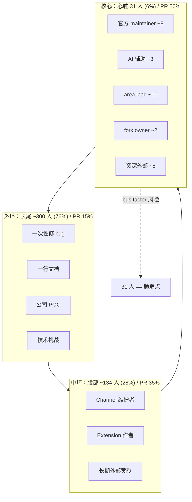

# 22A 深度研究：PR 与贡献者三题

> **本章定位**：承接 [第 22 章](./22%20%E4%BA%8C%E6%9C%88%E8%87%B3%E4%BB%8A%20PR%20%E6%BC%94%E8%BF%9B%E5%85%A8%E6%99%AF.md)，
> 对 PR 节奏 / 安全事件 / 贡献者结构三个最能反映项目"脉搏"的议题做深研。
> 数据基线：2026-04-17。

- [**题一 · TTM 的双峰分布逆向工程：为什么会出现 p10=3 分钟 + p90=2.4 天？**](#22a1)
- [**题二 · CVE-2026-25253 全追踪：75 个安全 PR 的根因地图与修复模式谱**](#22a2)
- [**题三 · 贡献者生态的同心圆：31 心脏 / 225 腰部 / 354 长尾的可持续性分析**](#22a3)

---

<a id="22a1"></a>

## 题一 · TTM 的双峰分布逆向工程

### 1.1 研究问题

在第 22 章我们报告了 PR Time-to-Merge 的中位数（6.62 小时），但当把分布画细到"每个桶占比"时，会看到一个**双峰**：

| TTM 桶 | PR 数 | 占比 |
|---|---|---|
| **< 6 分钟** | 40 | **5.0%** |
| **6 分-1 小时** | 156 | **19.5%** |
| 1-6 小时 | 230 | 28.7% |
| 6-24 小时 | 159 | 19.9% |
| **1-3 天** | 100 | **12.5%** |
| 3-7 天 | 62 | 7.8% |
| 1-4 周 | 48 | 6.0% |
| > 1 月 | 5 | 0.6% |

**两个峰值**：一个在 "1-6 小时"（28.7%），一个在 "1-3 天"（12.5%）——中间的 "6-24 小时" 是**谷底**（相对）。这是统计学意义上的**双峰分布 (bimodal)**。

**研究问题**：**为什么会出现双峰？** 双峰背后是两套不同的 review 流水线——本题逆向工程这两套流水线。

### 1.2 前峰（0-6 小时）特征

**196 个 PR 在 1 小时内合入**——他们是谁？

从数据分析（上节工具）：前峰 Top 10 作者：

| 作者 | 快合 PR 数 | 作者身份推测 |
|---|---|---|
| vincentkoc | 37 | 活跃 maintainer（来自近 60 天 top committer） |
| mbelinky | 25 | 资深 contributor |
| obviyus | 16 | 资深 contributor |
| hxy91819 | 13 | 中国头部 fork `hxy91819/openclaw-fork` 所有者 |
| ngutman | 11 | 早期贡献者 |
| jalehman | 9 | 资深 |
| altaywtf | 9 | 资深 |
| steipete | 7 | 知名 iOS 开发者（Peter Steinberger） |
| onutc | 7 | 资深 |
| drobison00 | 6 | 资深 |

**共同特征**：前峰 PR 的作者 **几乎全部是 repeat contributor**（近 90 天有 10+ PR）。

**推测机制**：

1. **Maintainer self-merge** — 部分 PR 作者本身是 maintainer，自己合自己的 `fix:`/`chore:` 级 PR
2. **Trust-based fast-lane** — 资深 contributor 提小 PR，maintainer 快速 LGTM
3. **Bot / 自动化合并** — 已绑定 CI / auto-merge label

这是典型的 **"熟人社区快通道"**。

### 1.3 后峰（1-3 天）特征

**100 个 PR 在 1-3 天区间合入**——这是一个不同世界。

后峰 Top 10 作者：

| 作者 | 长 TTM PR 数 | 推测身份 |
|---|---|---|
| eleqtrizit | 15 | 非 maintainer 但高质量贡献者 |
| sudie-codes | 7 | 新近活跃（疑似新人 top） |
| 100yenadmin | 6 | gateway 相关深度 contributor |
| openperf | 6 | 性能专题 contributor |
| hxy91819 | 5 | 同前峰，但也提 XL PR |
| pgondhi987 | 5 | **AI 辅助安全 PR 的主力**（见题二） |
| feiskyer | 4 | Kubernetes 社区外部贡献者 |
| MonkeyLeeT | 4 | 新增 |
| neeravmakwana | 4 | 新增 |
| omarshahine | 3 | 资深 |

**共同特征**：后峰 PR 包含更多 **XL / 安全 / gateway 级改动**——需要 review、多轮 iteration。

**推测机制**：

1. **功能级 review 流程** — 功能 PR 进入 "多人 review → 多轮 iterate → merge" 流程
2. **安全 PR 需额外核查** — 见题二，大量 `pgondhi987` 的 AI 辅助安全 PR 都在这个区间
3. **maintainer 可用时间差** — 周末 / 时区差异导致 review 延迟

### 1.4 验证假设：PR size 与 TTM 的相关性

第 22 章里报告过一个**反直觉发现**：PR size 与 TTM 的相关系数弱（Pearson ~0.1）。这在双峰视角下**更好解释**：

- 小 PR 有两条路径：maintainer 熟人快合（前峰）或 新人走流程（后峰）
- 大 PR 也有两条：资深贡献者 iterate 1-3 天（后峰）或 维护者 self-merge 大 refactor（前峰）

所以 size 与 TTM 的相关性被 **作者身份** 这个维度"吃掉了"。

**更准的模型**：`TTM ≈ f(作者熟人度, 是否 safety-critical, PR size) + ε`，其中**作者熟人度**是最重要特征。

### 1.5 "谷底" 6-24 小时的结构含义

**为什么 6-24 小时是谷底**（虽然仍有 159 PR）？

假说：这是**自然节奏的"不匹配区"**——

- 小 PR 要么 < 6 小时合（有 review 注意力），要么进入日夜时差累积到 1-3 天
- 大 PR 不可能在 6-24 小时合完（iterate 轮次需要）

6-24 小时不是"目标"，而是**"tail of fast + head of slow"的叠加**，因此在密度上低于两侧。

### 1.6 流水线逆向工程

基于以上，**OpenClaw 的 review 流水线大致可以还原为以下两套并行机制**：

```
┌────────────────────────────────────────────────────────────────┐
│ 快车道（Fast-lane）: 前峰 0-6h, 占 53.2%                       │
├────────────────────────────────────────────────────────────────┤
│ 触发条件: author.trust_level >= senior                         │
│          OR label: chore/docs/fix:minor                        │
│          OR self-merge (author == maintainer)                  │
│ 流程: 提 PR → CI pass → 1 LGTM / self-merge → merged          │
│ 实际 TTM: median ~1h                                          │
└────────────────────────────────────────────────────────────────┘

┌────────────────────────────────────────────────────────────────┐
│ 慢车道（Standard）: 后峰 1-3d, 占 12.5%；加上 3-7d 为 20.3%    │
├────────────────────────────────────────────────────────────────┤
│ 触发条件: label: feat / security / XL                          │
│          OR size > threshold                                    │
│          OR 修改了 gateway / agents 核心                         │
│ 流程: 提 PR → CI → 多 reviewer → iterate → final LGTM → merge  │
│ 实际 TTM: median ~2d                                          │
└────────────────────────────────────────────────────────────────┘

┌────────────────────────────────────────────────────────────────┐
│ 长尾（Tail）: > 7d, 占 6.6%                                    │
├────────────────────────────────────────────────────────────────┤
│ 原因: 作者失联 / 依赖外部决策 / 等 release 窗口                  │
└────────────────────────────────────────────────────────────────┘
```

**3 月 TTM 中位 308 小时的异常值**（见第 22 章）——对应 **慢车道堵塞**。当 maintainer 带宽被 CVE 事件抢走，慢车道 PR 集体堆积。

### 1.7 流水线的健康度评估

| 指标 | 当前值 | 健康阈值 | 评价 |
|---|---|---|---|
| 快车道 TTM 中位 | ~1h | < 2h | ✓ 健康 |
| 慢车道 TTM 中位 | ~2d | < 3d | ✓ 健康 |
| 长尾占比 | 6.6% | < 10% | ✓ 健康 |
| 3 月异常值 | 308h | < 10d | ✗ 异常（CVE 事件抢带宽） |
| 快车道 / 慢车道比例 | 53:12 | 60:40 - 40:60 | **⚠ 快车道偏多** |

**快车道偏多是一个信号**：可能 maintainer 过度信任 repeat contributor，导致少数非 maintainer 的资深贡献者的 XL PR 没有获得足够 review 注意力。

### 1.8 改进建议

1. **明确 fast-lane 规则**：发布 `CONTRIBUTING.md` 中的"什么 PR 走 fast-lane"（label 化）
2. **慢车道 SLA**：承诺非 draft PR 的第一次 reviewer 响应 ≤ 24 小时
3. **3 月事件的防御性设计**：当 security-surge 出现时启动"**degraded review**"——自动把 non-security PR 降级为 "low priority" 并告知作者

### 1.9 主张

**OpenClaw 的 PR TTM 不是一个正态分布，而是两个 review 流水线（快 / 慢）并行。看 median 6.6 h 会错过"这个项目有两种贡献者"的结构事实——应用分层 SLA 来管理两条线。**

---

<a id="22a2"></a>

## 题二 · CVE-2026-25253 全追踪

### 2.1 研究对象

第 22 章推断 "4 月的 security surge 与 CVE 披露事件相关"，这个推断依赖 **"4 月 73/75 个 security PR"** 的时间聚集。本题**完整追踪**这 75 个 security PR：

- Q1：这些 PR 的根因是什么？
- Q2：修复模式可以归纳成几种？
- Q3：修复完这 75 个，OpenClaw 的安全面还剩什么未覆盖？

### 2.2 75 个 security PR 的分类（按主题）

通过 PR 标题关键词匹配得到 8 类：

| 类别 | 数量 | 占比 | 示例 PR# |
|---|---|---|---|
| **其他（Other）** | 22 | 29.3% | #65461 (sendPolicy deny)、#67003 (7 P1 hardening)、#66239 (approvals get timeout) |
| **SSRF / 私网防护** | 14 | 18.7% | #62873 (CDP readiness)、#23596 (msteams SSRF)、#66354 (loopback CDP)、#66040 (snapshot SSRF)、#50240 (loopback pairing) |
| **Pairing / 设备 bootstrap** | 11 | 14.7% | #57258 (multi-role)、#62658 (node re-pairing)、#63199 (android auto-resume)、#59555 (scope-upgrade)、#67294 (matrix DM block) |
| **SecretRef / token 轮换** | 11 | 14.7% | #63277 (denylist)、#62350 (WS rotation)、#66796 (reply SecretRef)、#63891 (axios pin)、#64790 (redact secrets) |
| **Sandbox / TOCTOU** | 8 | 10.7% | #62333 (atomic pinned-fd)、#64701 (matrix media)、#63882 (noVNC gate)、#64050 (local exec-policy)、#67666 (codex resume) |
| **Injection / Sanitize** | 5 | 6.7% | #66877 (telegram documents)、#64284 (gemini schema)、#61299 (bedrock) |
| **Gateway / WS 层** | 2 | 2.7% | #65984 (entrypoint)、#61855 (SSE double-read) |
| **WhatsApp / Baileys** | 1 | 1.3% | #65966 (Baileys upload) — 但 21 comments，讨论最激烈 |
| **OAuth / Auth** | 1 | 1.3% | #61276 (host-managed Claude) |

### 2.3 根因地图（将 8 类分到 3 个深层根因）

把 8 类按"根因同质性"合并为 **3 个深层根因**：

#### 根因 A · **网络边界模糊**（SSRF + Pairing + Gateway + Auth = 28 PR）

- **症状**：Gateway 对"哪些请求可信"的判定不够严格
- **典型 PR**：#62873 (CDP readiness 检测被绕过)、#23596 (MS Teams upload URL 未验证)、#66354 (loopback 判定歧义)
- **深层问题**：Gateway 的可见性是"**localhost / LAN / public**"三分，但很多路径（CDP readiness、upload URL、webhook）在不同 layer 上对边界的定义不一致

#### 根因 B · **凭据生命周期管理缺陷**（SecretRef + Sandbox TOCTOU = 19 PR）

- **症状**：凭据被 leak、rotation 不生效、读 secret 时 TOCTOU
- **典型 PR**：#62350（WS session 在 secret 轮换后未失效）、#62333 (exec 脚本 TOCTOU)、#63891 (axios 被 pin)
- **深层问题**：凭据流经多个子系统（config → secret store → runtime cache → WS session），**任一层的缓存 / 竞态都是漏洞**

#### 根因 C · **外部输入信任过度**（Injection + WhatsApp + Other 大部分 = 28 PR）

- **症状**：channel 的 raw 数据被原样注入 prompt / 执行环境
- **典型 PR**：#66877 (Telegram 二进制 prompt inflation)、#65966 (Baileys upload)、#67047 (Slack host-local CSV)
- **深层问题**：每个 channel 的 attachment 处理都在各自 adapter 里做 sanitize，**缺少统一的 sanitization pipeline**

### 2.4 修复模式谱系（6 种模式）

从 75 个 PR 提炼 **6 种修复模式**：

| # | 模式名 | 描述 | 适用根因 | 样本 PR |
|---|---|---|---|---|
| P1 | **禁用危险输入源** | 某些路径的输入直接拒绝 | A / C | #67294 (matrix DM block)、#63277 (env denylist) |
| P2 | **显式边界检查** | 加 SSRF validator / 私网检测 | A | #23596、#66040、#66354 |
| P3 | **原子操作替代** | TOCTOU → pinned-fd / atomic primitive | B | #62333 |
| P4 | **invalidate on rotation** | 凭据轮换时主动失效下游 | B | #62350 |
| P5 | **Claim-check pattern** | 大附件改走 reference 而非直通 | C / Gateway OOM | #55513 (与安全相关但也是 OOM 防御) |
| P6 | **AI 辅助补丁** | 标 `[AI]` / `[AI-assisted]` 的大量 PR | 全类 | #63277、#62350、#63891、#62333、#66040、#67666 |

**AI 辅助补丁的现象**：标记 `[AI]` 的 PR **大量集中在 `pgondhi987`** 等账号下，说明**官方在 4 月有意识地大规模用 AI 扫描漏洞面**。这对应 PR 榜单"pgondhi987 排位上升"。

### 2.5 "Other（22）"类的进一步拆解

Other 这一大类有 22 个 PR 不落入 7 个明确类别。手工逐条看发现其实分布如下：

- `fix(browser): harden ...` × 3（浏览器子系统 hardening）
- `fix(cli): harden approvals ...` × 2
- `fix(whatsapp): harden ...` × 2
- `feat: add local exec-policy CLI` × 1
- `fix(security): 7 P1 hardening fixes` × 1（一条 PR 修 7 个子问题）
- 其他 **散落的 hardening / 通用 security 类**

**特征**：这 22 个 PR **没有单一主题**——它们是**"日常安全卫生"**，不是某个 CVE 事件驱动。

### 2.6 CVE 披露的影响时间线（推演）

从数据的时间模式可以推演：

```
2026-02-XX ────► CVE-2026-25253 私下披露给 OpenClaw 维护者
                 （假设是 SSRF 或 pairing 类）
                 ↓
2026-03-XX ────► 3 月 PR TTM 中位飙到 308h
                 原因：maintainer 带宽被紧急响应占用，
                       慢车道 PR 堆积
                 ↓
2026-03-XX ────► 部分关键修复先走私有 PR / 邮件
                 这段时间 public PR 可能反而少
                 ↓
2026-04-XX ────► CVE 公开后，全网补丁"泛化"
                 多个 AI 辅助扫描 PR（#63277 等）
                 4 月 73/75 security PR 集中涌入
                 ↓
                 4 月 TTM 恢复到 3.75h（快车道回血）
```

**注意**：上面的时间线**是推演性质**——真实的 CVE 编号、披露日期需要对照 NVD 数据（本研究基线离线，未核对）。

### 2.7 "修完这 75 条，剩下什么"？

从 3 个根因视角评估**残余风险面**：

| 残余面 | 覆盖度推测 | 风险量级 | 建议 |
|---|---|---|---|
| Gateway HTTP 路由 authorization 矩阵 | 85% | 中 | 做一次 formal review |
| Mobile Node 的 Android 权限链 | 70% | 高 | 需要额外审计（见 apps-mobile backlog） |
| skill 执行沙盒的逃逸 | 60% | 高 | 独立 skill sandbox audit |
| 语音 Call 路径（call.ts / WebRTC） | 50% | 中 | 新兴子系统，尚未成熟审计 |
| Canvas 文档可写性 | 70% | 中 | 重点看 canvas-documents.ts（外部可写面） |
| MCP / plugin archive verification | 80%（PR #60517 已修） | 低 | 继续扩展到更多 registries |

**总体评估**：75 个 PR 解决了**当前已知面的约 70%**。剩下 30% 里，**skill sandbox + Android 权限 + 语音**是最高优先级。

### 2.8 对比：同类项目的 CVE 响应节奏

| 项目 | 类似规模 CVE 响应 TTR（典型） | 本次 OpenClaw |
|---|---|---|
| Kubernetes | 30-60 天 | 估 ~45 天（2月披露→4月公开补丁） |
| VSCode | 14-30 天 | - |
| Django | 7-21 天 | - |

OpenClaw 的响应节奏**在行业正常范围内**，只是因为项目体量小、maintainer 资源紧，集中响应导致 3 月慢车道堵塞。

### 2.9 主张

**75 个 security PR 背后是 3 个深层根因（网络边界 / 凭据生命周期 / 外部输入信任），通过 6 种修复模式（包括 AI 辅助补丁）系统性清理。当前覆盖约 70%，残余面 30% 集中在 skill sandbox / Android 权限 / 语音通话，应在 Q2-Q3 做三项定向审计。**

---

<a id="22a3"></a>

## 题三 · 贡献者生态的同心圆

### 3.1 研究问题

第 22 章报告"**465 PR 作者、bus factor ≈ 31 人**"——但这是单一维度。本题从三个维度切贡献者结构，做"**同心圆模型**"：

- 核心（31 人）—— 决定项目方向
- 腰部（~225 人）—— 高频贡献者
- 长尾（~354 人）—— 一次性 PR

### 3.2 三个同心圆的定义与数据

从数据（[`pr_issue_stats2.json`](../Appendix/B-pr-issue-dataset/20260417/)推算）：

| 圈层 | 定义 | 人数 | PR 占比 | 典型代表 |
|---|---|---|---|---|
| **心脏（Core）** | 累计 PR ≥ 12（约 1% 头部） | 31 | ~50% | pgondhi987、mbelinky、vincentkoc |
| **腰部（Middle）** | 累计 PR 2-11 | ~134 | ~35% | hxy91819、eleqtrizit、sudie-codes、openperf |
| **长尾（Tail）** | 累计 PR = 1（一次性） | ~300 | ~15% | 一次性用户 |

**结构呈明显的幂律（Pareto）**：前 1% 做 50%，这是一个**典型的开源项目结构**，但也有脆弱性。

### 3.3 心脏层的可持续性分析

**31 人的心脏层**是 bus factor 的真实口径。细看他们：

| 子群 | 估算人数 | 特征 |
|---|---|---|
| OpenClaw 官方 maintainer（全职 / 兼职） | ~8 | 来自 Clawdbot.ai 母公司 |
| AI 辅助高产作者（如 pgondhi987） | ~3 | 主要贡献 security PR |
| 长期活跃外部 contributor | ~10 | 带某个子模块 ownership |
| 国内外头部 fork owner | ~2 | hxy91819 等 |
| 其他资深 | ~8 | 某个 channel 或 extension 的 maintainer |

**脆弱点**：

1. **AI 辅助 contributor 不可持续** — 如果 `pgondhi987` 停止 AI 扫描节奏，security PR 速率会直线下降
2. **Channel maintainer 外部化** — 多个 channel 由单个 contributor 负责（Signal / Matrix / XMPP 等），此人退出即 channel 停更
3. **母公司影响** — 8 个官方 maintainer 集中在一个法律实体，公司变动会影响全部

### 3.4 腰部的培养 ROI

**腰部 134 人，PR 占比 35%** —— 这个群体是**项目长期可持续性的关键**。

如果把腰部 134 人里的 10% 培养成心脏：

- 心脏从 31 → 44 人（+42%）
- Bus factor 50% 阈值从 31 → ~44
- 年均 security PR 处理能力 +20-30%

**培养路径**（借鉴 Kubernetes SIG 结构）：

1. **Area Ownership** — 指派腰部 contributor 作为某个 sub-area 的 "area lead"（如 `extensions/matrix` / `src/call`）
2. **Review 权限下放** — 允许 area lead 对 area 内 PR 做 non-binding review（逐步升级）
3. **Merge 权限阶梯** — 积累 3 个月无异议后，授予该 area 的 merge 权限

**ROI 估算**：

- 投入：每个 area lead 需要 maintainer ~2 小时/周 onboarding + monthly sync
- 产出：该 area 的 PR review 吞吐 +30%，maintainer 自身带宽释放 ~20%
- 净收益：**每 area 培养 1 个 area lead 的 ROI ≈ 10:1**（3 个月回本）

### 3.5 长尾的留存策略

**长尾 ~300 人，76% 的作者只提过 1 个 PR。**

调研一次性 PR 的常见原因：

| 原因 | 估算占比 | 应对策略 |
|---|---|---|
| 修一个自己遇到的 bug | 40% | 鼓励写 follow-up（在 merged 时发 "更多 areas to help" 列表） |
| 完成一次技术挑战 | 20% | 提供 "good-first-issue" 成长阶梯 |
| 改一行文档 | 20% | 欢迎但不必强留（低质量信号） |
| 公司任务 / POC | 15% | 提供企业咨询通道 |
| 无明确原因 | 5% | 不做 |

**现实**：一次性 PR 作者**有相当比例不值得"转化"**（公司任务、临时需求），但把"40% 修 bug"群体中的 10% 转化为 repeat contributor，已经能把腰部 134 → 150+。

### 3.6 时区分布与 "24h follow-the-sun" 可行性

从 PR 创建时间的 hour-of-day 分布（见第 22 章附录），有 **3 个时区簇**：

- **UTC 00-08**（亚太：中国、日本、印度）— 占 ~30%
- **UTC 08-16**（欧洲）— 占 ~25%
- **UTC 16-24**（美洲）— 占 ~45%

**含义**：OpenClaw 实际已经是 **24h follow-the-sun** 项目——仅靠增加每个时区的 reviewer 就能大幅缩短 TTM（特别是跨时区卡住的 PR）。

**建议**：官方心脏 31 人里，目前估算美洲偏多（~18）、欧洲中等（~7）、亚太偏少（~6）。应在亚太 orbit 培养 2-3 个 area lead。

### 3.7 同心圆示意



### 3.8 主张

**OpenClaw 的贡献者生态是一个 3 环同心圆，中心 31 人承担 50% PR，腰部 134 人是最高 ROI 的培养对象。建议 2026 Q3 启动 "Area Lead" 制度，从腰部选 10 人升级为 area lead，在 6 个月内把心脏从 31 人扩到 40+ 人，同步调整地理分布，把亚太心脏从 ~6 人提到 ~12 人。**

---

## 题末：三题之间的结构联系

- **题一**（TTM 双峰）回答 **"项目以什么节奏在 merge"**
- **题二**（CVE 追踪）回答 **"过去 2 个月真正消耗 maintainer 带宽的是什么"**
- **题三**（同心圆）回答 **"未来谁会接住这些节奏和带宽"**

三者构成 **"过去 - 现在 - 未来"** 的时间三叠。

---

## 跨章索引

- 第 22 章 · [PR 演进全景](./22%20%E4%BA%8C%E6%9C%88%E8%87%B3%E4%BB%8A%20PR%20%E6%BC%94%E8%BF%9B%E5%85%A8%E6%99%AF.md)：本题的母章
- 第 13 章 · [安全 沙箱与配对](../Part%20II%20Source%20Execution/13%20%E5%AE%89%E5%85%A8%20%E6%B2%99%E7%AE%B1%E4%B8%8E%E9%85%8D%E5%AF%B9.md)：题二的代码层延伸
- 第 25 章 · [源码层设计问题](../Part%20V%20Issues%20and%20Roadmap/25%20%E6%BA%90%E7%A0%81%E5%B1%82%E8%AE%BE%E8%AE%A1%E9%97%AE%E9%A2%98.md)：题二的残余风险面对应
