# 23 社区关注的能力增强

> **本章目的**：把前三章的数据合流成一张"**能力需求地图**"，回答：
> - **"近 2 个月大家关注哪方面能力增强？"**（用户原题）
> - **哪些需求被官方接住了，哪些被"外包"给 fork，哪些被冷处理？**
> - **未来 6 个月官方的最优 roadmap 优先级应该是什么？**
> **读者画像**：OpenClaw roadmap owner / 开源 OKR 设计者 / 生态战略分析师。

## 23.0 方法学：三路数据的三角验证

本章**不再引入新数据**，而是把前三章（[20 fork](./20%20%E6%B4%BB%E8%B7%83%20Fork%20%E4%B8%8E%E5%8F%98%E7%A7%8D%E7%94%9F%E6%80%81.md) / [21 peer](./21%20%E5%90%8C%E7%B1%BB%20AI%20%E5%8A%A9%E6%89%8B%E6%A8%AA%E5%90%91%E5%AF%B9%E6%AF%94.md) / [22 PR](./22%20%E4%BA%8C%E6%9C%88%E8%87%B3%E4%BB%8A%20PR%20%E6%BC%94%E8%BF%9B%E5%85%A8%E6%99%AF.md)）的信号做 **三角验证（triangulation）**：

| 信号源 | 代表含义 | 数据形式 |
|---|---|---|
| **Fork 生态**（第 20 章） | 社区**自己补的洞**（用户认为官方应该做却没做） | 头部 fork 主题聚类 |
| **PR 数据**（第 22 章） | 官方**实际在做**的方向 + 外部 contributor 关注点 | PR 主题 + label + 作者榜 |
| **Issue 数据**（第 22/24 章） | 用户**遇到的问题 + 抱怨** | issue 主题 + label + 状态 |
| **Peer 对比**（第 21 章） | 赛道**独有 / 缺位**的结构性判断 | 能力矩阵 + JTBD |

**三角验证准则**：

- **三方共同强信号** → 必须做（R1 级）
- **Fork + Issue 强但 PR 弱** → 官方该接，但可能缺资源（R2 级：RoI 最高）
- **PR 强但 Fork + Issue 弱** → maintainer 主导的方向，非用户强需求（R3 级：待评估）
- **三方均弱** → 战略冷区

### 用于量化的"需求-供给缺口"公式

定义每项能力的 **Gap Score**（0-100）：

```
Gap = 40 * DemandSignal(fork) + 40 * DemandSignal(issue) - 30 * SupplySignal(PR) + 20 * PeerUniqueness
```

其中：

- `DemandSignal(fork)` = 该主题在 Top 30 starred fork 中的命中占比
- `DemandSignal(issue)` = issue 主题 / 420 的归一化
- `SupplySignal(PR)` = PR 主题 / 1200 的归一化
- `PeerUniqueness` = 在第 21 章矩阵里被标注为 "OC 唯一 / 独有" 则给 1，否则 0

**负 PR 权重的含义**：PR 多 = 已被接住，Gap 低。Uniqueness 正权重 = 独特性战略溢价。

这不是精确公式，是**排序工具**；下面会给出分数并讨论。

---

## 23.1 五条确认共识（三方都强 — R1）

按 Gap Score 从高到低排序（粗略量化）：

### 共识 1：**Channel 扩张 & 企业通道**（Gap ≈ 78）

| 维度 | 数据 |
|---|---|
| Fork | Top 30 里 5/12 中国化 fork 均在补企业微信 / 钉钉 / 微信 |
| Issue | channels-messaging 149（35.5%）— 第二大主题 |
| PR | 250（20.8%）— 最大一块 |
| Peer | 第 21 章证明 channel 是 OC **唯一能力面** |

**解读**：官方**已经在做**，但仍不足以消化 fork 侧需求——因为 fork 的焦点是**中国 + 企业 IM**（WeCom / DingTalk / WeChat），而 PR 的焦点是**欧美企业 IM**（MS Teams +2700% / Matrix / Slack）。**两条增长线平行，不互相覆盖**。

### 共识 2：**Provider 碎片化**（Gap ≈ 74）

| 维度 | 数据 |
|---|---|
| Fork | `localclaw`（本地开源模型） · `linuxhsj/openclaw-zero-token`（零 token 代理） · `CrayBotAGI/OpenCray`（国产模型） |
| Issue | 140 条（33.3%）— 第三大主题 |
| PR | 172 条（14.3%），4 月 +231% |
| 外部事件 | DeepSeek V4 / Claude 4.7 / GPT 5.4 / Qwen / Kimi 密集发版 |

**解读**：OpenClaw 已接 50+ provider，但"**provider 切换 / quota 可视 / cost 归集**" 这一层**还是黑箱**——issue 140 中约三分之一在问"为什么我的 Kimi key 不 work"这类运维问题。需要的是**一个 provider 控制面** 而不是更多 provider。

### 共识 3：**Agent / Session 技术债**（Gap ≈ 71）

| 维度 | 数据 |
|---|---|
| Fork | 没有独立的 agent-focused fork（太核心，社区难分叉） |
| Issue | **176 条（41.9%）— 第一大主题** |
| PR | 128 条（10.7%） |
| 热点 PR | `#64241 strict-agentic execution contract`、`#61463 phase-aware text extraction`、`#64225 replayed tool calls context`（见 22 章 Top 20） |

**解读**：PR/Issue 比 = 0.73 — **供给赶不上需求**。agent loop 是一切上层能力的根基，这里的技术债会**放大所有功能 feature 的痛感**。

### 共识 4：**Security 后处理**（Gap ≈ 64）

| 维度 | 数据 |
|---|---|
| Fork | 没有（官方主责） |
| Issue | 49 |
| PR | 139（11.6%），**4 月单月 96 条；security-keyword 扫描得到 73 个 4 月 PR 中 68 个** |
| 外部 | CVE-2026-25253、ClawHavoc |

**解读**：4 月的 68 条集中 hardening 实际已经大半覆盖。下一波应从 "fix" 转向 **"预防 / 合规 / 审计"** —— R2 范畴的 **tool policy schema + skill 信誉体系 + 合规审计 log** 成为自然延伸（见第 26 章 R1.x）。

### 共识 5：**Voice / Media / 实时交互**（Gap ≈ 58）

| 维度 | 数据 |
|---|---|
| Fork | 无独立 fork，但官方主打 |
| Issue | voice 15，media 38（相对少） |
| PR | voice 43（+288%，**所有主题里增速第一**），media 52（+236%） |
| Peer | 第 21 章表明 voice **是 OC 唯一差异化**，其他 coding agent 一片空白 |

**解读**：PR 强 + Peer 唯一，但 Issue 低 — 需求是**官方推动**而不是用户已痛。适合做**战略投入**（保护护城河），但不是解决已有痛点。建议 roadmap 标 "**Strategic Moat**" 档位。

---

## 23.2 "官方未接" 的真缺口（Gap 最高 — R2）

这些是"Fork + Issue 强但 PR 弱"——**真正该做没做**：

### 缺口 1：**WeCom / DingTalk / WeChat 官方 extension**（Gap ≈ 92）

| 维度 | 数据 |
|---|---|
| Fork | 5/12 中国化 fork 聚焦 | `jiulingyun/openclaw-cn` (4695★) · `luolin-ai/openclawWeComzh` (110★) · `RainbowRain9/openclaw-china` (116★) · `BytePioneer-AI/openclaw-china` (3822★) |
| Issue | 低（中文用户不习惯 GitHub issue）— **说明缺口难以从 issue 感知** |
| PR | feishu 23 / qqbot 13，**WeCom / DingTalk / WeChat = 0** |
| Peer | OC 的 channel 框架是唯一能接住这些的——第 21 章证实 |

**高 Gap 的原因**：

- **Demand(fork) 极高** - 多个千星级 fork 都在补
- **Supply(PR) = 0** - 官方没接
- **Peer 独特** - 其他 coding agent 绝对做不了

**对应 第 16 章** 已经详细论证；这里只是从"四方数据综合"再做一次强化确认。

### 缺口 2：**企业 Control Center / 可观测面板**（Gap ≈ 86）

| 维度 | 数据 |
|---|---|
| Fork | `DenchHQ/DenchClaw` (1524★) + `TianyiDataScience/openclaw-control-center` (3818★) = 5,342 ★ 集中在这块 |
| Issue | 分散在 infra / onboarding / memory — 分类器未明显聚类 |
| PR | 没有独立主题；`src/infra` 有 4910 commit 但是技术修复导向 |
| Peer | coding agent 一律不做此事；Coze / Dify 部分提供，但与 OpenClaw 不重合 |

**定义范围**：

- 统一 token / quota / cost 可视化
- Agent 调用链 trace
- 工单 / 审批工作流预置
- 多租户 + RBAC + 审计日志

**高 Gap 原因**：**商业化/企业化第一道门票**。所有大型部署都会在这里卡住，没有这层，OC 没法进入受监管行业。

### 缺口 3：**Mobile Android 深度能力**（Gap ≈ 78）

| 维度 | 数据 |
|---|---|
| Fork | `OpenClawAndroid/openclaw-android-assistant` (255★) · `bighamx/openclaw-android-node-apk` (56★) · `OpenBMB/EdgeClaw`（间接相关） |
| Issue | apps-mobile 59（**PR/Issue = 0.46× — 全主题最低**） |
| PR | 27 |
| Peer | OC 是 **唯一有 mobile node** 的项目（第 21 章） |

**具体空缺**：

- AccessibilityService 的稳定性 / 兼容性
- 后台 notification + 前台保活
- 深度 automation 操作（不仅 "发通知" 而是 "操作 app"）
- 多设备 / 跨账号安全配对

### 缺口 4：**中文文档与 Onboarding**（Gap ≈ 63）

| 维度 | 数据 |
|---|---|
| Fork | `xianyu110/awesome-openclaw-tutorial` (4150★) + 3 个教程 fork（总 587★） |
| Issue | onboarding-setup 71 |
| PR | 48 |
| docs/zh-CN | 1,618 commit（已有投入，但用户感知不足） |

**矛盾**：docs 已经有 1,618 commit，但 4k 星级的第三方教程仍在产生——说明 **文档与"新手用户"之间存在"发现性"鸿沟**。建议：

- 在 README 首页放**"30 分钟上手 OpenClaw"**短视频（类似 Claude Code 的 Quickstart）
- 在 doctor / wizard 里内置**"show me next 3 things"**
- i18n 从"翻译"改为 "**本地化**"（不同地区的示例 channel 和 provider）

### 缺口 5：**Memory 长对话一致性**（Gap ≈ 58）

| 维度 | 数据 |
|---|---|
| Fork | 无专门 fork，但 `extensions/memory-core / memory-wiki` 热度高 |
| Issue | 85 条 |
| PR | 145 条（4 月 +189%），`#65233 idle-aware background` 讨论 13 条 |
| Peer | 无独有，但 OpenClaw 的多 backend 更成熟 |

官方已经转身在这块投入了（4 月），但**issue 中"对话越长越蠢"这条抱怨反复出现**（见第 24 章）。建议 roadmap 上给 **"memory quality benchmark"** 一个专门的 OKR。

---

## 23.3 "官方在做但并非社区首要需求"（Gap 低 — R3）

这些是 "PR 热 + Fork/Issue 弱"—**maintainer-driven**：

| 主题 | PR | Issue | Fork | 解读 |
|---|---|---|---|---|
| docs-i18n | 91 | 4 | 教程 fork 有 | maintainer 主动刷 docs，用户不会主动提 issue |
| cron-schedule | 46 | 30 | 0 | "定时助手" 是战略投入，用户尚未感知 |
| skills-hub | 26 | 16 | 无独立 fork | skill 体系本身的 infra 改进 |
| webhooks-integrations | 7 | 12 | 0 | 存在但小众 |

这些主题未来**不需要增加资源**；保持维护即可。

---

## 23.4 按 Persona 画的"能力希望表"

把需求按**用户类型**拆开，能看到不同人的优先级截然不同：

### Persona A：**中国个人用户**（中文、自部署、想把 AI 接到自己聊天工具）

| 想要的能力 | 当前状况 |
|---|---|
| 企业微信 / 钉钉 / 微信 plug-in | ❌ 官方缺，Community Plugin 有但学习成本高 |
| 国产模型（DeepSeek / Kimi / Qwen） tool_call | ⚠️ 能接但坑多 |
| 中文 TTS / ASR | ⚠️ Sherpa-ONNX 加入但不完整 |
| 中文 docs / 教程 | ❌ 官方 docs 英文为主 |

**优先做**：R2-1（缺口 1，中国通道）+ R2-4（缺口 4，中文本地化）

### Persona B：**北美个人开发者 hacker**（想给自己做个数字分身）

| 想要的能力 | 当前状况 |
|---|---|
| Voice 对话 | ✅ 有；PR 最高增长 |
| iOS / Android 助手 | ⚠️ 有但需要打磨 |
| 本地跑模型 | ⚠️ `localclaw` / `extensions/openai-alt` 可用 |
| Skill 生态 | ✅ 繁荣 |

**优先做**：R3 档不动；继续投入 voice / mobile 深度

### Persona C：**企业管理员 / 部署工程师**

| 想要的能力 | 当前状况 |
|---|---|
| Control Center / 仪表盘 | ❌ 无（缺口 2） |
| 审计 / 合规 / 日志 | ⚠️ infra 4910 commit，但未成"合规就绪" |
| Token / cost 归集 | ❌ |
| SSO / RBAC | ⚠️ |
| 企业 IM（MS Teams / Slack / Feishu） | ✅ |

**优先做**：R2-2（缺口 2）+ R1-4（security 合规扩展）

### Persona D：**产品经理 / 构建 AI 产品者**

| 想要的能力 | 当前状况 |
|---|---|
| Canvas / A2UI | ✅ |
| Skill 批量管理 | ⚠️ |
| Workflow 可视化 | ❌（第 21 章指出） |
| 多 agent 编排 | ⚠️ |
| 白标 / 品牌定制 | ❌ |

**优先做**：参考 `N1nEmAn/edict-2.0`（fork 中的 multi-agent 编排）和 Coze/Dify 的 workflow 设计

### Persona E：**AI 研究者 / Agent RL 从业者**

| 想要的能力 | 当前状况 |
|---|---|
| Benchmark harness | ✅ `#64441` 已起步 |
| Replay / debug trace | ⚠️ |
| Tool call schema 开放 | ✅ |
| 跟 Gen-Verse OpenClaw-RL 对接 | ⚠️ 需要外部 |

**优先做**：把 `extensions/qa-lab` 升级为一等公民 benchmark 产品

---

## 23.5 RICE 评分：roadmap 优先级矩阵

按 **RICE = Reach × Impact × Confidence / Effort** 模型给 12 个候选 roadmap item 排序：

| Item | Reach | Impact | Conf | Effort | **RICE** | 说明 |
|---|---|---|---|---|---|---|
| R2-1 WeCom / DingTalk 官方 extension | 9 | 3 | 0.9 | 3 | **8.1** | 中国通道（缺口 1） |
| R1-3 agent-session 技术债专项 | 10 | 3 | 0.8 | 4 | **6.0** | issue 第一大主题（共识 3） |
| R2-2 Control Center / 可观测面板 | 6 | 3 | 0.7 | 3 | **4.2** | 企业部署门票（缺口 2） |
| R1-2 provider 控制面（quota / cost / latency） | 8 | 2 | 0.9 | 4 | **3.6** | 共识 2 的 "运维侧" |
| R1-4 security policy schema + skill 信誉 | 7 | 2 | 0.8 | 4 | **2.8** | 共识 4 后处理 |
| R2-5 memory quality benchmark | 6 | 2 | 0.7 | 3 | **2.8** | 共识 3 相关 |
| R2-4 中文 onboarding + 本地化 | 7 | 2 | 0.8 | 4 | **2.8** | 缺口 4 |
| R2-3 Android 深度 automation | 6 | 3 | 0.6 | 5 | **2.16** | 缺口 3 |
| R3-a workflow 画布 | 5 | 3 | 0.5 | 8 | **0.94** | 建议 1 外部对标 Coze / Dify |
| R1-5 voice latency + 中文 TTS 完整 | 5 | 2 | 0.7 | 3 | **2.33** | 共识 5 战略护城河 |
| R3-b visual multi-agent 编排 | 4 | 2 | 0.4 | 7 | **0.46** | 参考 edict-2.0 fork |
| R3-c 白标 / 品牌定制 / distro 认证 | 3 | 2 | 0.4 | 5 | **0.48** | 长尾可选 |

> **Reach**：预估受影响用户量（1-10）
> **Impact**：对整体产品价值的影响（1-3）
> **Confidence**：数据支持置信度（0.1-1.0）
> **Effort**：投入人月（实数）

**Top 5 RICE 结论**：**R2-1（中国通道）> R1-3（agent debt）> R2-2（Control Center）> R1-2（provider 控制面）> R1-4（安全后处理）**。

---

## 23.6 节奏与时间分布：Q1-Q2 演进逻辑

把 PR 节奏 + Fork 活跃 + Issue 创建画到同一时间轴上：

```mermaid
%%{init: {'theme': 'neutral', 'themeVariables': {'background': '#ffffff', 'primaryColor': '#f5f5f5', 'primaryTextColor': '#000000', 'primaryBorderColor': '#333333', 'lineColor': '#444444', 'textColor': '#000000', 'mainBkg': '#f5f5f5', 'nodeBorder': '#333333', 'clusterBkg': '#fafafa', 'clusterBorder': '#888888', 'actorBkg': '#f5f5f5', 'actorBorder': '#333333', 'actorTextColor': '#000000', 'actorLineColor': '#444444', 'signalColor': '#444444', 'signalTextColor': '#000000', 'noteBkgColor': '#f0f0f0', 'noteTextColor': '#000000', 'noteBorderColor': '#888888'}}}%%
flowchart LR
    subgraph Jan["2026-01<br/>低谷"]
        J1[32 commits]
        J2[3 issues]
    end
    subgraph Feb["2026-02<br/>扩张期"]
        F1[6985 commits]
        F2[channels 89 PR]
        F3[docs 68 PR]
        F4[agent 43 PR]
    end
    subgraph Mar["2026-03<br/>CVE修复期"]
        M1[8710 commits]
        M2[163 issues]
        M3[merged slow, TTM 308h]
        M4[CVE-2026-25253]
    end
    subgraph Apr["2026-04<br/>能力加码期"]
        A1[7287 commits / 17d]
        A2[provider 129 PR +231 pct]
        A3[voice 31 PR +288 pct]
        A4[security aftermath 68 PR]
        A5[MS Teams breakthrough plus 2700 pct]
    end
    Jan --> Feb --> Mar --> Apr
```

<div style="background: #ffffff !important; background-color: #ffffff !important; padding: 16px; border-radius: 8px; margin: 16px 0;" bgcolor="#ffffff">



</div>

**三阶段特征**：

1. **扩张期（Feb）**：大体量 PR + 多主题并行 + docs 重投入；"向外长"的节奏
2. **修复期（Mar）**：commit 数保持高，但 PR merged 少、TTM 暴涨；"向内稳"
3. **能力期（Apr）**：所有主题以不同速率升温，**voice / media / provider / memory 齐头并进**；同时 security 后处理延续
4. **（预测）巩固期（May-Jun）**：根据 RICE 排序，应出现"**把能力连起来**" 的动作——Control Center / agent 契约稳定 / channel 扩展完成

---

## 23.7 6 个月 Forward-looking：官方 roadmap 建议

基于 RICE 排序 + 节奏判断，给出一个**假设性的 6 个月 roadmap 轨迹**：

### M1（May 2026）"把缺口 1 和 2 补上 第一版"

- **R2-1-a**：发布 WeCom official extension（sister project 或 bundled）——Gap 最大，ROI 最高
- **R2-2-a**：开放 `/admin` control-plane route（token / quota 只读版）
- **R1-3-a**：agent-session 技术债阶段 1（replayed tool call 污染修复，已 in-flight）

### M2（Jun 2026）"稳定 + 扩展"

- **R2-1-b**：DingTalk official extension
- **R1-2-a**：provider quota 可视化 + cost 归集
- **R2-4-a**：中文 onboarding flow（doctor 中文模式 + 本地化 wizard）
- **R1-4-a**：policy schema v1 & skill 信誉体系 beta

### M3（Jul-Aug 2026）"护城河 + 企业化"

- **R1-5**：voice latency < 200ms + 中文 TTS 完整
- **R2-3**：Android deep automation SDK v1
- **R2-2-b**：Control Center full UI（tracking / audit / RBAC）
- **R3-b**：benchmark harness 公开化

### M4（Q4）"生态沉淀"

- **R2-5**：memory benchmark + quality 对外承诺
- **R3-a**：workflow 画布 preview
- **R3-c**：distro 认证计划（和 openclaw-cn / DenchClaw / EdgeClaw 合作）

### 风险与反向情景

| 风险 | 触发条件 | 应对 |
|---|---|---|
| CVE 2.0 再次发生 | 新的 skill 社会工程 or SSRF 扩散 | Q3 应预留 20% maintainer 带宽缓冲 |
| maintainer 流失 | bus factor 31 变 25 | R2-4 帮助新人上手 + 升级 middle-tail 贡献者（22.9.3） |
| 竞对突袭（Claude Code 开 channel / Opencode 抢 Gateway） | 2 个项目 + 1 年内 | 抓紧 R1-5 / R2-3 的护城河建设 |

---

## 23.8 对原题 "近 2 个月大家关注哪方面能力增强？" 的结构化答案

以下是这章的**简短答题框架**（适合对外汇报）：

**过去 60 天社区的能力关注，按"真实强度"排序**：

1. 🔥 **Security & Sandbox**（实际做最多，CVE 驱动；4 月 68/139 PR 集中）
2. 🔥 **Channel 扩张**（MS Teams +2,700% / Matrix +117% / Slack +91% + 中国 IM via fork）
3. 🔥 **Provider 碎片化治理**（+231%，紧跟 DeepSeek / Kimi / Claude 4.7 / GPT 5.4 发版）
4. 🔥 **Memory 长对话质量**（+189%，idle-aware maintenance）
5. 🔥 **Voice / Media 实时交互**（+288% / +236%，战略护城河扩张）

**被外部 fork "接住" 但官方未接**：

- 🇨🇳 中国 channel（WeCom / DingTalk / WeChat）
- 📊 Control Center / 可观测面板
- 📱 Android 深度 automation
- 📚 中文 onboarding / 本地化

**官方主动投入但社区冷处理**：

- docs-i18n（91 PR vs 4 issue）——说明发现性问题
- cron-schedule（46 PR）——战略预埋

---

## 下一章预告

Part IV 到此结束。Part V（第 24-26 章）从"**缺陷侧**"反向看 OpenClaw：issue 抱怨聚类（第 24 章）、源码层设计问题（第 25 章）、优化方向建议（第 26 章），与本章 RICE 优先级形成**"需求侧 vs 供给侧 vs 问题侧"的完整闭环**，最终交汇到第 27 章的结语判断。
