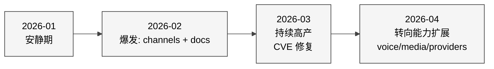

# 23 社区关注的能力增强

## 本章目的

综合 [第 20 章（fork 生态）](./20%20%E6%B4%BB%E8%B7%83%20Fork%20%E4%B8%8E%E5%8F%98%E7%A7%8D%E7%94%9F%E6%80%81.md)、[第 21 章（peer projects 对比）](./21%20%E5%90%8C%E7%B1%BB%20AI%20%E5%8A%A9%E6%89%8B%E6%A8%AA%E5%90%91%E5%AF%B9%E6%AF%94.md)、[第 22 章（PR 演进）](./22%20%E4%BA%8C%E6%9C%88%E8%87%B3%E4%BB%8A%20PR%20%E6%BC%94%E8%BF%9B%E5%85%A8%E6%99%AF.md) 三条分析线，回答用户原题 **"近 2 个月大家关注哪方面能力增强？"**。

## 一、五条主线的共识

### 1. 安全沙箱（修洞 + 加固）

| 证据 | 数据点 |
|---|---|
| PR 数据 | security-sandbox 类 139 PR；2026-04 单月 96 条 |
| fork 数据 | 头部 fork 未集中在 security（说明官方承担） |
| Issue 数据 | bug 类 125 + regression 56 + bug:behavior 43（见 [第 24 章](../Part%20V%20Issues%20and%20Roadmap/24%20Issues%20%E4%B8%8E%E6%8A%B1%E6%80%A8%E8%81%9A%E7%B1%BB.md)）|
| 外部事件 | CVE-2026-25253、ClawHavoc |

**结论**：2026-Q1 后安全是第一优先级。社区和官方都在关心，但"做"主要是官方。

### 2. 通道覆盖扩张（Channels）

| 证据 | 数据点 |
|---|---|
| PR 数据 | channels-messaging 250 PR（20.8%） |
| fork 数据 | openclaw-cn / openclaw-china / openclawWeComzh 都在补企业微信 / 钉钉 / 微信 |
| label 分布 | telegram 78、discord 54、msteams 41、matrix 38 |

**结论**：channel 是最持续的投入方向。企业向（MS Teams / Matrix）增速最快；中国通道（WeCom / DingTalk）仍是官方空白。

### 3. Provider 碎片化治理（Models）

| 证据 | 数据点 |
|---|---|
| PR 数据 | models-providers 172 PR；4 月占 129 条（+231% vs Feb）|
| fork 数据 | localclaw（本地开源模型）、linuxhsj/openclaw-zero-token |
| 外部 | DeepSeek、Qwen、Kimi、Claude 4.7、GPT 5.4 密集发版 |

**结论**：provider 扩展紧跟模型发版节奏。社区关心"如何统一切换、如何本地跑、如何对接国产"。

### 4. 中国生态适配（第 16 章专题）

| 证据 | 数据点 |
|---|---|
| fork 数据 | 头部 5 个 fork 里 3 个是中国化（openclaw-cn 4695 ★, RainbowRain9/openclaw-china 116 ★, OpenClawChinese 347 ★）|
| PR 数据 | channel:feishu 23、channel:qqbot 13 合入；企业微信 / 钉钉 / 微信暂无官方 |
| 教程 | 中文教程仓库 4150+ ★（xianyu110/awesome-openclaw-tutorial）|

**结论**：这是官方 RoI 最高的补齐方向——存量需求极大，官方未满足，社区在用 fork 填。

### 5. 语音 + 多媒体 + 实时交互（Voice / Media）

| 证据 | 数据点 |
|---|---|
| PR 数据 | voice-audio 43（+288% 月比），image-video-media 52（+236%）|
| 独占性 | 第 21 章矩阵里 voice 是 OpenClaw 独有，其他 agent 完全不做 |
| 演示 | Peter 在 3 月发布会强调的主要是 voice + canvas 体验 |

**结论**：这是 OpenClaw 的"差异化护城河"，社区在这块有持续投入。

## 二、次级但值得关注的方向

### a. Memory / Context Engine（第 4 章）

memory-context PR 145 条；fork 里虽少，但 issue 里对"长对话遗忘""同一事项被反复问"抱怨多。4 月加速（+189%）说明正在返工。

### b. Onboarding / Doctor / Wizard

onboarding-setup PR 48 条；第 8 章提到的 `doctor` 命令被频繁 tweak。这是 "新用户进门" 的痛点。

### c. Browser-tools（sandbox-browser）

browser-tools PR 57 条；浏览器生命周期历史上是 leak 大户（第 10 章）。加上 Playwright 版本升级的周期性维护。

### d. Cron / Schedule

cron-schedule PR 46 条；"定时助手"是个人 agent 的自然需求。

### e. Canvas / UI Web

canvas-ui-web 55 条，apps-mobile 27 条，docs-i18n 91 条。说明前端与文档持续迭代。

## 三、社区 ≠ 官方 的能力缺口

把"社区想要"和"官方做到"两张表并排，缺口表如下：

| 能力 | 社区重视度 | 官方完成度 | 缺口 |
|---|---|---|---|
| 企业微信 / 钉钉 / 微信 | ⭐⭐⭐⭐⭐ | ❌ | **极大** |
| Control Center / 可观测面板 | ⭐⭐⭐⭐ | ❌ | **大** |
| 国产模型 tool_call 统一适配 | ⭐⭐⭐⭐ | ⚠️ | **中** |
| 中文文档 / 教程 | ⭐⭐⭐⭐ | ❌ 基本 | **中** |
| Android automation 深度能力 | ⭐⭐⭐⭐ | ⚠️ | **中** |
| 企业级合规（日志审计 / 脱敏） | ⭐⭐⭐ | ❌ | **大** |
| 小模型本地部署 | ⭐⭐⭐ | ⚠️ | **中** |
| 多 agent 编排 visual | ⭐⭐ | ❌ | 小 |

## 四、节奏曲线

**三阶段演进**：

1. **Feb**：扩张期（新 channel、docs、agent-session）
2. **Mar**：修复期（security-sandbox、CI、regression）
3. **Apr**：能力加码期（provider、voice、media、memory）

## 五、对"未来 3-6 月"的自上而下判断

基于以上数据 + fork 空缺 + peer 对比，未来 3-6 月社区最可能关注：

1. **第二波安全加固**：工具 policy schema 完善 + skill 信誉体系 + 更细的 main/non-main boundary
2. **中国 channel 官方化**：WeCom / DingTalk 官方 extension 是最大 ROI
3. **Voice 体验完善**：中文 TTS、latency 保障、speaker diarization
4. **Provider 治理仪表盘**：cost / quota / latency 可视化
5. **Memory 质量提升**：长对话不遗忘、事件 dedup
6. **Mobile Node 能力深度**：尤其 Android，对家庭 / 工作 automation 是爆发点

## 下一章预告

这三章共同回答了用户原题"近 2 个月能力增强分布"。Part V（第 24-26 章）转向"问题与缺陷"，对应用户第三个子问题。
