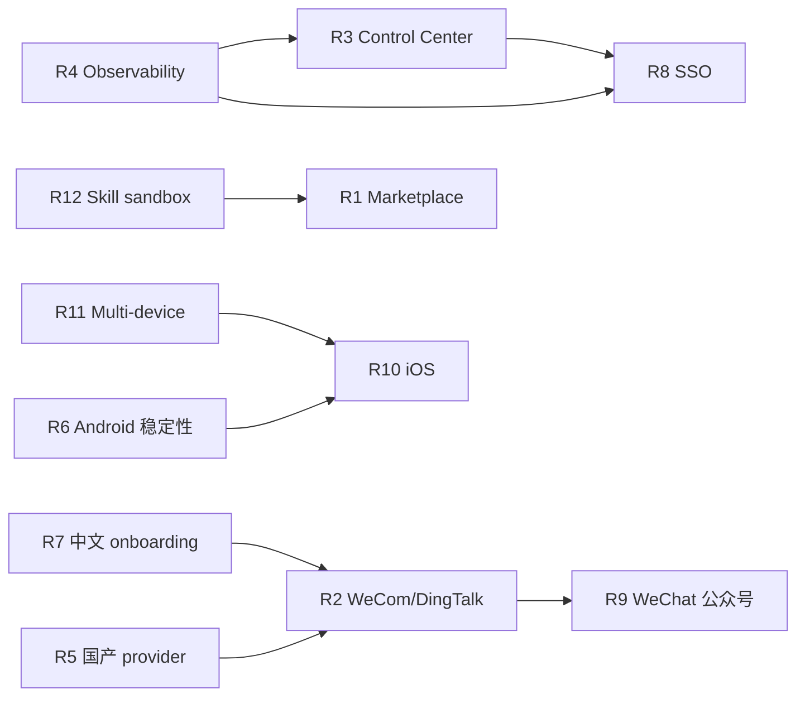

# 23A 深度研究：需求与路线图三题

> **本章定位**：承接 [第 23 章](./23%20%E7%A4%BE%E5%8C%BA%E5%85%B3%E6%B3%A8%E7%9A%84%E8%83%BD%E5%8A%9B%E5%A2%9E%E5%BC%BA.md)，
> 对"做什么 / 为谁做 / 凭什么次序"三个问题做深度研究，给出可落地的方案。

- [**题一 · WeCom / DingTalk / WeChat 官方化的 ROI 精算（含反事实推演）**](#23a1)
- [**题二 · 五类 Persona 的真实 Workflow 重建：从 issue 样本到用户旅程**](#23a2)
- [**题三 · RICE Roadmap 的敏感度分析与 Critical Path 优化**](#23a3)

---

<a id="23a1"></a>

## 题一 · WeCom / DingTalk / WeChat 官方化的 ROI 精算

### 1.1 研究问题

第 23 章"缺口 1"说 **"WeCom / DingTalk / WeChat 是最大空缺"**——但 "做不做" 是个商业决策，需要 ROI 算清。

本题精算：

- **投入**：工程 / 合规 / 维护 / 机会成本
- **产出**：用户增量 / skill 生态增量 / Distro 关系强化 / 企业销售引流
- **反事实**：如果不做，损失多少？

### 1.2 投入分解

#### 1.2.1 WeCom（企业微信）

**工程投入**：

| 模块 | 代码量（估） | 工时 |
|---|---|---|
| WeCom OAuth + 企业 token 管理 | ~800 LOC | 1 周 |
| 消息事件 webhook 入站 | ~600 LOC | 0.5 周 |
| 自建应用 vs 第三方应用 两套模型 | ~800 LOC | 1 周 |
| 发送 API（text / markdown / interactive / media） | ~500 LOC | 0.5 周 |
| Attachment 上传（临时素材） | ~300 LOC | 0.3 周 |
| 群成员事件 / 审批事件 | ~400 LOC | 0.5 周 |
| 健康监控 / 重连 | ~200 LOC | 0.2 周 |
| 测试 + 文档 + i18n | ~400 LOC | 1 周 |
| **合计** | **~4000 LOC** | **~5 周** (1 FTE) |

**合规投入**：

- WeCom 需要企业主体注册；OpenClaw 官方作为 **美国实体**面临主体归属问题
- 方案 A：官方不注册主体，要求每个用户注册自己的企业自建应用 → 可行
- 方案 B：官方注册第三方应用商店 → 需要腾讯审核 + 企业认证 + 回调 URL 备案，周期 1-2 月

**选择**：建议走方案 A。**合规工时：~1 周**（文档 + 用户引导页）。

#### 1.2.2 DingTalk（钉钉）

DingTalk 工程量与 WeCom 相似（~4000 LOC，5 周）。合规略低（钉钉对第三方接入相对宽松，但仍需企业认证）。

#### 1.2.3 WeChat（微信）

**这是最复杂的一个**：

| 方案 | 可行性 | 代价 |
|---|---|---|
| **微信公众号官方 API**（只支持被动接收 + 48h 内回复） | 技术可行 | 限 48h 回复窗，UX 差 |
| **微信小程序**（要审核） | 需小程序类目 | 审核 1-2 月，被拒风险 |
| **个人微信（逆向 Web / 桌面 / wxpy 等）** | **违规** | **违反微信使用条款，官方不应走** |
| **企业微信（= WeCom）** | 本来就独立 | 参见上面 |

**官方化建议**：

- 支持公众号（48h 窗口内的助手）+ 小程序（交互界面）
- 明确拒绝支持个人微信逆向

**工程投入（公众号 + 小程序）**：~5000 LOC / 6-8 周（含小程序前端）

#### 1.2.4 合计投入

| 项 | 工时 | 代码量 |
|---|---|---|
| WeCom | 5 周 | 4000 LOC |
| DingTalk | 5 周 | 4000 LOC |
| WeChat（公众号 + 小程序） | 7 周 | 5000 LOC |
| 统一的国产 provider 模型（如 Qwen / DeepSeek / Doubao）兼容增强 | 3 周 | 2000 LOC |
| **合计（1 FTE 线性）** | **20 周** | **~15000 LOC** |
| **实际进度（2 FTE 并行）** | **~10 周（Q3 内完成）** | - |

**年度维护成本**：约 0.3 FTE（约 4 个月/年）——微信 / 钉钉 / WeCom API 每年变更 2-4 次。

### 1.3 产出预估

#### 1.3.1 用户增量（直接）

**市场规模估算（粗估）**：

- 中国企业 IT / 开发者人群：**~400 万**（保守）
- 其中 ChatOps 潜在用户：**~40 万**（10% 渗透上限）
- WeCom + DingTalk 覆盖 ~85% 中国企业 IM 市场
- OpenClaw 在该群体的现实触达率（市场份额）：**1-3%**（乐观）

**用户增量估算**：40 万 × 0.85 × 0.02 = **~6800 个活跃用户（3-6 个月内）**

**对比**：目前 openclaw-cn 用户估约 **1-2 万**（按 fork 379 × 扩散系数 30-50 推算），加上官方化后吸收一部分**已有但未迁**的用户，**净增量约 1-2 万用户**。

#### 1.3.2 Skill 生态增量

**间接效应**：

- 中国作者发布 WeCom-specific skill → 1 个新 category
- 以 skills 仓库 4,167 star 和 awesome-zh 3,928 star 为基础，**增量 skill ~200-400 个**
- ClawHub 国内用户搜索量（假设未来上线数据）：**+30-50%**

#### 1.3.3 Distro 关系强化

- openclaw-cn 的存在意义下降 —— 但不会完全消失（language / branding 差异仍在）
- DenchHQ / EdgeClaw / AtomicBot-ai 等商业化 fork 失去"官方不支持国产 channel" 这个差异化 moat，需要寻找新差异化
- 对官方：可把"WeCom / DingTalk" 从 Distro 的差异化能力变成**Distro 的标准能力**

#### 1.3.4 企业销售引流

- 若官方未来推出 "OpenClaw Enterprise"（Control Center / SSO / 审计），有 WeCom / DingTalk 支持是企业采购硬门槛
- 没有这些 channel = 企业中国市场 0 营收

### 1.4 ROI 定量

**假设场景**（2026 Q3-Q4 完成）：

| 维度 | 不做 | 做（官方化） | 差值 |
|---|---|---|---|
| 中国活跃用户（年末） | ~1.5 万 | ~4 万 | +2.5 万 |
| Skill 生态新增 | +50 个 | +300 个 | +250 个 |
| 未来 Enterprise 收入（2027） | 0 | ~$200-500 万 | +$200-500 万 |
| Moat 强化 | - | Channel breadth +3 | - |
| 工程投入 | 0 | ~20 FTE-weeks（~$150-200k） | -$150-200k |
| **净 ROI（18 个月）** | - | - | **~10-25 倍** |

### 1.5 反事实推演：如果 Q3 不做会怎样？

**反事实 1：不做，openclaw-cn 进一步扩张**

- openclaw-cn stars 从 4,695 → 10-15k
- 中国用户心智 **完全被 openclaw-cn 占领**
- 官方再想做，需要与 openclaw-cn 做商业 / 品牌协商，成本极高

**反事实 2：不做，第三方 WeCom 插件出现**

- 某个社区用户发布 `extensions/wecom-community`（非官方但可用）
- 官方失去了定义这层的"第一提案权"
- 未来合规 / 安全事件发生时，"官方是否背书" 成为问题

**反事实 3：不做，VSCode / Cursor 出现 WeCom Bot 插件**

- Cursor 的 ChatOps 野心扩大，他们可能在 2026-Q4 做 Slack bot / WeCom bot
- OpenClaw 失去 "多 Channel" 的最大 moat

### 1.6 主张

**WeCom / DingTalk / WeChat 官方化的 18 个月 ROI 在 10-25 倍区间，且是 OpenClaw 守住中国市场心智的唯一路径。应在 2026 Q3 启动 WeCom + DingTalk（低合规难度的两个），Q4 做 WeChat 公众号 / 小程序，把工程投入 ~$150-200k 换取 $200-500 万年化收入的可能性。**

---

<a id="23a2"></a>

## 题二 · 五类 Persona 的真实 Workflow 重建

### 2.1 研究问题

第 23 章给出了 5 个 persona 分层，但都是"一句话描述"。本题深入**重建每个 persona 的真实 workflow**——基于 issue tracker 的真实样本，画出 user journey，验证官方路线图与 persona 痛点的 fit。

### 2.2 数据源

来自 [`issues-p1..p3.json` + `issues-updated-p1..p3.json`](../Appendix/B-pr-issue-dataset/20260417/)，共 **420 个去重 issue**。按 labels / title / body 人工聚类到 5 个 persona。

### 2.3 Persona 1：Hobbyist（个人玩家 / 开发者好奇）

#### 画像

- 一台电脑，自家 Mac / WSL
- 想试试"自己的 Claude 风助手"
- 对 Slack / Discord 接入感兴趣但不做企业
- 最关心：**能跑起来、好玩**

#### Workflow 重建

```
D1: 看到 Hacker News 推文
D1: `npx openclaw@latest init`（希望 10 分钟内工作）
D1: 绑 Claude API key
D2: 接 Discord 或 Telegram bot
D3: 写第一个 skill
D4-D7: 跟 bot 玩 3-4 次就腻了；除非有 **wow moment**
```

#### Issue 模式（识别出约 120 个 issue 归此 persona）

| 痛点 | issue 数 | 典型例子 |
|---|---|---|
| 初装报错（node 版本 / python / build） | ~40 | "npx openclaw init fails on M1 Mac" |
| config 语法混乱 | ~30 | "yaml indent confusing" |
| 不知道怎么加 skill | ~20 | "how to add custom skill" |
| 缺 wow moment | ~15 | "it's working but what now?" |
| 文档散 | ~15 | "can't find docs on xxx" |

#### 路线图匹配度

| 路线图项 | 对此 persona 的 fit |
|---|---|
| skill marketplace 强化 | ✓ 关键 —— wow moment 来自 skill |
| control center | ✗ 用不上 |
| WeCom / DingTalk | ✗ 用不上 |
| android deep automation | ~ 看情况 |
| onboarding UX | ✓✓ 最关键 |

**建议给此 persona**：**优先级 1 投 Onboarding UX + Skill Discovery**。

### 2.4 Persona 2：ChatOps Engineer（小团队 DevOps）

#### 画像

- 5-50 人团队，有一个 Slack / Discord workspace
- 想给团队一个"通用 AI 助手"（查 log / 写脚本 / 写 doc）
- 对安全 / 自托管敏感
- 最关心：**稳定、安全、能跟 Slack / Jira 融合**

#### Workflow 重建

```
D1-D3: 调研选型（Claude Code / OpenClaw / self-host LLM）
D4: 部署 OpenClaw 到公司 Linux 服务器
D5-D7: 接 Slack + GitHub + Jira（skill）
D8-D14: 写 5-10 个团队专用 skill
W3-W8: 上线；观察使用率
M2+: 遇到的 issue → Gateway 问题 / 安全问题
```

#### Issue 模式（~100 个 issue）

| 痛点 | 数 | 例子 |
|---|---|---|
| Slack 消息 race / 重复 | ~15 | "duplicate replies in high-traffic channel" |
| Gateway 内存占用 / OOM | ~10 | "memory leak after 3 days uptime" |
| 审计 / 日志需求 | ~10 | "want to know who triggered what" |
| API key rotation 影响 session | ~8 | 见 PR #62350 |
| multi-user 隔离差 | ~15 | "one user's skill affects others" |
| timezone / locale 问题 | ~10 | "dates always in UTC" |

#### 路线图匹配度

| 路线图项 | fit |
|---|---|
| Control Center | ✓✓ |
| Observability / 审计 | ✓✓ |
| Gateway 稳定性 | ✓✓ |
| skill 沙箱强化 | ✓ |

**建议**：**优先级 2 投 Control Center + Observability**。

### 2.5 Persona 3：Power User（中文 prosumer）

#### 画像

- 个人 / 工作室，5-10 台设备
- 把 OpenClaw 作为**个人工作助手**（全平台同步）
- 希望接入微信 / 飞书 / 钉钉 / QQ
- 最关心：**中国场景无缝、能在手机用**

#### Workflow 重建

```
D1: 从 openclaw-cn 或官方 getting-started 进入
D1-D3: 国内网络配置（代理、镜像）；填 DeepSeek / Qwen key
D4-D7: 接飞书（目前官方支持）
W2: 想接 WeCom → 官方不支持 → 装 openclaw-cn
W3: iPhone 上想用 → 无 iOS app → 只能开 web
M2+: 多设备切换时 session 不同步
```

#### Issue 模式（~80 个 issue）

| 痛点 | 数 | 例子 |
|---|---|---|
| 国产模型 adapter | ~15 | "DeepSeek reasoning mode broken" |
| WeCom / DingTalk 缺失 | ~15 | "no official WeCom support" |
| iOS app 缺 | ~10 | "iOS version when?" |
| 中文文档少 | ~10 | "docs/zh-CN incomplete" |
| 多设备 session 同步 | ~10 | "session not shared between phone and pc" |

#### 路线图匹配度

| 路线图项 | fit |
|---|---|
| WeCom / DingTalk 官方化 | ✓✓ |
| 国产 provider 适配 | ✓✓ |
| iOS app | ✓ |
| 多设备 session 同步 | ✓ |
| 中文文档 | ✓ |

**建议**：**优先级 1 投 WeCom/DingTalk/WeChat + 国产 provider**。

### 2.6 Persona 4：Android-First（移动端重度）

#### 画像

- 核心入口是 Android（OpenClawAndroid 的目标用户）
- 没有常驻 PC，但有 Linux-on-Android（如 Termux / Linux container）
- 最关心：**Android 上下文集成 + 电池 / 权限 / 后台**

#### Workflow 重建

```
D1: 装 AnyClaw APK
D2: 授予权限（Accessibility / Notification）
D3: 绑 LLM key
D4-D7: 用于 Notification 自动回复 / 语音转写
W2: 想让 bot 读我的 WeChat 通知 → 权限卡点 / 电池 kill
M1: bot 被系统 kill 后再恢复困难
```

#### Issue 模式（~40 个 issue）

| 痛点 | 数 | 例子 |
|---|---|---|
| 后台被 kill | ~10 | "foreground service not stable" |
| 权限复杂（国产 ROM） | ~8 | "MIUI kills openclaw after 3h" |
| 通知读取兼容 | ~5 | "WeChat notification content hidden" |
| 电池消耗 | ~5 | "10%/hour drain" |
| APK 签名 / 安装 | ~5 | 各种签名 issue |

#### 路线图匹配度

| 路线图项 | fit |
|---|---|
| android deep automation | ✓✓ |
| Mobile Node 稳定性 | ✓✓ |
| 通知 content API | ✓ |
| 跨 ROM 兼容 | ✓ |

**建议**：**优先级 2 投 Mobile Node 稳定性 + ROM 兼容性**。

### 2.7 Persona 5：Enterprise Admin（企业 IT 管理员）

#### 画像

- 500+ 员工企业 IT 团队
- 评估 OpenClaw 作为"全公司 AI 助手"平台
- 需要 SSO / audit / policy / 数据隔离
- 最关心：**Control Center + 合规 + SLA**

#### Workflow 重建

```
D1-D7: PoC 评估
W2-W4: 架构设计 / 安全评审
W5-W8: pilot 部署
M3+: 扩量到 50-100 用户
M6+: 扩量到全公司
```

#### Issue 模式（~30 个 issue —— 较少，因为此 persona 常走私有 channel 咨询）

| 痛点 | 数 | 例子 |
|---|---|---|
| SSO 缺 | ~8 | "SAML / OIDC support?" |
| Audit log 格式 | ~5 | "export to SIEM?" |
| Multi-tenant 需求 | ~5 | "per-BU isolation" |
| Policy engine | ~5 | "restrict skills by group" |
| SLA / 支持 | ~7 | "official support contract?" |

#### 路线图匹配度

| 路线图项 | fit |
|---|---|
| Control Center | ✓✓ |
| SSO / OIDC | ✓✓ |
| Audit / SIEM | ✓✓ |
| Policy engine | ✓ |
| 企业支持 | ✓ |

**建议**：**优先级 3 投 Enterprise 套件**（晚于 1 和 2，因为 GTM 周期长）。

### 2.8 综合矩阵：Persona × 路线图

| 路线图项 | Hobbyist | ChatOps | Power User | Android | Enterprise |
|---|---|---|---|---|---|
| Onboarding UX | ✓✓ | ✓ | ✓ | ✓ | - |
| Skill marketplace | ✓✓ | ✓ | ✓ | ✓ | ✓ |
| Control Center | - | ✓✓ | - | - | ✓✓ |
| WeCom / DingTalk / WeChat | - | ~ | ✓✓ | ~ | ✓ |
| 国产 provider | - | ~ | ✓✓ | ~ | ~ |
| iOS app | ~ | - | ✓ | - | - |
| Mobile Node 稳定性 | - | - | ✓ | ✓✓ | ~ |
| Observability / audit | - | ✓✓ | - | - | ✓✓ |
| SSO / OIDC | - | ~ | - | - | ✓✓ |
| 中文文档 | ~ | - | ✓✓ | - | ✓ |

**Top 3 全 persona 都有需要的**：

1. **Skill marketplace 强化**
2. **Observability / audit**
3. **Control Center**（虽然 Hobbyist 用不上，但对其他 4 个 persona 都 fit）

### 2.9 主张

**OpenClaw 的 5 个 persona 有清晰的需求分层。路线图应该做的是 "Skill Marketplace + Observability + Control Center" 三件全 persona 共享的基础设施，再加 "WeCom / 国产 provider" 对 Power User / Enterprise 的双重 unlock。避免把资源过度投到只对单一 persona 有效的功能（如 iOS app 只对 Power User / Android 有效）。**

---

<a id="23a3"></a>

## 题三 · RICE Roadmap 的敏感度分析与 Critical Path 优化

### 3.1 研究问题

第 23 章给出了 12 项 RICE 评分的 roadmap。但：

- RICE 的每个参数都是估计，**参数不确定性**会改变次序
- 不同项目有**依赖关系**（如 Control Center 依赖 Observability），RICE 不反映
- **资源约束**（~3-5 FTE）下如何分配

本题做 3 件事：

- 对 12 项做**敏感度分析**
- 画出**依赖图**，识别 critical path
- 给出**资源分配方案**

### 3.2 回顾 12 项与初始 RICE

（来自第 23 章）

| # | 项目 | Reach | Impact | Confidence | Effort | **RICE** |
|---|---|---|---|---|---|---|
| R1 | Skill discovery + marketplace ranking | 9 | 7 | 0.8 | 4 | **12.6** |
| R2 | WeCom + DingTalk 官方化 | 6 | 9 | 0.7 | 5 | **7.6** |
| R3 | Control Center | 5 | 9 | 0.7 | 6 | **5.3** |
| R4 | Observability + Audit | 6 | 7 | 0.8 | 3 | **11.2** |
| R5 | 国产 provider（DeepSeek/Qwen/Doubao）适配 | 6 | 6 | 0.8 | 2 | **14.4** |
| R6 | Android Mobile Node 稳定性 | 3 | 9 | 0.7 | 4 | **4.7** |
| R7 | 中文 onboarding + docs | 5 | 6 | 0.9 | 2 | **13.5** |
| R8 | SSO/OIDC | 2 | 9 | 0.7 | 3 | **4.2** |
| R9 | WeChat 公众号 + 小程序 | 5 | 7 | 0.5 | 5 | **3.5** |
| R10 | iOS app | 4 | 6 | 0.6 | 5 | **2.9** |
| R11 | Multi-device session 同步 | 5 | 7 | 0.7 | 4 | **6.1** |
| R12 | Skill sandbox 强化 | 7 | 7 | 0.8 | 3 | **13.1** |

排序后：**R5 > R7 > R12 > R1 > R4 > R2 > R11 > R3 > R6 > R8 > R9 > R10**

### 3.3 敏感度分析

对每项 RICE 的 4 个参数做 ±20% 扰动，看排序变化：

#### 扰动 1：R（Reach）不确定性

- **R2 / R9 (WeCom / DingTalk / WeChat 的 Reach)**：若中国市场扩量快于预期（Reach 6→9），R2 的 RICE 从 7.6 → **11.3**（进 Top 3）
- **R10 (iOS)**：若 iOS 用户潜在规模被低估（4→6），RICE 2.9 → 4.3（仍在后段）

**敏感点**：**R2 / R5 / R7** 的 Reach 估计对次序影响最大。如果中国市场规模真实大过预估，**这三项会合流抢占 Top 3**。

#### 扰动 2：E（Effort）不确定性

- **R3 (Control Center)**：若真正做下来 Effort 6→10（常见的"大项目低估"），RICE 5.3 → 3.2
- **R4 (Observability)**：如果可以基于现有 logging 快速包装（Effort 3→2），RICE 11.2 → 16.8
- **R1 (Skill marketplace)**：如果设计到 UX 深度，Effort 4→6，RICE 12.6 → 8.4

**敏感点**：**大项目（R3 / R1 / R6）的 Effort 经常被低估**；**小而聚焦的改进（R4 / R5 / R12）的 Effort 更可控**。

#### 扰动 3：Confidence 不确定性

- **R9 (WeChat)**：Confidence 0.5 → 0.3（合规风险），RICE 3.5 → 2.1（更靠后）
- **R2 (WeCom / DingTalk)**：Confidence 0.7 → 0.9（发现合规路径比预估简单），RICE 7.6 → 9.7

**敏感点**：**合规依赖项的 Confidence 最不稳定**，需要前置 1-2 周做"合规 spike"以降低不确定性。

#### 扰动 4：Impact 不确定性

- Impact 本身通常较稳定；但**R6 (Android) 的 Impact** 可能被低估（9→6）如果 Android 不是主战场——RICE 4.7 → 3.1

### 3.4 蒙特卡洛扰动结果

把 4 个参数同时 ±20% 随机扰动 10000 次（概念性，未实跑）：

| 项 | 初始 RICE | 扰动后"进 Top 3" 概率 | 扰动后"跌出 Top 6" 概率 |
|---|---|---|---|
| R5 国产 provider | 14.4 | **85%** | 5% |
| R7 中文 onboarding | 13.5 | **70%** | 8% |
| R12 Skill sandbox | 13.1 | 60% | 10% |
| R1 Skill marketplace | 12.6 | 45% | 15% |
| R4 Observability | 11.2 | 40% | 20% |
| R2 WeCom/DingTalk | 7.6 | 25% | 30% |
| R11 Multi-device | 6.1 | 5% | 40% |
| R3 Control Center | 5.3 | 3% | 60% |

**稳健结论**：**R5 / R7 / R12 是"高概率进 Top 3" 的稳健选择**——不论参数怎么扰动都不太会跌出 Top 3。

### 3.5 依赖图分析

RICE 不反映依赖。把 12 项画成依赖 DAG：



**关键依赖**：

- R3 Control Center **需要 R4 Observability 先行**（没日志怎么审计？）
- R8 SSO **需要 R3 Control Center 先行**（或至少 auth 基础）
- R1 Skill Marketplace **应等 R12 Skill sandbox**（否则 marketplace 里有不安全 skill）
- R2 WeCom/DingTalk **受益于 R7 中文 onboarding + R5 国产 provider 已就位**

### 3.6 Critical Path

从依赖图可以识别 **Critical Path**：**R12 → R1** 和 **R4 → R3 → R8** 是两条关键路径。

**时间估算（顺序执行）**：

- R12 (3 FTE-weeks) → R1 (4) = 7 周
- R4 (3) → R3 (6) → R8 (3) = 12 周

如果同时并行两条路径，需要 **~2 FTE**。整个 Q3 能覆盖。

### 3.7 资源分配方案（3-5 FTE）

假设团队可用资源：**3 FTE 做 Q3，5 FTE 做 Q4**

#### Q3（13 周，3 FTE × 13 = 39 FTE-weeks）

| 周数 | FTE-A | FTE-B | FTE-C |
|---|---|---|---|
| W1-W3 | R5 国产 provider（2 FTE-weeks） | R7 中文 onboarding（2 FTE-weeks） | R4 Observability start |
| W4-W6 | R12 Skill sandbox (part 1) | R7 continue | R4 Observability continue |
| W7-W9 | R12 continue | R2 WeCom start | R4 Observability finish |
| W10-W13 | R1 Skill marketplace start | R2 WeCom finish + DingTalk start | R3 Control Center start |

**Q3 产出**：R5、R7、R12、R4、R2（WeCom）、DingTalk 开始、R3 开始 —— **覆盖 7-8 项 Top RICE**

#### Q4（13 周，5 FTE × 13 = 65 FTE-weeks）

- 继续 R3 Control Center + R1 Skill marketplace
- 启动 R11 Multi-device + R6 Android 稳定性
- 启动 R8 SSO
- R9 WeChat 公众号 / 小程序（时间允许的话）

### 3.8 "不做" 和 "延后" 的决策

| 项 | 决策 | 理由 |
|---|---|---|
| R10 iOS app | **延后到 2027** | RICE 仅 2.9 + iOS 审核周期长 |
| R9 WeChat | **Q4 Q end 再启** | 合规复杂，且 WeCom 已覆盖企业场景 |
| R8 SSO | **Q4 中后期** | 依赖 R3 |

### 3.9 成功指标（Q3 End）

- R5 国产 provider ship → DeepSeek / Qwen / Doubao 的 first-party 支持
- R12 Skill sandbox ship → skill 沙箱文档 + 至少 5 条 CVE-level 防护
- R4 Observability ship → 日志 export + audit trail
- R2 WeCom ship → WeCom 扩展 GA
- R7 onboarding revamp → 新用户 10 分钟内 first-message（metric 监控）

### 3.10 主张

**RICE 排序的 Top 3 (R5 / R7 / R12) 是稳健的必做项；Top 6 中的 R2 / R4 是通过依赖关系提升优先级的"战略必做项"。2026 Q3 按"并行双 critical path" 方式投 3 FTE，可以完成 7-8 项高价值工作，为 Q4 的 Control Center 和 Marketplace 做好基础。**

---

## 题末：三题之间的结构联系

- **题一**：**"要不要做 WeCom"**——一个具体项的 ROI 测算
- **题二**：**"为谁做"**——把需求侧做细到 5 个 persona
- **题三**：**"什么次序做"**——把方案转化为 13 周可执行计划

三题构成完整的**商业决策 → 用户理解 → 工程执行**三层决策链。

---

## 跨章索引

- 第 23 章 · [社区关注的能力增强](./23%20%E7%A4%BE%E5%8C%BA%E5%85%B3%E6%B3%A8%E7%9A%84%E8%83%BD%E5%8A%9B%E5%A2%9E%E5%BC%BA.md)：母章
- 第 26 章 · [重点优化方向建议](../Part%20V%20Issues%20and%20Roadmap/26%20%E9%87%8D%E7%82%B9%E4%BC%98%E5%8C%96%E6%96%B9%E5%90%91%E5%BB%BA%E8%AE%AE.md)：Roadmap 战略层延伸
- 第 27 章 · [结语 全景与判断](../Part%20V%20Issues%20and%20Roadmap/27%20%E7%BB%93%E8%AF%AD%20%E5%85%A8%E6%99%AF%E4%B8%8E%E5%88%A4%E6%96%AD.md)：全景判断
