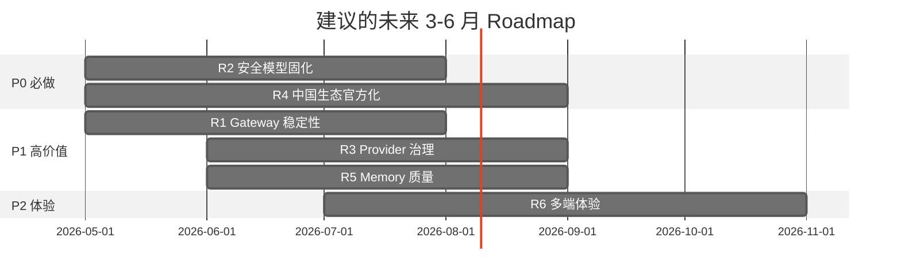

# 26 重点优化方向建议

## 本章目的

综合第 23 章社区关注度 + 第 24-25 章源码缺陷，给出未来 3-6 月的 **六条重点优化方向**。每条包含：问题来源、修复路径、源码证据、成功指标。

## R1 Gateway 稳定性与可观测

### 问题来源
- [第 2 章](../Part%20I%20Architecture%20and%20Philosophy/02-gateway-control-plane.md)：Gateway 是单点；[第 14 章](../Part%20III%20Channels%20Extensions%20Apps/14-channels-and-dm-policy.md)：channel webhook 掉线需手动重启
- [第 24 章](./24-issues-clustering.md) T5: channel webhook 掉线；T4：CPU/mem 高；T6：CI 失败
- [第 25 章](./25-source-level-design-flaws.md) 🟠：channel health 缺监控、Gateway 无横向扩展

### 修复路径
1. **channel health framework**：统一的 `healthcheck` 接口，每个 channel 报告 `last_event_ts / error_count / tunnel_status`
2. **auto-restart** policy：连续 N 次失败触发重建 webhook / 重连 WS
3. **Gateway metrics 面板**：web-ui 增加 "`openclaw status`" 可视化：channels / providers / sessions / Docker sandboxes
4. **HA 分裂**：为团队场景预留 gateway cluster（Redis pub/sub + stateful session sticky）——P2 级

### 源码位置
- 新增 [src/health](../../openclaw-repo/src/health)（目前不存在，需新建）
- 扩展 [src/gateway](../../openclaw-repo/src/gateway) 的 observability hook
- [ui/src](../../openclaw-repo/ui/src) 增加 status dashboard 页

### 成功指标
- P95 webhook 恢复时间 < 60s
- 用户侧 stale issue 下降 20%
- `openclaw doctor` 检出 channel 问题的覆盖率 > 90%

## R2 安全模型固化（tool policy + skill reputation）

### 问题来源
- [第 13 章](../Part%20II%20Source%20Execution/13-security-sandbox-pairing.md)：tool policy 老 extension 未全迁移；skill 以信任安装
- [第 17 章](../Part%20III%20Channels%20Extensions%20Apps/17-skills-deep-dive.md)：skill 版本治理弱
- [第 25 章](./25-source-level-design-flaws.md) 🔴：tool policy 灰色地带、skill marketplace 反作弊浅
- 外部事件：CVE-2026-25253、ClawHavoc

### 修复路径
1. **tool policy schema v2**：强制 `mainSessionOnly / requiresConfirm / riskLevel` 三字段，不声明即 default-deny
2. **全量迁移扫描器**：`openclaw doctor --security` 扫出老 extension 未声明的 tool
3. **skill 信誉体系**：发布者签名 + install 次数 + dispute 率，web UI 显眼展示
4. **行为级检测**：skill 运行时 audit log（syscall / net / fs）—— 可接入 Claw Shield 风控模块

### 源码位置
- [src/security](../../openclaw-repo/src/security) 扩 policy schema
- [src/plugin-sdk](../../openclaw-repo/src/plugin-sdk) 强制 lint 规则
- ClawHub 客户端（[extensions/kilocode](../../openclaw-repo/extensions/kilocode)？或新 extension）集成签名校验

### 成功指标
- 老 extension 的默认 `any` 权限为 0
- skill 下架到响应时间 < 24h（恶意 skill 从识别到全站清除）
- 安全类 issue 开口率下降 30%

## R3 Provider 治理与成本可见

### 问题来源
- [第 15 章](../Part%20III%20Channels%20Extensions%20Apps/15-model-providers-landscape.md)：provider 无版本冻结；cost 不透明
- [第 24 章](./24-issues-clustering.md) T2：failover 行为不一致

### 修复路径
1. **provider 版本 pinning**：在 `openclaw.plugin.json` 声明 model snapshot，避免 silent break
2. **failover 感知标记**：agent 回复中 optional 显示"此次由 X 回答"
3. **cost dashboard**：per-session / per-provider 累计；阈值告警
4. **tool_call 兼容性测试套件**：对国产模型统一跑 functional test

### 源码位置
- [src/plugin-package-contract](../../openclaw-repo/packages/plugin-package-contract) 加 model spec
- [extensions/llm-task](../../openclaw-repo/extensions/llm-task) 增加 budget policy
- [ui/src](../../openclaw-repo/ui/src) 增加 cost dashboard

### 成功指标
- 模型 silent break 事件月均 ≤ 1 次
- 用户知晓本次 provider 的比例 > 80%
- "provider 行为飘"类 issue 下降 50%

## R4 中国生态官方化

### 问题来源
- [第 16 章](../Part%20III%20Channels%20Extensions%20Apps/16-china-ecosystem-adaptation.md)：微信 / 钉钉 / 企业微信官方空白；合规开关缺；docs 无中文
- [第 20 章](../Part%20IV%20Variants%20and%20PR%20Evolution/20-active-forks-survey.md)：4 条主线中"中国化"头部 fork 占 5 个
- [第 23 章](../Part%20IV%20Variants%20and%20PR%20Evolution/23-what-community-wants.md) 表：中国生态是最大 RoI 缺口

### 修复路径
1. **官方收录 WeCom / DingTalk / WeChat 三个 channel**（可以从 `luolin-ai/openclawWeComzh` 等社区项目择优吸收）
2. **"仅使用境内 provider"总开关**：合规模式一键切换
3. **docs 中文 first-class**：开辟 `docs/zh-CN`（已有但空），与英文文档对齐
4. **国产模型 adapter 统一 tool_call 兼容层**：自动 detection + fallback

### 源码位置
- 新建 `extensions/wecom`、`extensions/dingtalk`、`extensions/wechat`
- [src/security](../../openclaw-repo/src/security) 新增 `complianceMode: cn-only`
- [docs/zh-CN](../../openclaw-repo/docs/zh-CN) 正式启动

### 成功指标
- 6 个月内官方 extension 覆盖中国 Top 3 messenger
- docs/zh-CN 完整度 ≥ 英文 80%
- `openclaw-cn` 等 fork 的 star 流速明显下降（说明官方覆盖了需求）

## R5 Memory / Context 质量

### 问题来源
- [第 4 章](../Part%20I%20Architecture%20and%20Philosophy/04-context-engine-and-memory.md)：Context Engine 缺来源追溯；Dreaming/Compaction 过度精简
- [第 24 章](./24-issues-clustering.md) T3：用户抱怨遗忘与重复问

### 修复路径
1. **compaction 策略开关**：aggressive / balanced / conservative 三档，用户可选
2. **事件级 memory**：对 "一次对话中提到的 commitment / preference" 显式存储，不只靠文本片段
3. **memory 来源可见**：context 里的每段注明 "from session X / note Y"
4. **memory 质量自动测试**：每日从 transcript 自动 QA（"昨天 user 说了什么？"）评分

### 源码位置
- [src/context-engine](../../openclaw-repo/src/context-engine)
- [extensions/active-memory](../../openclaw-repo/extensions/active-memory)、[extensions/memory-core](../../openclaw-repo/extensions/memory-core)
- 新增 memory eval suite（参考 [claude-code-source-analysis](/Users/hexiaonan/workspace/publish/claude-code-source-analysis) 的 memory 章节）

### 成功指标
- 用户在同一 session "我刚才说过" 的抱怨率下降 50%
- 长对话 transcript 自动评分 > 0.7
- Dreaming 事件合并误伤率 < 5%

## R6 多端体验（mobile + voice + canvas）

### 问题来源
- [第 10-11 章](../Part%20II%20Source%20Execution/10-tools-canvas-nodes.md)：A2UI 三端脱钩；voice 延迟；中文 TTS 弱
- [第 19 章](../Part%20III%20Channels%20Extensions%20Apps/19-mobile-nodes-ios-android.md)：Android 被杀、iOS 能力上限
- [第 23 章](../Part%20IV%20Variants%20and%20PR%20Evolution/23-what-community-wants.md)：voice / media 4 月激增

### 修复路径
1. **A2UI schema 版本契约**：客户端遇到未知组件 fallback 文字 + 上报 telemetry
2. **voice latency 预算监控**：stt / llm / tts 三段分别打点
3. **中文 TTS 集成**：内置阿里/火山/字节 TTS 作为国产 fallback
4. **Android node 白名单向导**：mkm / 华为 / 小米 / OPPO 各自配置 guide
5. **iOS Shortcut bridge**：把 Shortcut 暴露为 tool，绕过 iOS 沙箱限制

### 源码位置
- [vendor/a2ui](../../openclaw-repo/vendor/a2ui)、[apps/shared](../../openclaw-repo/apps/shared)
- [extensions/speech-core](../../openclaw-repo/extensions/speech-core)、[extensions/talk-voice](../../openclaw-repo/extensions/talk-voice)
- [apps/android](../../openclaw-repo/apps/android)、[apps/ios](../../openclaw-repo/apps/ios)

### 成功指标
- voice P95 RTT < 800ms
- Android node 24h 存活率 > 80%
- A2UI "unsupported component" 占渲染 < 2%

## 七、优先级路线图（建议）

## 八、R1-R6 的彼此关系

六条方向不是并列，而是有依赖：

- **R2 安全固化** 必须先于 R4（中国生态）和 R6（多端体验）——任何新 channel / node 的默认 policy 都要建立在 R2 之上
- **R1 Gateway 稳定性** 是 R3（Provider 治理）和 R5（Memory 质量）的前置——可观测 + 仪表盘的基础设施必须先铺
- **R4 中国生态** 和 **R6 多端体验** 是并行的业务方向，互不阻塞，但共享 R1 + R2 的平台能力

## 下一章预告

第二十七章是全书结语，把 Part I-V 的主线汇到四个总体判断、三个预测、两个未解难题，给一份能被直接转述的结论。
