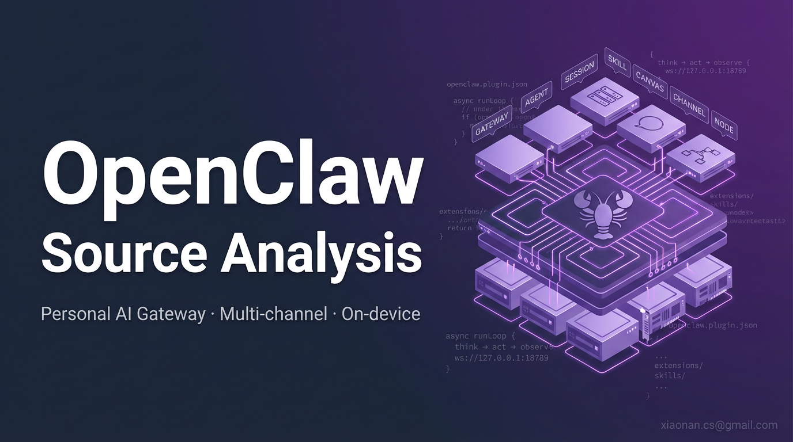

# OpenClaw 源码深度研究

> 对 [openclaw/openclaw](https://github.com/openclaw/openclaw) @ v2026.4.15 的系统性源码阅读与生态调研。
>
> 采集基线日期：**2026-04-17**；数据覆盖：2026-02-01 以来约 23,014 条 commit、1,200 条 merged PR、420 条 issue、300 个最新 fork + 240 个 star≥3 的 fork + 20 个衍生仓库。

## 快速导航

- **初次进入**：[Appendix D 封面与阅读路径](./Appendix/D%20%E5%B0%81%E9%9D%A2%E4%B8%8E%E9%98%85%E8%AF%BB%E8%B7%AF%E5%BE%84.md) 按角色选读 20-40 min
- **想一次性看懂**：从 [总纲 — OpenClaw 技术主线分析](./总纲-OpenClaw技术主线分析.md) 开始
- **想了解外界怎么看**：读 [全网调研 — 社区认知地图](./全网调研-社区认知地图.md)
- **架构设计**：Part I
- **执行链路**：Part II
- **通道与模型**：Part III
- **生态演进**：Part IV（直接回答"社区关注什么"）
- **缺陷与未来**：Part V（直接回答"优化方向"）
- **只读结论**：[第 27 章 结语 全景与判断](./Part%20V%20Issues%20and%20Roadmap/27%20%E7%BB%93%E8%AF%AD%20%E5%85%A8%E6%99%AF%E4%B8%8E%E5%88%A4%E6%96%AD.md)
- **需要原始数据**：[Appendix](./Appendix/)

## 全部章节

### 总纲与调研

- [总纲 — OpenClaw 技术主线分析](./总纲-OpenClaw技术主线分析.md)
- [全网调研 — 社区认知地图](./全网调研-社区认知地图.md)

### Part I Architecture and Philosophy — 架构与设计哲学

1. [01 项目定位与 Molty 愿景](./Part%20I%20Architecture%20and%20Philosophy/01%20%E9%A1%B9%E7%9B%AE%E5%AE%9A%E4%BD%8D%E4%B8%8E%20Molty%20%E6%84%BF%E6%99%AF.md)
2. [02 Gateway 控制面总览](./Part%20I%20Architecture%20and%20Philosophy/02%20Gateway%20%E6%8E%A7%E5%88%B6%E9%9D%A2%E6%80%BB%E8%A7%88.md)
3. [03 Agent 与 Session 模型](./Part%20I%20Architecture%20and%20Philosophy/03%20Agent%20%E4%B8%8E%20Session%20%E6%A8%A1%E5%9E%8B.md)
4. [04 Context Engine 与记忆体系](./Part%20I%20Architecture%20and%20Philosophy/04%20Context%20Engine%20%E4%B8%8E%E8%AE%B0%E5%BF%86%E4%BD%93%E7%B3%BB.md)
5. [05 插件与扩展机制](./Part%20I%20Architecture%20and%20Philosophy/05%20%E6%8F%92%E4%BB%B6%E4%B8%8E%E6%89%A9%E5%B1%95%E6%9C%BA%E5%88%B6.md)
6. [06 Skill 体系与 ClawHub](./Part%20I%20Architecture%20and%20Philosophy/06%20Skill%20%E4%BD%93%E7%B3%BB%E4%B8%8E%20ClawHub.md)

### Part II Source Execution — 源码执行链路

7. [07 启动与进程模型](./Part%20II%20Source%20Execution/07%20%E5%90%AF%E5%8A%A8%E4%B8%8E%E8%BF%9B%E7%A8%8B%E6%A8%A1%E5%9E%8B.md)
8. [08 CLI 与命令体系](./Part%20II%20Source%20Execution/08%20CLI%20%E4%B8%8E%E5%91%BD%E4%BB%A4%E4%BD%93%E7%B3%BB.md)
9. [09 路由 Hooks 与 Auto-reply](./Part%20II%20Source%20Execution/09%20%E8%B7%AF%E7%94%B1%20Hooks%20%E4%B8%8E%20Auto-reply.md)
10. [10 Tools Canvas 与 Nodes](./Part%20II%20Source%20Execution/10%20Tools%20Canvas%20%E4%B8%8E%20Nodes.md)
11. [11 实时语音与转写](./Part%20II%20Source%20Execution/11%20%E5%AE%9E%E6%97%B6%E8%AF%AD%E9%9F%B3%E4%B8%8E%E8%BD%AC%E5%86%99.md)
12. [12 多媒体生成与理解](./Part%20II%20Source%20Execution/12%20%E5%A4%9A%E5%AA%92%E4%BD%93%E7%94%9F%E6%88%90%E4%B8%8E%E7%90%86%E8%A7%A3.md)
13. [13 安全 沙箱与配对](./Part%20II%20Source%20Execution/13%20%E5%AE%89%E5%85%A8%20%E6%B2%99%E7%AE%B1%E4%B8%8E%E9%85%8D%E5%AF%B9.md)

### Part III Channels Extensions Apps — 通道 / 模型 / 客户端

14. [14 Channels 抽象与 DM 策略](./Part%20III%20Channels%20Extensions%20Apps/14%20Channels%20%E6%8A%BD%E8%B1%A1%E4%B8%8E%20DM%20%E7%AD%96%E7%95%A5.md)
15. [15 模型提供方接入全景](./Part%20III%20Channels%20Extensions%20Apps/15%20%E6%A8%A1%E5%9E%8B%E6%8F%90%E4%BE%9B%E6%96%B9%E6%8E%A5%E5%85%A5%E5%85%A8%E6%99%AF.md)
16. [16 中国区生态适配](./Part%20III%20Channels%20Extensions%20Apps/16%20%E4%B8%AD%E5%9B%BD%E5%8C%BA%E7%94%9F%E6%80%81%E9%80%82%E9%85%8D.md)
17. [17 Skills 实战剖析](./Part%20III%20Channels%20Extensions%20Apps/17%20Skills%20%E5%AE%9E%E6%88%98%E5%89%96%E6%9E%90.md)
18. [18 macOS 菜单栏 App](./Part%20III%20Channels%20Extensions%20Apps/18%20macOS%20%E8%8F%9C%E5%8D%95%E6%A0%8F%20App.md)
19. [19 iOS 与 Android 节点](./Part%20III%20Channels%20Extensions%20Apps/19%20iOS%20%E4%B8%8E%20Android%20%E8%8A%82%E7%82%B9.md)

### Part IV Variants and PR Evolution — 变种生态与演进（用户问 2）

20. [20 活跃 Fork 与变种生态](./Part%20IV%20Variants%20and%20PR%20Evolution/20%20%E6%B4%BB%E8%B7%83%20Fork%20%E4%B8%8E%E5%8F%98%E7%A7%8D%E7%94%9F%E6%80%81.md)
21. [21 同类 AI 助手横向对比](./Part%20IV%20Variants%20and%20PR%20Evolution/21%20%E5%90%8C%E7%B1%BB%20AI%20%E5%8A%A9%E6%89%8B%E6%A8%AA%E5%90%91%E5%AF%B9%E6%AF%94.md)
22. [22 二月至今 PR 演进全景](./Part%20IV%20Variants%20and%20PR%20Evolution/22%20%E4%BA%8C%E6%9C%88%E8%87%B3%E4%BB%8A%20PR%20%E6%BC%94%E8%BF%9B%E5%85%A8%E6%99%AF.md)
23. [23 社区关注的能力增强](./Part%20IV%20Variants%20and%20PR%20Evolution/23%20%E7%A4%BE%E5%8C%BA%E5%85%B3%E6%B3%A8%E7%9A%84%E8%83%BD%E5%8A%9B%E5%A2%9E%E5%BC%BA.md)

### Part V Issues and Roadmap — 缺陷分析与优化建议（用户问 3）

24. [24 Issues 与抱怨聚类](./Part%20V%20Issues%20and%20Roadmap/24%20Issues%20%E4%B8%8E%E6%8A%B1%E6%80%A8%E8%81%9A%E7%B1%BB.md)
25. [25 源码层设计问题](./Part%20V%20Issues%20and%20Roadmap/25%20%E6%BA%90%E7%A0%81%E5%B1%82%E8%AE%BE%E8%AE%A1%E9%97%AE%E9%A2%98.md)
26. [26 重点优化方向建议](./Part%20V%20Issues%20and%20Roadmap/26%20%E9%87%8D%E7%82%B9%E4%BC%98%E5%8C%96%E6%96%B9%E5%90%91%E5%BB%BA%E8%AE%AE.md)
27. [27 结语 全景与判断](./Part%20V%20Issues%20and%20Roadmap/27%20%E7%BB%93%E8%AF%AD%20%E5%85%A8%E6%99%AF%E4%B8%8E%E5%88%A4%E6%96%AD.md)

### Appendix 附录与原始数据集

- [Appendix 目录说明](./Appendix/README.md)
- [Appendix A 章节配置与源码路径](./Appendix/A%20%E7%AB%A0%E8%8A%82%E9%85%8D%E7%BD%AE%E4%B8%8E%E6%BA%90%E7%A0%81%E8%B7%AF%E5%BE%84.md)
- [Appendix D 封面与阅读路径](./Appendix/D%20%E5%B0%81%E9%9D%A2%E4%B8%8E%E9%98%85%E8%AF%BB%E8%B7%AF%E5%BE%84.md)
- 原始数据集：[Appendix/B-pr-issue-dataset/20260417](./Appendix/B-pr-issue-dataset/20260417/)
- Fork 榜：[Appendix/B-pr-issue-dataset/20260417/fork-activity-rank.md](./Appendix/B-pr-issue-dataset/20260417/fork-activity-rank.md)

## 研究方法

本研究遵循 `source-deep-research` 7 阶段工作流：

1. 通读源码，产出 27 章骨架（[scripts/chapters.yaml](./scripts/chapters.yaml)，构建后随 scripts/ 一起不发布）
2. 全网调研（2026-02 ~ 2026-04 中英文资料），写两篇总纲
3. Part IV/V 专属数据采集：PR、Issue、Fork、Commits 四路并行
4. 27 章按"七维框架"（外部视角 → 本质 → 痛点 → 方案 → 实现 → 易错 → 竞品 → 缺陷）写作
5. 交叉 review（源码引用存在性、Mermaid 白底板、导航一致性）
6. 系统化整理（本 README、Appendix 索引、命名规范）
7. 仓库构建与发布

## 致谢

- 研究对象：[openclaw/openclaw](https://github.com/openclaw/openclaw) 及全体 contributor（特别是 Peter Steinberger、Vincent Koc、Takhoffman、mbelinky、gumadeiras 等）
- 生态数据：GitHub REST API + 社区 awesome 列表 + 中英文技术媒体
- 相关研究对照：本仓库同目录 `hermes-agent-study` 与 `claude-code-source-analysis`

## 许可

本研究为独立分析，所有源码引用遵循原项目 License。研究文本本身采用 CC BY-SA 4.0。
