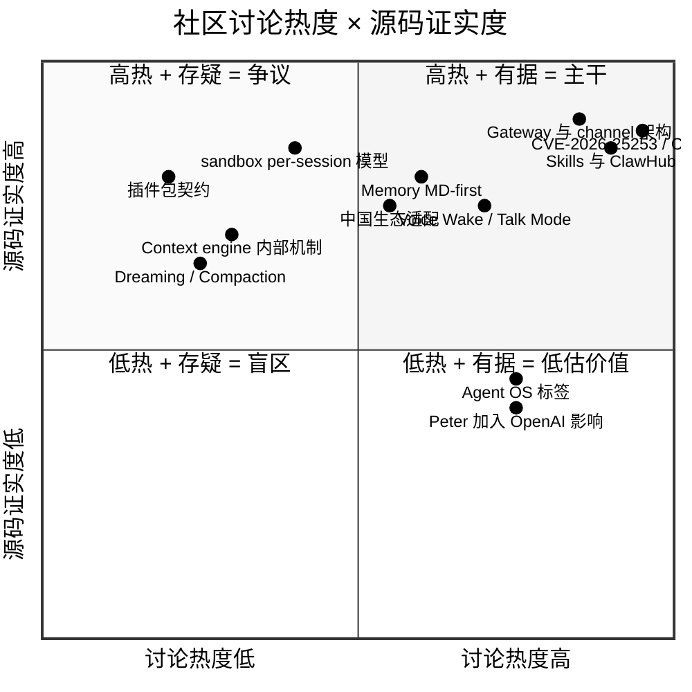

# 全网调研 — OpenClaw 社区认知地图

> 本文件是本研究的**外部认知基线**。收录 2026-02 至 2026-04 期间中英文社区对 OpenClaw 的主要讨论、误解、共识与盲区。目的不是罗列文章，而是绘制一张"社区看 OpenClaw 的视角地图"，供后续每个章节作为外部参考。

采集时间: 2026-04-17  
覆盖时段: 2026-02-01 ~ 2026-04-17（近 2.5 个月）

---

## 1. 一图概览：社区讨论的主要象限

四象限的解读：

- **右上（主干）**：社区与源码都充分覆盖，是后续每个章节主要复述的共识
- **左上（低估价值）**：源码明确、但社区很少谈——本研究可以补强
- **右下（争议）**：社区热议但源码证据薄弱——需要在章节里谨慎措辞
- **左下（盲区）**：冷门但复杂的机制——刚好是深度研究的价值所在

---

## 2. 核心共识（Top 6）

### 2.1 Gateway 是控制面，不是网关

所有主流分析（[Enrico Piovano](https://enricopiovano.com/blog/openclaw-architecture-deep-dive)、[Serenities AI 2026 Deep Dive](https://serenitiesai.com/articles/openclaw-deep-dive-2026)、[掘金万字](https://juejin.cn/post/7616167665171021870)、[ququ123 Gateway 源码解析](https://www.ququ123.top/2026/03/openclaw-gateway-core/)）在这点高度一致：

- 一个 WebSocket 端口（默认 `127.0.0.1:18789`）
- 所有 channel 适配器、所有端节点（macOS/iOS/Android）、所有工具都围绕它
- 它本身不执行业务，只做 session 分发 + 事件总线

### 2.2 Think-Act-Observe 是 agent 运行主循环

来自 [Piovano 的架构分析](https://enricopiovano.com/blog/openclaw-architecture-deep-dive)，对应源码 `src/agents/`。社区普遍称之为 "Pi Agent Core" 或 "agent-loop"——实际对应 [docs/concepts/agent-loop.md](../openclaw-repo/docs/concepts/agent-loop.md)。

### 2.3 MD 即 source of truth

[docs/concepts/memory.md](../openclaw-repo/docs/concepts/memory.md) 与 [LanceDB 合作博客](https://lancedb.com/blog/openclaw-memory-from-zero-to-lancedb-pro/) 一致：

- `~/.openclaw/workspace/MEMORY.md`
- `~/.openclaw/workspace/memory/YYYY-MM-DD.md`
- `~/.openclaw/workspace/DREAMS.md`
- 向量索引（sqlite-vec / LanceDB / Honcho）是**加速器**，不是真相源

### 2.4 Skill 用 SKILL.md 契约

社区这点基本沿用官方表述：SKILL.md 是 YAML frontmatter + 分段 markdown；ClawHub 是官方目录，VirusTotal 扫描，10k+ skill（[OpenClawDC](https://openclawdc.com/blog/openclaw-build-skill/)、[Learn OpenClaw](https://learnopenclaw.com/core-concepts/skills)）。

### 2.5 安全事件把 sandbox 推上主场

- **CVE-2026-25253**（CVSS 8.8）：Control UI WebSocket 认证缺陷，跨站 WS 劫持，1-click RCE；影响 42k+ 实例（[ClawSecure](https://www.clawsecure.ai/blog/cve-2026-25253-openclaw-vulnerability)、[ZeroClaw](https://zeroclaws.io/blog/openclaw-cve-2026-25253-deep-dive)）
- **ClawHavoc**：ClawHub 上 1,184 个恶意 skill 的供应链事件（[KiwiClaw](https://kiwiclaw.app/blog/openclaw-security-issues-2026.html)）
- 对应修复 PR：[#23574](https://github.com/openclaw/openclaw/pull/23574)（P0 critical remediation）与 [#21964](https://github.com/openclaw/openclaw/pull/21964)（gateway trust boundary）

### 2.6 OpenClaw 在 agentic CLI 里的定位

[The Viable Edge](https://www.viableedge.com/blog/openclaw-vs-alternatives-agentic-ai-comparison) 与 [DigitalApplied](https://www.digitalapplied.com/blog/ai-coding-ide-wars-openclaw-kilo-code-claude-code-cline-2026) 都把它对标 Claude Code / Cursor / Codex。关键差异：

- 不是 IDE 插件而是 **daemon + 多端节点**
- 不是 coding 专项，coding-agent 只是众多 skill 之一
- 受众是"把 AI 嵌进整个日常数字生活"的个人用户，不是"让 IDE 变聪明"的开发者

---

## 3. 争议与易误解（需要在正文谨慎处理）

### 3.1 "OpenClaw 是 OpenAI 的项目"

**事实**：Peter Steinberger 2026 年 2 月加入 OpenAI，但 OpenClaw 过渡到了**独立基金会（OpenClaw Foundation）**治理，OpenAI 是赞助商之一（与 GitHub、NVIDIA、Vercel 并列，见 [README.md](../openclaw-repo/README.md) sponsors 段）。

**正文口径**：不要把 OpenClaw 写成 OpenAI 产品，可以写"Peter 加入 OpenAI 后项目转独立基金会治理"。

### 3.2 "234k ★" vs "359k ★" vs "120k ★" 的数字分歧

不同文章给的 star 数字从 120k 到 359k 不等，取决于写作时间。**本研究采用实测基线**：采集时间 2026-04-17 `GET /repos/openclaw/openclaw` 返回 `stargazers_count: 359217`。

**正文口径**：使用"采集当日 359k"或明确标注日期，避免用其他文章的快照数字。

### 3.3 "SWE-bench 80.9%" 是 OpenClaw 的吗

不是。那是 Claude Code 的数字（[dev.to 30+ AI CLI 盘点](https://dev.to/soulentheo/every-ai-coding-cli-in-2026-the-complete-map-30-tools-compared-4gob)）。OpenClaw 的"领先"主要是 **token 消耗量 822B/day**（规模口径），与 benchmark 准确度口径不同。

### 3.4 "10700+ skill" vs "3000+ skill" vs "15000+ skill"

各博客口径不一致。[Serenities AI 2026 Deep Dive](https://serenitiesai.com/articles/openclaw-deep-dive-2026) 说 10,700+，[ClawHub Developer Guide](https://www.digitalapplied.com/blog/clawhub-skills-marketplace-developer-guide-2026) 说 3,000+，[Remoteopenclaw roadmap](https://remoteopenclaw.com/blog/openclaw-development-roadmap-2026) 说 15,000+。

**正文口径**：引用时注明文章时点，或使用源码侧可测数（`skills/` 本地 53 个 bundled skill + ClawHub 远端数字"数千级"）。

### 3.5 "sandboxes won't save you"

[HN 讨论](https://news.ycombinator.com/item?id=47154803) 与 [Zero-Trust OpenClaw DEV](https://dev.to/chwu1946/zero-trust-openclaw-gateway-security-and-shell-blocking-29bo) 都提出核心论点：沙箱并不能根本解决 prompt injection + 数据外泄问题，因为 agent 本身需要访问数据+互联网+第三方输入。

**正文口径**：赞成这个视角，在第 13、25 章明确写沙箱是"降低半径"而不是"消除风险"。

---

## 4. 盲区（社区基本没谈、但源码复杂度高）

| 盲区 | 源码证据 | 为什么被忽视 | 本研究覆盖位置 |
|------|----------|--------------|----------------|
| sandbox mode 是 per-session 而非 per-tool | `docs/gateway/sandbox-vs-tool-policy-vs-elevated.md` | 大多博客抄的是"有沙箱"的浅描述 | Ch13 |
| Dreaming / Compaction 的具体触发逻辑 | `docs/concepts/dreaming.md` `docs/concepts/compaction.md` | 名字很科幻但英文圈基本没深挖 | Ch04 |
| 106 个 extension 的加载时机与激活边界 | `src/plugin-activation-boundary.test.ts` | 只有 SDK 文档，没有实例分析 | Ch05 |
| Nodes（iOS/Android）的配对协议 | `src/pairing` `docs/gateway/pairing.md` | 大部分人只把它当 push notification | Ch10 Ch19 |
| 中国区生态：feishu/qqbot/wechat/zalo 与国产模型 | `extensions/{feishu,qqbot,zalo,line,zalouser}` + `extensions/{deepseek,moonshot,kimi-coding,qwen,qianfan,volcengine,byteplus,zai,minimax,stepfun,xiaomi,alibaba}` | 海外作者基本不碰 | Ch16 |
| Agent-workspace 的 AGENTS/SOUL/TOOLS.md 注入顺序 | `docs/concepts/agent-workspace.md` + `CLAUDE.md -> AGENTS.md` 符号链接 | 概念文档散在多处 | Ch03 Ch06 |
| ACP（Agent Communication Protocol） | [docs.acp.md](../openclaw-repo/docs.acp.md) | 2026-03 才引入，资料稀 | Ch05 + Ch23 |

---

## 5. 官方主路径 vs 社区延展工作流

为了避免把社区热议当成官方主路径（`source-deep-research` skill 明确反对这种漂移），本研究做如下定位：

### 5.1 官方主路径（README / onboarding / concepts docs 明确）

- `openclaw onboard --install-daemon` 为首选入门路径
- Gateway 作为唯一控制面
- MD-first memory
- `main` session 默认 host 执行，`non-main` session 默认 docker sandbox
- SKILL.md + ClawHub 是官方分发机制

### 5.2 社区延展（值得补强但非官方默认）

- `openclaw-cn` 等中文 fork 与国产通道补齐（`Part IV Ch20` 会单章介绍，但不提为默认）
- "零 token"/"零 OS" 之类的硬件裁剪变体（如 MimiClaw、LocalClaw）
- OpenClaw-RL（`Gen-Verse/OpenClaw-RL` 5k★）是 **训练方向**，非 agent runtime，研究里仅列为 Ch21 同类比较
- Agents-radar 等第三方监控面板，是观察工具，不是 agent 本身

正文中所有"社区做法"必须与官方主路径区分开，避免给读者造成"OpenClaw 默认就这么跑"的误印象。

---

## 6. 信息源索引

### 6.1 官方（一级资料）

- [openclaw/openclaw repo](https://github.com/openclaw/openclaw)
- [VISION.md](../openclaw-repo/VISION.md)
- [SECURITY.md](../openclaw-repo/SECURITY.md)
- [AGENTS.md](../openclaw-repo/AGENTS.md)（41KB 核心系统提示）
- [CHANGELOG.md](../openclaw-repo/CHANGELOG.md)（1.1MB）
- [docs/concepts/](../openclaw-repo/docs/concepts/)、[docs/gateway/](../openclaw-repo/docs/gateway/)
- [docs.acp.md](../openclaw-repo/docs.acp.md)（Agent Communication Protocol）
- [openclaw.ai](https://openclaw.ai)（官网）
- [steipete.me](https://steipete.me)（创始人博客）

### 6.2 英文社区（二级资料）

- [OpenClaw Architecture Deep Dive — Enrico Piovano](https://enricopiovano.com/blog/openclaw-architecture-deep-dive)
- [OpenClaw 2026: 234K Stars Deep Dive — Serenities AI](https://serenitiesai.com/articles/openclaw-deep-dive-2026)
- [OpenClaw Development Roadmap 2026](https://remoteopenclaw.com/blog/openclaw-development-roadmap-2026)
- [CVE-2026-25253 Dissected — ZeroClaw](https://zeroclaws.io/blog/openclaw-cve-2026-25253-deep-dive)
- [Sandboxes won't save you from OpenClaw — HN](https://news.ycombinator.com/item?id=47154803)
- [Memory for OpenClaw: From Zero to LanceDB Pro](https://lancedb.com/blog/openclaw-memory-from-zero-to-lancedb-pro/)
- [Every AI Coding CLI in 2026 — dev.to](https://dev.to/soulentheo/every-ai-coding-cli-in-2026-the-complete-map-30-tools-compared-4gob)
- [Zero-Trust OpenClaw — DEV Community](https://dev.to/chwu1946/zero-trust-openclaw-gateway-security-and-shell-blocking-29bo)

### 6.3 中文社区（二级资料）

- [万字解析 OpenClaw 源码架构 — 掘金](https://juejin.cn/post/7616167665171021870)
- [十大步骤、四个反共识：万字拆解 OpenClaw 源码 — 人人都是产品经理](https://www.woshipm.com/it/6350530.html)
- [OpenClaw 是如何处理飞书消息任务的 — 技术栈](https://jishuzhan.net/article/2036009670641516546)
- [OpenClaw 源码解析（一）Gateway — ququ123](https://www.ququ123.top/2026/03/openclaw-gateway-core/)
- [OpenClaw 从零配置：接入飞书 — 掘金](https://juejin.cn/post/7613330850830843954)

### 6.4 关键 PR / issue（作为源码证据）

- PR [#21964](https://github.com/openclaw/openclaw/pull/21964) gateway & plugin trust boundaries
- PR [#23574](https://github.com/openclaw/openclaw/pull/23574) P0 plugin sandbox + password hashing
- Issue [#6028](https://github.com/openclaw/openclaw/issues/6028) openclaw.json 编辑导致 gateway 崩溃
- Issue [#8731](https://github.com/openclaw/openclaw/issues/8731) 消息 bulk-delivery 问题
- Issue [#8288](https://github.com/openclaw/openclaw/issues/8288) agent 在失败 tool call 上无限挂起
- Issue [#2202](https://github.com/openclaw/openclaw/issues/2202) 429/402 错误下发空消息
- Issue [#6880](https://github.com/openclaw/openclaw/issues/6880) billing lock 没有 graceful degradation

---

## 7. 后续章节的引用纪律

1. 每章 Step 0 做"本章主题专属"小搜索，不依赖本总纲作为唯一外部参考
2. 正文引用社区资料时，保留作者/时间/平台信息，不把社区观点当官方定论
3. 涉及"为什么这样设计"的问题，若官方无明确声明，统一用"可能"、"或许"、"不排除"而不是定论
4. 数据引用优先用"源码+采集当日 API 返回"，其次才是社区博客的数字
5. Part IV 和 Part V 的量化结论必须能追溯到 `Appendix/B-pr-issue-dataset/` 的原始 JSON
