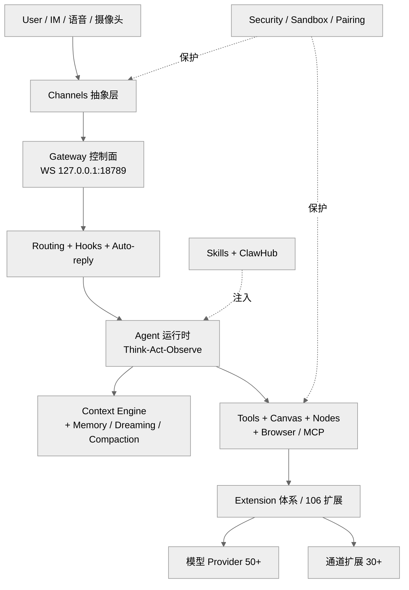
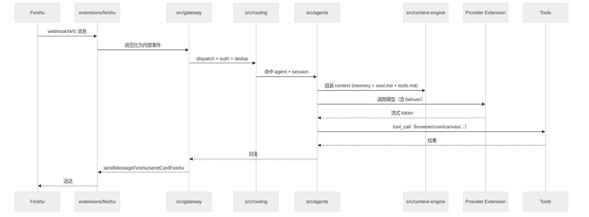

# 总纲 — OpenClaw 技术主线分析

> 本研究的主线导论。阅读本文后，你将建立起 OpenClaw 的整体技术地图：从"控制面 Gateway"出发，经"Agent 与 Session 模型"、"Context Engine 与记忆"、"插件/扩展/skill"，落到"通道与端侧设备"。本文基于 [openclaw/openclaw](https://github.com/openclaw/openclaw) `v2026.4.15` (commit `c56b56e`) 快照，交叉 2026-02 ~ 2026-04 的社区资料与源码本身写成。

---

## 1. 一句话定位

OpenClaw 是一个**你自己跑的 personal AI assistant 网关**。你装一个 `openclaw` CLI，它起一个 Gateway 守护进程，把你日常用的 IM/邮件/声音/屏幕/编辑器/桌面菜单栏"串"成一个 agent 统一入口，并允许你把这个 agent 沙箱化、限权、多端配对。

- 不是 SaaS，核心形态是 local-first 的 Gateway + 多端 Node
- 不是 coding IDE，但内置 coding-agent 等 skill；与 Claude Code/Cursor/Codex 是能力互补而非直接竞争
- 不是通用框架，是一个**成品助手**——安装完就有 macOS 菜单栏、iOS/Android 伴随 app、30+ 通道、50+ 模型 provider

---

## 2. 名字由来与演化节点

来自 [VISION.md](../openclaw-repo/VISION.md) 与社区资料交叉：

| 阶段 | 名字 | 时间 | 标志 |
|------|------|------|------|
| 个人实验 | Warelay | 2025 年中 | 创始人 Peter Steinberger 学习 AI 的 playground |
| 雏形 | Clawdbot | 2025 秋 | 第一次具备"能在真实电脑上跑任务的助手"形态 |
| 更名 | Moltbot | 2025 晚 | 引入蟹壳蜕变（molting）的隐喻 |
| 正式 | OpenClaw | 2025 年 11 月首发 | 定位"personal AI assistant" |
| 爆发 | OpenClaw Foundation | 2026 年 2 月 | 234k → 359k★ 窗口期；Peter 加入 OpenAI，项目过渡到独立基金会治理 |

今天（2026-04-17）的 baseline：**359,217 stars / 73,087 forks / 18,993 open issues / 31,559 commits / 96 releases**。

---

## 3. 六个顶层子系统

从 `src/` 60 个子目录、`packages/` 3 个 SDK、`extensions/` 106 个扩展、`skills/` 53 个内置 skill 抽象出六层结构：

六层对应本研究 Part I–III 的章节划分：

| 顶层域 | 对应章节 | 源码主目录 |
|--------|----------|-----------|
| 控制面 Gateway | Ch02 Ch07 | `src/gateway` `src/daemon` `src/bootstrap` `src/entry.ts` |
| Agent / Session | Ch03 Ch09 | `src/agents` `src/sessions` `src/chat` `src/routing` `src/hooks` `src/auto-reply` |
| Context / Memory | Ch04 | `src/context-engine` `extensions/memory-*` `extensions/active-memory` |
| Tools / Canvas / Voice / Media | Ch10 Ch11 Ch12 | `src/canvas-host` `src/node-host` `src/realtime-voice` `src/media*` |
| Extension / Skill | Ch05 Ch06 Ch15 Ch16 Ch17 | `packages/plugin-sdk` `src/plugins` `extensions/` `skills/` |
| Channel / App | Ch14 Ch18 Ch19 | `src/channels` `extensions/{whatsapp,telegram,feishu,…}` `apps/macos` `apps/ios` `apps/android` |

---

## 4. 核心执行链路（一条消息的旅程）

以"飞书群里 @ 机器人发一句话"为例（结合 [掘金万字解析](https://juejin.cn/post/7616167665171021870) 与 [技术栈飞书接入分析](https://jishuzhan.net/article/2036009670641516546) 中的 10 步法，对照 `src/gateway`、`src/routing`、`extensions/feishu` 实际代码）：

关键设计点（均在 Part II 展开）：

- **single control plane**：所有端（CLI、WebChat、iOS Node、macOS 菜单栏、各通道）都通过同一个 WS 端口 18789 与 Gateway 通信
- **Channel 抽象**：`src/channels` 只定义接口，真实通道实现落 `extensions/<channel>`，做到"主干不依赖任何特定 SaaS"
- **Context Engine**：MD 文件是 source of truth（`~/.openclaw/workspace/{SOUL,AGENTS,TOOLS}.md` + `memory/YYYY-MM-DD.md`），vector 检索只是加速器
- **Dreaming / Compaction**：会话到达阈值前先 flush 到记忆文件，再执行压缩——把"上下文窗口管理"外部化
- **Sandbox policy**：`main` session 默认可直接执行 host 命令；`non-main` session 默认跑在 per-session Docker 沙箱里

---

## 5. 六个容易忽视的"权衡锚点"

做源码研究时，这六处是 OpenClaw 区别于同类项目的差异化设计点，也是全文分析的主要证据锚：

1. **MD 优先而非 DB 优先**：记忆用 Markdown（`memory/`、`SOUL.md`、`DREAMS.md`），vector 索引可换（sqlite-vec / LanceDB / honcho）。代价是同步与去重需要 app 侧兜底，收益是可以 `git commit` 整个 agent state。
2. **extension 即 npm 包**：`packages/plugin-package-contract` 规定扩展可直接以 npm 包分发（`package.json` 的 `openclaw.extensions`），免去自建 registry；代价是给供应链安全带来压力（对应 ClawHavoc 事件）。
3. **sandbox mode 是 per-session 的，不是 per-tool**：因此 `main` session 有全权、`non-main` session 默认隔离。这是一种"你是谁比你做什么更重要"的身份优先安全观，与 `docs/gateway/sandbox-vs-tool-policy-vs-elevated.md` 一致。
4. **Gateway 不是反向代理**：它是"总线 + 协议解释器"。Channel 把外部事件翻译成内部协议，Gateway 负责 session/agent 分发，tools 的执行是在 gateway 进程或子进程里完成的。不要把它当 API Gateway。
5. **node 模型配对**：iOS/Android 不是 RPC 客户端，而是"设备节点"（`apps/ios`、`apps/android`、`src/pairing`）。节点承担摄像头/屏幕/麦克风等本地能力，Gateway 负责编排。
6. **channels 与 provider 是对偶的**：一个是"信息从哪进来"，一个是"模型从哪调"。两者都被纳入 extension 体系（`extensions/<channel>` 与 `extensions/<provider>`），是 106 个扩展的主体。

---

## 6. 本研究的证据基线

所有章节都以以下三类证据为主：

- **源码引用**：文件路径 + 行号，来自 [openclaw-repo](../openclaw-repo)（`v2026.4.15` 全量快照）
- **官方文档**：[docs/concepts](../openclaw-repo/docs/concepts)、[docs/gateway](../openclaw-repo/docs/gateway)、[SECURITY.md](../openclaw-repo/SECURITY.md)、[VISION.md](../openclaw-repo/VISION.md)
- **社区资料**：见 [全网调研-社区认知地图](./全网调研-社区认知地图.md)，主要来自 2026-02 ~ 2026-04 的英文技术博客、Hacker News、中文平台（掘金、技术栈、少数派、知乎等）

Part IV 和 Part V 额外依赖量化数据集：

- `Appendix/B-pr-issue-dataset/20260417/`：2026-02-01 以来 1200 个合并 PR、420 个 issue、300 个最新 fork 的 JSON 原始数据
- 本地 git 历史：23,014 commits（2026-02-01 起），按主题分类落在 `Appendix/B-pr-issue-dataset/20260417/commit-themes-*.json`

---

## 7. 三个 Part 的取舍

- **Part I Architecture and Philosophy**：回答"OpenClaw 到底是什么、长什么样、为什么是这个样子"。不展开具体代码细节，重点是设计选择和 trade-off。
- **Part II Source Execution**：沿着一条消息的旅程走，把启动、CLI、路由、tools、语音、媒体、沙箱挨个拆到"看得到行号"的程度。
- **Part III Channels Extensions Apps**：把 106 个扩展、50+ 模型 provider、53 个 skill 和 3 个移动 / 桌面 app 铺开——其中中国区生态（第 16 章）是海外同类研究普遍缺失、本研究差异化补强的部分。

Part IV 和 Part V 的写法会偏"答题"而不是"阐述"：

- **Part IV**：直接回答"社区在关注哪方面能力增强 + 近 2 个月 PR 演进"
- **Part V**：直接回答"openclaw 的缺陷和后续优化方向"

---

## 8. 导航

- 完整目录与阅读路径请从 [README.md](./README.md) 进入
- 外部视角请先读 [全网调研-社区认知地图](./全网调研-社区认知地图.md)
- 章节配置与数据集位于 [Appendix/](./Appendix/)
